成都东软学院

本科毕业设计报告

题目：基于AI的文生图与图像智能编辑系统的设计与实现

| 学 院：    | 计算机与软件学院 |
|------------|------------------|
| 专 业：    | 软件工程         |
| 班 级：    | 软件工程24301    |
| 学生姓名： | 卢一博           |
| 学生学号： | 24010230127      |
| 指导教师： | 曹旭             |

2026年5月

# 摘 要

随着生成式人工智能（AIGC）技术的快速发展，文生图模型已经从实验性研究成果逐步演变为创意设计、视觉生产和数字内容创作中的重要工具。然而，现有图像生成工具大多强调“生成”能力，而对生成结果的后续修饰、增强、抠图、扩图和局部重绘等能力支持不足，用户往往需要在多个软件之间频繁切换，导致创作链路割裂、工作效率下降。针对上述问题，本文设计并实现了一个集文生图与图像智能编辑于一体的本地化 Web 系统。

本系统采用前后端分离架构。后端基于 Python 与 FastAPI 构建，集成 Stable Diffusion XL、LaMa、Real-ESRGAN、GFPGAN、RestoreFormer、SAM2 以及 RemoveBG 等模型或插件，实现了文生图、AI擦除、AI扩图、AI重绘、去背景、超分辨率、修复人脸和智能选区等功能。前端基于 React、TypeScript 与 Vite 构建，结合交互式画布、全局状态管理和实时进度反馈机制，实现了从文本生成、图像编辑到工作区保存与恢复的一体化操作体验。

在实现过程中，本文重点探讨并解决了多模型本地推理下的显存资源调度、编辑类与非编辑类功能之间的无缝衔接、工作区快照保存与恢复、基于 JWT 的用户鉴权以及实时生成进度反馈等关键问题。经测试验证，系统在 Windows + CUDA 环境下运行稳定，能够完成从创意输入到结果图像保存、增强和再编辑的完整工作流，具有较好的实用价值与工程意义。

**关键词**：人工智能生成内容；扩散模型；图像智能编辑；FastAPI；工作区管理；本地部署

Abstract

With the rapid development of Artificial Intelligence Generated Content (AIGC), text-to-image technology represented by diffusion models has become a significant productivity force in the field of creative design. However, current tools often focus on single-image generation while neglecting the coherence of subsequent refined editing, leading to a severe workflow disconnect between generation and modification for users. Addressing this pain point, this paper designs and implements an integrated, locally deployed AI-based text-to-image and intelligent image editing system.

The system adopts a frontend-backend separated architecture. The backend is built with Python and FastAPI, and integrates Stable Diffusion XL, LaMa, Real-ESRGAN, GFPGAN, RestoreFormer, SAM2, and RemoveBG-related models or plugins, thereby supporting text-to-image generation, AI erasing, AI outpainting, AI repainting, background removal, super-resolution, face restoration, and interactive segmentation. The frontend is developed with React, TypeScript, and Vite. Combined with an interactive canvas, global state management, and real-time progress feedback, it provides an integrated workflow from prompt-based generation to editing, enhancement, and workspace persistence.

During implementation, this work mainly focuses on several key engineering issues, including GPU memory scheduling under local multi-model inference, seamless image handoff across different functional tabs, workspace snapshot persistence and recovery, JWT-based user authentication, and real-time progress notification for long-running generation tasks. Experimental use shows that the system runs stably in a Windows and CUDA environment and supports a complete workflow from prompt input to image generation, enhancement, editing, and saving, demonstrating solid practical and engineering value.

**Key Words**: AIGC; Diffusion Models; Intelligent Image Editing; FastAPI; Workspace Management; Local Deployment

目 录

第1章 绪论

1.1 选题背景

1.2 选题目的

1.3 国内外现状

1.4 主要研究内容

1.4.1 系统概述

1.4.2 功能概述

1.4.3 性能优化与交互逻辑研究

1.5 报告内容组织结构

第2章 关键技术介绍

2.1 关键性开发技术介绍

2.1.1 扩散模型与 Stable Diffusion

2.1.2 FastAPI 异步 Web 框架

2.1.3 基于 React 与 TypeScript 的前端体系

2.2 其它相关技术

2.2.1 Hugging Face diffusers 库

2.2.2 PyTorch 深度学习框架

2.2.3 CUDA 硬件加速

2.2.4 辅助增强插件模型

第3章 系统分析

3.1 系统构架概述

3.2 需求分析

3.2.1 用户需求分析

3.2.2 业务需求分析

3.2.3 功能需求分析

3.2.4 业务建模

3.3 用例规约

3.3.1 创作生成模块用例

3.3.2 编辑类功能模块用例

3.3.3 非编辑类功能模块用例

3.4 系统可行性分析

3.4.1 技术可行性 

3.4.2 经济可行性 

3.4.3 操作可行性

3.4.4 系统安全性分析

3.5 系统开发环境

第4章 系统设计

4.1 系统架构设计

4.2 系统功能模块整体设计

4.3 系统功能模块详细设计

4.3.1 文生图创作模块设计

4.3.2 AI擦除模块设计

4.3.3 AI扩图模块设计

4.3.4 AI重绘模块设计

4.3.5 去背景模块设计

4.3.6 超分辨率模块设计

4.3.7 修复人脸模块设计

4.3.8 智能选区模块设计

4.3.9 用户工作区模块设计

4.4 接口设计

4.4.1 创作型模块接口设计

4.4.2 编辑类模块接口设计

4.4.3 非编辑类模块接口设计

4.4.4 工作区模块接口设计

4.4.5 登录功能接口设计

4.5 数据库设计

4.5.1 CDM图

4.5.2 数据库表结构设计

第5章 系统实现

5.1 开发环境与工程结构实现

5.1.1 服务端工程结构

5.1.2 前端工程结构

5.1.3 运行环境与启动流程

5.2 服务端核心实现

5.2.1 FastAPI 路由与请求校验实现

5.2.2 模型调度与显存缓存实现

5.2.3 插件式图像处理实现

5.2.4 工作区持久化与资源管理实现

5.2.5 JWT 鉴权与资源访问控制实现

5.3 前端交互与状态管理实现

5.3.1 页面框架与功能 Tab 实现

5.3.2 交互式画布与蒙版编辑实现

5.3.3 功能联动与自动衔接实现

5.3.4 工作区保存、恢复与无缝衔接实现

5.4 实时反馈与体验优化实现

5.4.1 实时进度推送与任务结束通知

5.4.2 保存确认、异常提示与取消任务机制

第6章 系统测试

6.1 测试环境与测试方法

6.1.1 测试环境

6.1.2 测试方法

6.2 测试用例

6.2.1 登录与注册模块

6.2.2 文生图模块

6.2.3 AI擦除模块

6.2.4 AI扩图模块

6.2.5 AI重绘模块

6.2.6 去背景模块

6.2.7 超分辨率模块

6.2.8 修复人脸模块

6.2.9 智能选区模块

6.2.10 工作区模块

6.3 测试结果分析

第7章 结论

7.1 全文总结

7.2 不足与展望

参考文献

# **第1章 绪论**

本设计针对当前生成式人工智能应用中“生成能力强、编辑链路弱”的典型问题，围绕文本生成图像与图像智能编辑的一体化协同展开研究。系统以扩散模型为核心算法基础，以本地部署、统一交互、工作区保存和多功能无缝衔接为目标，构建了一个面向个人创作者和轻量级设计场景的 Web 平台。该课题具有较强的工程实践价值，一方面能够验证多模型协同和前后端联动方案的可行性，另一方面也为本地化 AIGC 工具的产品化落地提供了可参考的实现路径。

## 1.1 选题背景

近年来，生成式人工智能在图像创作领域发展迅速。以 Stable Diffusion 为代表的扩散模型使普通用户仅通过自然语言描述就能够获得质量较高的图像结果，极大拓展了视觉创作的边界。与此同时，用户对 AIGC 工具的期待已经从“能生成图像”进一步转向“能围绕生成结果持续编辑、优化和管理”的完整工作流。

当前市面上的工具大致分为两类：一类强调文生图能力，但在局部编辑、智能抠图、图像增强和工作流管理方面支持有限；另一类图像编辑软件虽然具备丰富的处理能力，但缺乏与生成式模型的深度整合。用户在实际创作过程中往往需要在文生图页面、抠图工具、超分工具和本地图像编辑器之间来回切换，既增加了操作复杂度，也容易造成进度丢失和素材管理混乱。

此外，随着个人创作者、学生用户以及小型工作室对本地部署需求的上升，隐私保护和使用成本也成为重要考虑因素。将图像上传到云端处理存在数据泄露风险，而高频订阅式商业服务也会增加长期使用成本。因此，研究并实现一个支持本地运行、账号登录、工作区保存、多功能协同和实时进度反馈的一站式智能图像系统，具有明显的现实意义。

## 1.2 选题目的

本课题的主要目标是设计并实现一个基于 AI 的文生图与图像智能编辑系统，使用户能够在同一平台内完成文本生成图像、图像局部擦除、智能扩图、局部重绘、去背景、超分辨率、人脸修复与智能选区等操作，并通过工作区机制实现历史结果的保存、恢复和二次创作。

具体而言，本课题希望解决以下几个方面的问题：

1. 构建统一的前后端系统架构，将文生图和图像编辑功能整合在同一套业务体系之内。
2. 实现基于本地显卡的多模型协同推理，降低用户对外部云服务的依赖。
3. 优化多功能之间的交互衔接逻辑，使生成结果、编辑结果和增强结果能够在不同功能页之间顺畅流转。
4. 建立工作区保存与恢复机制，使用户的图片、参数和操作状态能够持久化管理。
5. 通过实时进度通知、异常提示和鉴权机制提升系统的可用性、安全性和工程完整度。

## 1.3 国内外现状

在当前的图像生成技术研究领域中，扩散模型已成为生成式人工智能（AIGC）的核心底层架构。扩散模型通常被定义为一个双向的马尔可夫链过程，其核心逻辑在于通过前向扩散阶段逐步向原始图像数据中注入高斯噪声，并利用深度神经网络在逆向去噪阶段学习如何从纯噪声分布中精确还原出高质量的目标图像。这种基于概率分布演变的建模方式，有效克服了传统生成对抗网络（GAN）在训练稳定性与模式坍塌方面的局限，为实现高度复杂的语义映射与图像重构奠定了坚实的理论基础。

作为扩散模型领域最具代表性的工程实践，Stable Diffusion 通过引入潜在扩散模型（Latent Diffusion Model）架构，实现了图像生成效率与质量的平衡。该技术并不直接在像素空间进行高维计算，而是利用变分自编码器（VAE）将图像压缩至低维的潜在空间进行去噪处理，从而显著降低了对硬件推理算力的需求。这一突破使得高质量的图像编辑任务得以在个人计算设备上运行，在本项目的后端架构中，通过对 diffusers 库以及多种高性能采样器的深度集成，充分利用了这一技术特性来实现实时的局部重绘与图像外扩功能。

随着 Stable Diffusion 体系的日益成熟，全球 AIGC 产业正经历从宏观内容生成向微观精确控制的纵深演进。国际上，以 Stability AI 为首的开源力量与以 OpenAI、Adobe 为代表的商业巨头持续在模型底座、语义理解及专业流集成方向发力，研究重点已转向如何通过 ControlNet、BrushNet 等技术实现对图像布局与细节的像素级操控。国内方面，百度、阿里巴巴及腾讯等头部科技公司依托大规模预训练算力，相继推出了具备本土化语义理解优势的大模型，同时国内开源社区在针对特定风格的轻量化微调模型以及针对中文字符生成的 AnyText 算法落地应用上也表现出极高的活跃度。

尽管国内外技术储备已非常雄厚，但在实际应用层面仍面临着显著的门槛。目前主流的专业级 WebUI 工具界面极其复杂且参数冗冗，导致非专业人员的学习成本过高；而现有的商业化云端解决方案则普遍存在用户隐私泄露风险及高昂的订阅费用。因此，针对个人用户和专业创作者的需求，开发一个集成 LaMa 语义填充、交互式目标分割以及高精度图像增强等多种前沿算子的轻量化集成系统，并支持完全的本地化部署，不仅符合当前技术向终端下沉的趋势，也具备极高的应用价值与现实意义。

## 1.4 主要研究内容

### 1.4.1 系统概述

本文设计的系统是一个面向桌面端浏览器环境运行的 AI 图像创作平台。系统采用前后端分离模式，前端负责用户交互、图像预览、画布编辑和工作区管理，后端负责业务路由、模型调度、插件调用、数据持久化和权限控制。系统在逻辑上以“统一工作区”为核心，将文生图结果、编辑结果和增强结果统一纳入同一套状态与数据结构中进行管理。

与单一功能工具不同，本系统强调的是完整的创作闭环。用户既可以从“文生图”开始进行创意生成，也可以从本地上传图片开始进入编辑流程；在任意功能处理中产生的新结果，还可以继续衔接到其他功能模块中做进一步修饰、增强和保存，从而形成连续、可恢复、可保存的图像处理链路。

### 1.4.2 功能概述

系统主要包含以下功能：

1. 文生图功能：支持用户输入提示词、反向提示词、尺寸、步数、采样器和随机种子等参数，调用支持文生图的扩散模型生成图像。
2. AI扩图功能：针对已有图像向四周拓展画面范围，并结合扩散模型完成边界内容补全。
3. AI擦除功能：用户通过蒙版标记需要移除或修复的区域，系统根据上下文生成自然填充结果。
4. AI重绘功能：在局部区域内按照新的提示词进行再生成，实现局部内容替换与风格调整。
5. 去背景功能：调用 RemoveBG 插件自动提取主体并移除背景，适合素材抠图和人物主体分离。
6. 超分辨率功能：调用 Real-ESRGAN 插件对图像进行放大和细节增强，提高输出清晰度。
7. 修复人脸功能：调用 GFPGAN 或 RestoreFormer 对面部区域进行修复，改善人物图像失真问题。
8. 智能选区功能：基于交互式分割模型，根据用户点击点快速生成选区蒙版，为后续编辑提供辅助。

除上述八大功能外，系统还提供用户注册登录、工作区保存、工作区恢复、结果下载、历史作品管理和跨功能自动衔接等支撑能力。

### 1.4.3 性能优化与交互逻辑研究

针对本地部署场景下的性能瓶颈，本文重点研究了多模型协同条件下的资源调度与交互优化问题。后端通过模型缓存和显存回收机制，避免多个大型模型同时常驻显存；在推理阶段结合 CUDA 环境和 PyTorch 推理模式降低资源消耗。对于生成式任务，系统使用 Socket.IO 推送进度与完成事件，以改善长耗时任务的交互体验。

在前端侧，系统围绕统一状态管理和功能页联动进行了设计。编辑类功能、非编辑类功能与文生图结果之间通过共享工作图像与功能状态实现自动衔接，并在必要时通过确认弹窗保护未保存进度。基于交互式画布、撤销重做和工作区保存机制，系统有效提升了连续创作过程中的可控性与稳定性。

## 1.5 报告内容组织结构

本文共分为七个章节，各章节内容安排如下：

第1章为绪论，主要介绍课题的研究背景、研究意义以及国内外研究现状，并对本文的研究内容进行概述；

第2章为相关技术介绍，主要阐述系统开发过程中涉及的关键技术；

第3章为系统分析，对系统的功能需求及可行性进行分析；

第4章为系统设计，介绍系统总体架构及各模块设计；

第5章为系统实现，详细说明各功能模块的实现过程；

第6章为系统测试，对系统功能进行测试与结果分析；

第7章为结论，对全文进行总结并提出后续改进方向。

# **第2章 关键技术介绍**

## 2.1 关键性开发技术介绍

### 2.1.1 扩散模型与 Stable Diffusion

本项目的图像生成逻辑高度依赖于 Stable Diffusion 系列模型及其在 Hugging Face diffusers 库中的实现。diffusers 是目前业界领先的扩散模型集成方案，提供了从调度器（Schedulers）到管道（Pipelines）的完整封装。系统通过集成该技术，实现了 Stable Diffusion XL 1.0 等前沿模型的调用，能够高质量地完成局部重绘（Inpainting）与图像外扩（Outpainting）任务。通过利用 safetensors 格式存储模型权重，系统进一步增强了模型加载的安全性与速度。

### 2.1.2 FastAPI 异步 Web 服务框架

为了保障图像处理请求的高并发处理能力与响应速度，系统后端采用了 FastAPI 作为 Web 服务框架。FastAPI 是一种基于 Python 3.7+ 标准类型提示的现代、高性能 Web 框架，其核心优势在于原生支持异步编程（async/await），极大提升了 I/O 密集型任务的处理效率。本项目通过 FastAPI 定义了标准化的 RESTful API 接口，负责模型加载状态查询、图像上传下载以及推理任务的调度管理。此外，结合 Pydantic 库进行的数据模型校验，确保了前后端数据交互的严格一致性与系统健壮性。

### 2.1.3 基于 React 与 TypeScript 的前端体系

系统前端采用 React 框架构建，并全面使用 TypeScript 编程语言以增强代码的可维护性与类型安全性。React 的组件化开发模式使得复杂的用户交互界面，如实时绘图画布、模型参数调节面板等，能够被高效地解耦与复用。TypeScript 的引入则通过静态类型检查，在开发阶段即能发现潜在的逻辑错误，尤其在处理复杂的图像元数据和异步 API 响应时提供了坚实的基础。在构建工具方面，项目选用了 Vite 进行项目的快速打包与热更新，显著提升了前端开发与线上部署的效率。

## 2.2 其它相关技术

### 2.2.1 Hugging Face diffusers 库

diffusers 是 Hugging Face 提供的扩散模型标准库，是本系统实现模型调度的底层支柱。它将复杂的扩散逻辑封装为标准化的 Pipeline（流水线），支持 Stable Diffusion 1.5、SDXL 等多种开源大模型，并提供了调度器（Schedulers）优化技术，能在保证画质的前提下显著缩短生成时间。

### 2.2.2 PyTorch 深度学习框架

本系统后端核心算法的运行依赖于 PyTorch 深度学习框架。作为目前主流的开源张量计算与神经网络库，PyTorch 提供了强大的自动求导系统以及对算子级别的灵活控制能力，使其能够支撑 LaMa 以及各种扩散模型（Diffusion Models）的高效推理。在本项目的环境配置中，系统要求 Torch 版本需达到 2.0.0 以上，以利用其在模型量化、编译优化及分布式训练方面的最新特性。同时，结合项目中的 accelerate 与 peft 库，系统能够实现对显存占用的精细化管理，并支持在消费级显卡甚至是仅有 CPU 的环境下进行平滑运行。

### 2.2.3 CUDA 硬件加速

由于本系统采用本地部署方案，图像生成极其依赖计算资源。系统通过 NVIDIA CUDA 架构实现深度学习任务的硬件加速。利用 PyTorch 框架直接调用显卡内核，将原本在 CPU 上需耗时数分钟的计算任务缩短至秒级，是实现实时 AI 编辑的前提。

### 2.2.4 辅助增强插件模型

为了扩展图像编辑的功能边界，系统还集成了一系列基于计算机视觉的辅助插件。例如，利用 Segment Anything (SAM) 插件实现快速、精准的目标物体分割；通过 RealESRGAN 技术实现生成图像的超分辨率增强；以及采用 GFPGAN 或 RestoreFormer 插件进行人脸特征的修复与增强。这些辅助技术的加入，使得本系统不再局限于单一的重绘功能，而是进化为一个综合性的 AI 图像编辑平台。

# **第3章 系统分析**

## 3.1 系统构架概述

本系统采用 B/S（Browser/Server）架构，目标是在浏览器环境下为用户提供一站式 AI 图像生成与智能编辑服务。系统整体可划分为展示层、业务逻辑层、模型推理层和数据持久化层。

展示层由 React 前端构成，主要负责用户输入、参数配置、画布交互、结果展示和工作区操作；业务逻辑层由 FastAPI 服务承载，负责路由分发、请求校验、会话控制、模型切换、工作区保存和用户鉴权；模型推理层由 Stable Diffusion、LaMa、Real-ESRGAN、GFPGAN、SAM2 等模型或插件组成，负责具体的图像生成与处理；数据持久化层则基于 SQLite 和本地文件系统，存储用户、工作区、资源文件、操作记录和工作状态快照。

与传统仅依赖单一模型的图像工具不同，本系统以工作区为中心组织用户数据，使得文生图、编辑类功能和非编辑类功能共享统一的数据流。用户在任意模块得到的新图像结果，都可以继续进入其他模块进行处理，形成连续、可恢复、可保存的创作闭环。

## 3.2 需求分析

### 3.2.1 用户需求分析

用户希望通过该平台，仅需输入简单的文本描述即可获得高质量的视觉作品。同时，用户要求在生成图像后能够直接进行无缝编辑，如去除图像中的冗余物体、扩展构图比例、一键抠图或修复模糊画质。此外，由于涉及个人创意，用户对数据的隐私性和系统的运行稳定性有较高要求，倾向于本地化处理以避免数据泄露。

### 3.2.2 业务需求分析

从系统业务流程角度看，本课题需要完成“用户登录-进入工作区-生成或导入图片-多功能处理-保存与恢复-继续创作”的完整闭环。系统既要支持从文本直接开始的创作型流程，也要支持从已有图片开始的编辑型流程；既要支持局部编辑，也要支持插件增强；在结果管理层面，还要支持用户按工作区进行保存、恢复、删除和再次加工。

因此，系统业务上至少需要覆盖以下能力：统一账号体系、统一图片入口、统一状态管理、统一工作区保存机制以及多功能间的结果自动衔接。只有这些环节协同运行，系统才不仅是多个 AI 功能的简单堆叠，而是一个真正可用的图像创作平台。

### 3.2.3 功能需求分析

文生图功能：支持输入提示词、反向提示词、图像尺寸、采样步数、采样器和种子参数，并基于扩散模型生成图像。

AI擦除功能：支持在画布上绘制蒙版，对指定区域进行内容移除与智能修复。

AI扩图功能：支持对图像边界进行扩展，并自动补全新增区域内容。

AI重绘功能：支持用户基于局部提示词对选定区域进行重新生成和风格替换。

去背景功能：支持对上传图像执行主体分离和背景移除，输出透明背景结果。

超分辨率功能：支持调用超分模型对图像进行细节增强和高倍放大。

修复人脸功能：支持对人物图像中的面部区域进行增强和失真修复。

智能选区功能：支持用户通过交互点击快速生成选区，为后续蒙版编辑提供辅助。

进度保存功能：支持将当前工作图像、参数状态和模块结果保存到工作区，并在后续恢复继续编辑。

### 3.2.4 业务建模

从用户视角看，系统中的参与者主要分为访客和登录用户两类。访客可通过注册与登录进入系统；登录用户进入系统后，既可以发起文生图任务，也可以上传已有图像进入编辑流程，并在后续处理中使用 AI擦除、AI扩图、AI重绘、去背景、超分辨率、修复人脸和智能选区等功能，还可以对当前创作结果进行工作区保存、恢复、删除和下载。系统的业务建模如图 3.1 所示。

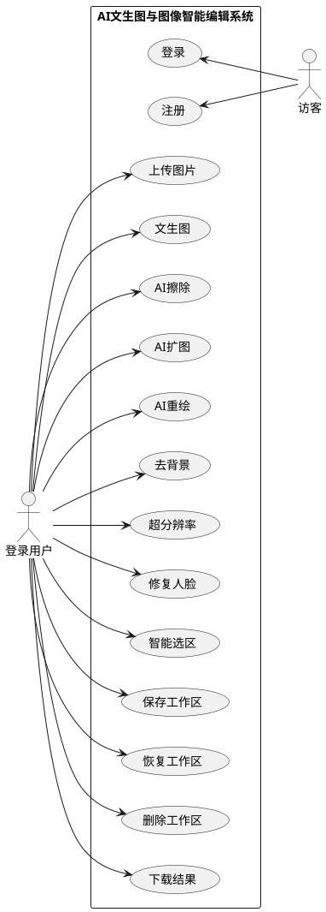

图 3.1 文生图与图像智能编辑系统用例图

## 3.3 用例规约

系统的核心用例可概括为：文生图创作、AI擦除、AI扩图、AI重绘、智能选区、去背景、超分辨率、修复人脸、工作区保存与工作区恢复。其中前八项为主要业务功能，工作区保存与恢复贯穿整个处理过程。

### 3.3.1 创作生成模块用例

1. 文生图创作用例规约表

| 组成项目 | 子项描述 |
|------|------|
| 用例编号 | UC01 |
| 用例名称 | 文生图创作 |
| 用例简述 | 用户输入提示词和生成参数，系统调用支持文生图的模型生成对应图像。 |
| 参与者 | 登录用户 |
| 前置条件 | 用户已完成注册并登录系统；服务端存在可用的文生图模型；用户进入“文生图”Tab。 |
| 后置条件 | 生成结果加载到当前工作区状态，并显示在前端页面中；用户可继续下载、保存或自动衔接到其他功能。 |
| 基本路径 | 1. 用户进入文生图页面；2. 输入提示词、反向提示词并设置尺寸、步数、采样器和随机种子等参数；3. 点击“生成”按钮；4. 前端向后端提交文生图请求；5. 系统执行模型推理并通过实时进度提示反馈生成状态；6. 系统返回生成结果并显示在前端；7. 用户选择继续编辑、下载结果或保存到工作区。 |
| 拓展路径 | 5a. 当前存在未保存的图片或工作进度，系统先弹出保存确认对话框；5b. 所选模型不支持文生图，系统提示用户切换模型；6a. 图像生成失败，系统反馈错误信息并记录操作日志；6b. 用户主动取消任务，系统终止生成并提示已取消。 |
| 字段列表 | 1.提示词=用户输入的正向文本描述；2.反向提示词=用于排除不希望出现的画面内容；3.模型=当前选用的文生图模型；4.图像宽度=输出图像宽度；5.图像高度=输出图像高度；6.采样步数=扩散推理的迭代步数；7.采样器=文生图任务使用的采样方法；8.随机种子=用于复现生成结果的种子值。 |
| 业务规则 | 无 |
| 非功能需求 | 图像生成过程需有实时进度提示；允许用户取消长时间任务；生成结果应能无缝衔接到后续功能模块。 |
| 设计约束 | 无 |

### 3.3.2 编辑类功能模块用例

1. AI擦除用例规约表

| 组成项目 | 子项描述 |
|------|------|
| 用例编号 | UC02 |
| 用例名称 | AI擦除 |
| 用例简述 | 用户在当前图片上绘制蒙版，系统根据蒙版区域执行内容移除和智能修复。 |
| 参与者 | 登录用户 |
| 前置条件 | 用户已登录系统；当前工作区中存在可编辑图片；用户进入“AI擦除”Tab。 |
| 后置条件 | 擦除后的结果替换当前工作图像，并可继续编辑、保存或切换到其他功能。 |
| 基本路径 | 1. 用户进入 AI擦除页面；2. 系统加载当前工作图像到编辑画布；3. 用户在画布上绘制待擦除区域蒙版；4. 用户设置模型或保持默认参数；5. 点击执行按钮提交擦除请求；6. 后端根据原图与蒙版执行修复推理；7. 系统返回修复结果并更新当前工作图像。 |
| 拓展路径 | 3a. 用户未绘制有效蒙版，系统提示先选择待处理区域；5a. 当前存在未保存进度且用户先切换了图片来源，系统弹出保存确认；6a. 模型推理失败，系统提示处理失败并记录日志；6b. 用户取消任务，系统停止处理并保留原图状态。 |
| 字段列表 | 1.当前图片=待执行擦除的工作图像；2.蒙版=用户在画布上绘制的待处理区域；3.模型=当前选用的修复或擦除模型；4.提示词=扩散修复时用于描述目标内容的文本；5.反向提示词=用于限制不希望出现的结果；6.采样步数=擦除任务的推理步数；7.随机种子=用于复现擦除结果的种子值。 |
| 业务规则 | 无 |
| 非功能需求 | 画布操作应保持流畅，支持缩放、拖拽和撤销重做；结果返回后应立即刷新当前工作图像。 |
| 设计约束 | 无 |

2. AI扩图用例规约表

| 组成项目 | 子项描述 |
|------|------|
| 用例编号 | UC03 |
| 用例名称 | AI扩图 |
| 用例简述 | 用户设置扩展方向与范围，系统对当前图片执行边界扩展和新增区域补全。 |
| 参与者 | 登录用户 |
| 前置条件 | 用户已登录系统；当前工作区中存在图片；服务端存在支持扩图的模型；用户进入“AI扩图”Tab。 |
| 后置条件 | 工作区中的当前图片被更新为扩图结果，图像尺寸和边界内容同步变化。 |
| 基本路径 | 1. 用户进入 AI扩图页面；2. 系统加载当前图片并显示扩展控制区域；3. 用户设置扩展方向与尺寸范围；4. 用户根据需要填写提示词和其他参数；5. 点击执行按钮提交扩图请求；6. 后端根据扩展参数执行 outpaint 推理；7. 系统返回扩图结果并更新当前工作区图像。 |
| 拓展路径 | 3a. 用户设置的扩展范围无效，系统提示重新调整参数；5a. 当前模型不支持扩图，系统提示切换支持扩图的模型；6a. 扩图处理失败，系统返回错误提示并记录日志；6b. 用户取消任务，系统终止本次扩图。 |
| 字段列表 | 1.当前图片=待扩展的工作图像；2.扩展方向=画布向上、下、左、右扩展的方向；3.扩展范围=新增区域的尺寸和边界范围；4.模型=当前选用的扩图模型；5.提示词=用于指导新增区域生成内容的文本；6.反向提示词=用于限制新增区域不希望出现的内容；7.采样步数=扩图任务的推理步数；8.随机种子=用于复现扩图结果的种子值。 |
| 业务规则 | 无 |
| 非功能需求 | 参数调整后界面应能及时预览扩展区域；扩图结果应保持与原图衔接自然，并在处理期间提供状态反馈。 |
| 设计约束 | 无 |

3. AI重绘用例规约表

| 组成项目 | 子项描述 |
|------|------|
| 用例编号 | UC04 |
| 用例名称 | AI重绘 |
| 用例简述 | 用户为局部区域绘制蒙版并输入新的提示词，系统对选定区域执行局部再生成。 |
| 参与者 | 登录用户 |
| 前置条件 | 用户已登录系统；当前工作区中存在图片；用户进入“AI重绘”Tab。 |
| 后置条件 | 重绘结果更新到当前工作图像，未选区域保持原有内容，结果可继续保存或进入其他功能。 |
| 基本路径 | 1. 用户进入 AI重绘页面；2. 系统加载当前图片到画布；3. 用户绘制需要重绘的局部区域；4. 用户输入新的重绘提示词并设置相关参数；5. 点击执行按钮提交重绘请求；6. 后端结合蒙版和提示词执行 repaint 推理；7. 系统返回局部重绘结果并替换当前工作图像。 |
| 拓展路径 | 3a. 用户未选择有效区域，系统提示先绘制蒙版；4a. 用户未输入必要的重绘提示词，系统提示补充内容；6a. 重绘处理失败，系统反馈错误信息并记录日志；6b. 用户取消任务，系统保留当前未处理状态。 |
| 字段列表 | 1.当前图片=待重绘的工作图像；2.局部蒙版=用户选定的局部重绘区域；3.重绘提示词=用于指导局部再生成的文本描述；4.反向提示词=用于排除不希望出现的内容；5.模型=当前选用的局部重绘模型；6.采样步数=局部重绘的推理步数；7.随机种子=用于复现重绘结果的种子值。 |
| 业务规则 | 无 |
| 非功能需求 | 局部区域交互应精确可控；处理结果应尽量保持未选区域稳定，并提供处理过程提示。 |
| 设计约束 | 无 |

4. 智能选区用例规约表

| 组成项目 | 子项描述 |
|------|------|
| 用例编号 | UC05 |
| 用例名称 | 智能选区 |
| 用例简述 | 用户通过前景点和背景点交互，系统快速生成候选选区并转换为可编辑蒙版。 |
| 参与者 | 登录用户 |
| 前置条件 | 用户已登录系统；当前工作区中存在图片；服务端已启用交互式分割插件；用户进入“智能选区”Tab。 |
| 后置条件 | 系统生成的选区被转换为可继续用于 AI擦除或 AI重绘的蒙版结果。 |
| 基本路径 | 1. 用户进入智能选区页面；2. 系统显示当前图片并进入点击选区模式；3. 用户依次添加前景点和背景点；4. 前端将点击点提交给分割插件；5. 系统返回临时分割结果并在前端展示；6. 用户确认选区结果；7. 系统将选区转为蒙版并写入当前工作状态。 |
| 拓展路径 | 3a. 用户点击信息不足，系统提示继续补充前景点或背景点；5a. 分割插件处理失败，系统提示稍后重试；6a. 用户对候选结果不满意，可继续追加点击点重新分割。 |
| 字段列表 | 1.当前图片=执行智能选区的工作图像；2.前景点=用户标记的目标区域点击点；3.背景点=用户标记的非目标区域点击点；4.分割结果确认=用户对候选选区的确认操作。 |
| 业务规则 | 无 |
| 非功能需求 | 选区生成应尽量快速响应；候选结果应清晰可视；确认后的蒙版应能直接衔接到编辑类功能。 |
| 设计约束 | 无 |

### 3.3.3 非编辑类功能模块用例

1. 去背景用例规约表

| 组成项目 | 子项描述 |
|------|------|
| 用例编号 | UC06 |
| 用例名称 | 去背景 |
| 用例简述 | 用户对当前图片执行主体分离，系统输出透明背景结果。 |
| 参与者 | 登录用户 |
| 前置条件 | 用户已登录系统；当前工作区中存在图片；服务端已启用 RemoveBG 插件；用户进入“去背景”Tab。 |
| 后置条件 | 去背景结果写入去背景结果状态，并可无缝回流到编辑类功能或保存到工作区。 |
| 基本路径 | 1. 用户进入去背景页面；2. 系统加载当前工作图片；3. 用户选择去背景模型；4. 点击执行按钮提交处理请求；5. 后端调用 RemoveBG 插件执行主体分离；6. 系统返回透明背景结果并显示在前端页面；7. 用户继续保存、下载或衔接到其他功能。 |
| 拓展路径 | 3a. 可用模型为空或模型不可用，系统提示用户检查插件配置；5a. RemoveBG 插件处理失败，系统提示错误并记录日志；6a. 用户对结果不满意，可重新处理或切换到其他功能进一步编辑。 |
| 字段列表 | 1.当前图片=待去背景的工作图像；2.去背景模型=当前选用的去背景插件模型。 |
| 业务规则 | 无 |
| 非功能需求 | 处理结果应尽量保持主体边缘完整；处理过程应有明确的运行状态提示；结果应支持自动衔接后续编辑。 |
| 设计约束 | 无 |

2. 超分辨率用例规约表

| 组成项目 | 子项描述 |
|------|------|
| 用例编号 | UC07 |
| 用例名称 | 超分辨率 |
| 用例简述 | 用户对当前图片执行细节增强与放大处理，系统输出更高分辨率图像。 |
| 参与者 | 登录用户 |
| 前置条件 | 用户已登录系统；当前工作区中存在图片；服务端已启用 Real-ESRGAN 插件；用户进入“超分辨率”Tab。 |
| 后置条件 | 超分结果写入当前工作区状态，用户可继续保存、下载或衔接到其他功能。 |
| 基本路径 | 1. 用户进入超分辨率页面；2. 系统加载当前工作图片；3. 用户选择超分模型并设置放大倍数；4. 点击执行按钮提交增强请求；5. 后端调用 Real-ESRGAN 插件执行放大和细节增强；6. 系统返回高分辨率结果并显示在前端；7. 用户继续保存、下载或切换到其他功能。 |
| 拓展路径 | 3a. 所选模型不可用，系统提示重新选择；5a. 超分处理失败，系统返回错误提示并记录日志；5b. 图像尺寸过大导致处理耗时较长，系统持续显示处理中状态；6a. 用户取消任务，系统停止本次处理。 |
| 字段列表 | 1.当前图片=待增强的工作图像；2.超分模型=当前选用的超分辨率模型；3.放大倍数=图像放大的目标比例。 |
| 业务规则 | 无 |
| 非功能需求 | 大图处理期间应持续反馈运行状态；结果展示应稳定，避免因分辨率升高导致界面异常。 |
| 设计约束 | 无 |

3. 修复人脸用例规约表

| 组成项目 | 子项描述 |
|------|------|
| 用例编号 | UC08 |
| 用例名称 | 修复人脸 |
| 用例简述 | 用户对当前图片执行人脸增强处理，系统调用人脸修复插件改善人物面部细节。 |
| 参与者 | 登录用户 |
| 前置条件 | 用户已登录系统；当前工作区中存在图片；服务端已启用 GFPGAN 或 RestoreFormer 插件；用户进入“修复人脸”Tab。 |
| 后置条件 | 人脸修复结果更新到当前工作区状态，并可继续保存或衔接到编辑类功能。 |
| 基本路径 | 1. 用户进入修复人脸页面；2. 系统加载当前工作图片；3. 用户选择修复插件；4. 点击执行按钮提交修复请求；5. 后端调用对应插件执行面部增强；6. 系统返回修复结果并显示在前端；7. 用户保存结果或继续衔接到其他功能。 |
| 拓展路径 | 3a. 修复插件不可用，系统提示检查配置；5a. 插件执行失败，系统反馈错误并记录日志；5b. 图片中未检测到可修复的人脸区域，系统提示当前图像不适合执行该功能。 |
| 字段列表 | 1.当前图片=待修复的人像图像；2.修复插件=当前选用的人脸修复插件。 |
| 业务规则 | 无 |
| 非功能需求 | 修复过程应有明确的运行状态提示；结果应尽量保持人脸区域自然，不破坏整图风格一致性。 |
| 设计约束 | 无 |

### 3.3.4 工作区模块用例

1. 工作区保存用例规约表

| 组成项目 | 子项描述 |
|------|------|
| 用例编号 | UC09 |
| 用例名称 | 工作区保存 |
| 用例简述 | 用户将当前创作状态保存为工作区记录，便于后续恢复和继续编辑。 |
| 参与者 | 登录用户 |
| 前置条件 | 用户已登录系统；当前存在可保存的图片或工作进度；用户位于任一支持保存的功能页面。 |
| 后置条件 | 系统创建或更新工作区会话与快照，并在“我的作品”中显示对应记录。 |
| 基本路径 | 1. 用户在当前功能页完成生成或编辑；2. 点击“保存”按钮；3. 前端整理当前标签页、主图、蒙版、预览图和各功能参数状态；4. 前端向后端提交工作区保存请求；5. 后端写入或更新工作区会话、快照与资源文件；6. 系统返回保存成功结果；7. 前端刷新“我的作品”列表并提示保存完成。 |
| 拓展路径 | 2a. 当前没有可保存的图片或工作进度，系统提示无可保存内容；4a. 会话编号不存在或已失效，后端改为创建新会话或返回错误提示；5a. 保存失败，系统反馈错误信息并记录日志。 |
| 字段列表 | 1.工作区标题=用户保存时为当前会话设置的名称；2.当前功能页=触发保存时所在的功能 Tab；3.主图=当前工作区的核心图像资源；4.蒙版=编辑类功能下的当前蒙版资源；5.预览图=用于界面展示的预览资源；6.各功能参数状态=文生图+编辑类+插件类功能的当前配置；7.当前会话编号=已有工作区会话的唯一标识。 |
| 业务规则 | 无 |
| 非功能需求 | 保存操作应尽量稳定且避免阻塞界面；保存成功后应能立即在“我的作品”中看到结果。 |
| 设计约束 | 无 |

2. 工作区恢复用例规约表

| 组成项目 | 子项描述 |
|------|------|
| 用例编号 | UC10 |
| 用例名称 | 工作区恢复 |
| 用例简述 | 用户从“我的作品”中选择已有工作区，将其恢复到当前编辑现场继续创作。 |
| 参与者 | 登录用户 |
| 前置条件 | 用户已登录系统；“我的作品”中存在至少一条工作区记录；用户进入工作区管理页面。 |
| 后置条件 | 当前工作图片、功能状态和资源映射被恢复到前端，用户可继续编辑、处理或再次保存。 |
| 基本路径 | 1. 用户进入“我的作品”页面；2. 系统加载当前用户的工作区列表；3. 用户选择某条工作区记录；4. 前端向后端发起恢复请求；5. 后端读取对应会话快照、资源和功能状态；6. 系统返回恢复所需数据；7. 前端重建当前工作状态并跳转到相应功能页继续编辑。 |
| 拓展路径 | 2a. 当前没有可恢复的工作区记录，系统提示用户先创建作品；4a. 所选工作区不存在或已被删除，系统提示记录无效；5a. 快照或资源文件缺失，系统提示恢复失败并记录日志。 |
| 字段列表 | 1.工作区会话编号=待恢复工作区的唯一标识。 |
| 业务规则 | 无 |
| 非功能需求 | 恢复操作应尽量准确还原图片和参数状态；恢复完成后应保持各功能页之间的无缝衔接能力。 |
| 设计约束 | 无 |

## 3.4 系统可行性分析

### 3.4.1 技术可行性

本系统在技术实现上具有高度可行性。

首先，算法层面，以 Stable Diffusion 为核心的扩散模型及 Real-ESRGAN 等超分辨率模型均已开源且具备成熟的 Python API (Hugging Face diffusers)，为系统核心功能的实现提供了可靠的技术支撑。

其次，架构层面，B/S 架构配合 FastAPI 框架和 Socket.IO 实时反馈机制能够较好地解决 AI 推理过程中的长耗时交互问题。系统通过统一状态管理、可取消任务和工作区持久化机制保障前后端协作稳定。

最后，硬件层面，现代消费级显卡（如 NVIDIA RTX 系列）已具备运行此类模型的能力，配合 CUDA 加速技术，使得本地化部署具备了实际运行的算力基础。

### 3.4.2 经济可行性

本系统的经济可行性主要体现在开发与运行成本的控制上。

系统核心组件全部基于开源协议（如 Apache 2.0、CreativeML Open RAIL-M 等），无需支付昂贵的商业授权费用。相比于订阅 Midjourney、DALL-E、Nano Banana 等商用云服务，本系统采用本地化部署模式，极大地降低了长期的带宽成本和单次生成的算力开销。对于个人创作者或小微企业而言，仅需一次性的硬件投入即可获得持续的 AI 生产力，具有显著的经济优势。

### 3.4.3 操作可行性

系统在操作流程设计上力求简洁直观。通过现代化的 Web 前端（React），将复杂的 AI 参数（如 CFG Scale、Seed 等）封装为易于理解的可视化滑块或预设选项。核心交互环节——智能画布编辑器，模仿了主流设计软件的操作习惯，支持快捷键和鼠标滚轮操作。用户无需具备深度学习背景，仅通过简单的“输入文字”和“鼠标涂抹”即可完成高质量的图像处理任务，操作门槛低，易用性强。

### 3.4.4 系统安全性分析

系统安全性主要体现在身份认证、数据隔离、参数校验和资源访问控制四个方面。

在身份认证方面，系统采用基于 JWT 的登录认证机制。用户注册后，登录接口返回访问令牌，前端在后续请求中以 Bearer Token 方式提交身份信息。对于图片资源下载等场景，系统还支持在资源访问路径中携带令牌，实现受保护资源的访问控制。

在数据隔离方面，工作区、资源文件、操作记录和活动记录均以用户为边界进行组织，不同用户之间的数据不会交叉读取。后端在处理工作区详情、恢复、删除和资源获取时，会结合当前用户身份校验访问权限。

在输入安全方面，系统基于 Pydantic 对接口输入参数进行类型校验和范围约束，避免非法参数直接进入模型推理过程。对于模型切换、插件调用和工作区保存等场景，系统也会在服务端进行额外检查。

在运行安全方面，本系统采用本地部署方案，用户图像和工作区数据主要保存在本地数据库与文件系统中，减少了云端传输带来的隐私风险。同时，任务取消、异常提示和保存确认机制也有助于降低误操作和错误状态对用户数据造成的影响。

## 3.5 系统开发环境

本系统的开发涉及深度学习推理环境与 Web 全栈开发环境的整合。具体开发环境配置如表 3.4 所示。

表格 3.4

| **环境类别**       | **工具/名称与版本**                                          |
| ------------------ | ------------------------------------------------------------ |
| **操作系统**       | Windows 10 10.0.26200                                        |
| **硬件环境**       | NVIDIA GeForce RTX 4080 (16GB 显存)                          |
| **前端开发工具**   | Visual Studio Code / Node.js v24.14.1                        |
| **后端开发环境**   | Python 3.10.11                                               |
| **数据库系统**     | SQLite（SQLAlchemy ORM）                                     |
| **AI 核心框架**    | PyTorch 2.5.1 + CUDA 12.1                                    |
| **Web 框架**       | FastAPI 0.108.0（后端）/ React 18.2.0（前端）                |
| **前端语言与构建** | TypeScript 5.2.2 / Vite 7.0.0                                |
| **AI 算法库**      | diffusers 0.27.2、transformers 4.48.3、accelerate 1.13.0、rembg 2.0.69、opencv-python 4.11.0.86 |
| **实时通信**       | python-socketio 5.7.2 / socket.io-client 4.7.2               |
| **版本控制**       | Git                                                          |
| **API 调试工具**   | Postman / FastAPI Swagger UI                                 |

# **第4章 系统设计**

## 4.1 系统架构设计

本系统采用典型的 B/S 架构，以浏览器作为统一入口，以 FastAPI 服务作为业务中枢，以本地深度学习模型作为算力支撑。系统可划分为前端展示层、业务逻辑层、模型与插件层以及数据持久化层四部分。

前端展示层主要负责用户登录、参数录入、功能标签切换、图像上传、画布编辑和工作区管理；业务逻辑层负责接口路由、请求校验、任务状态控制、模型切换、工作区保存和用户鉴权；模型与插件层负责执行文生图、局部修复、超分辨率、人脸修复、去背景和智能选区等推理任务；数据持久化层则保存用户信息、工作区快照、资源文件和操作记录。

系统架构设计如图 4.1 所示。

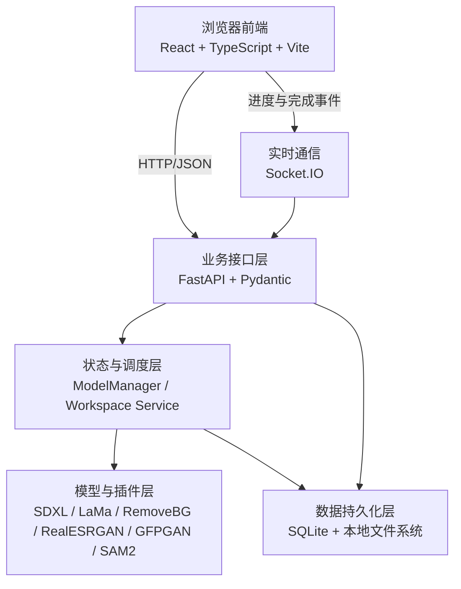

图 4.1 系统架构设计图

## 4.2 系统功能模块整体设计

系统从功能上可分为创作生成模块、编辑类模块、非编辑类模块、工作区模块和通用支撑模块五部分。

创作生成模块以文生图为核心，负责根据提示词完成图像生成；编辑类模块包括 AI擦除、AI扩图、AI重绘和智能选区，主要围绕当前画布图像展开局部交互式处理；非编辑类模块包括去背景、超分辨率和修复人脸，主要依赖插件执行整体图像增强；工作区模块负责对用户创作进度进行保存、恢复与管理；通用支撑模块则负责登录鉴权、模型切换、进度反馈和结果下载等基础能力。

这些模块在系统中并不是彼此独立的，而是以统一工作图像和全局状态为纽带相互连接。文生图结果可以自动衔接到其他七项功能，去背景、超分辨率和修复人脸的处理结果也可以回流到编辑类模块继续处理，从而形成连续的多阶段创作链路。

## 4.3 系统功能模块详细设计

本系统功能模块详细设计围绕创作生成、编辑处理、插件增强、工作区管理和登录支撑五类业务展开。由于不同模块的业务链路和交互方式存在明显差异，下面按照具体功能逐项说明，并使用严格采用 BCE 模式的时序图描述用户、界面、控制器和业务实体之间的协同过程。与传统多页面业务系统不同，本系统多数功能在执行成功后不会跳转到新的成功页面，而是直接在当前界面更新结果状态；执行失败时，系统通常通过当前界面的错误提示消息反馈异常。

### 4.3.1 文生图创作模块设计

文生图创作模块涉及的功能包括参数录入、生成执行、结果展示和后续衔接。由于该模块的核心业务集中在文生图生成环节，本部分在文生图创作模块设计中选择文生图生成功能进行详细描述。

1. 文生图生成：文生图生成是用户从零开始创作图像的核心入口。首先，用户访问文生图界面，并在界面中输入提示词、反向提示词、图像尺寸、采样步数、采样器和随机种子等参数。然后，点击“生成”按钮提交文生图请求。若当前仍存在未保存的图片或工作进度，系统会先弹出确认对话框，由用户选择“保存后生成”或“不保存直接生成”。当用户选择“保存后生成”时，前端会先执行工作区保存；保存成功后，系统重置当前生成会话并进入新的文生图流程，若保存失败则终止本次生成并在当前界面提示错误信息。当用户选择“不保存直接生成”时，系统会直接重置当前生成会话并进入新的文生图流程。若当前无未保存内容，则直接进入生成流程。随后前端调用文生图接口，系统校验模型与参数合法性并执行文生图推理。生成成功后，结果不会跳转到新的成功页面，而是仍显示在当前文生图界面中，写入已生成结果列表并同步更新当前工作图像；生成失败时，前端在当前界面显示错误提示消息。文生图生成序列图如图 4.2 所示。

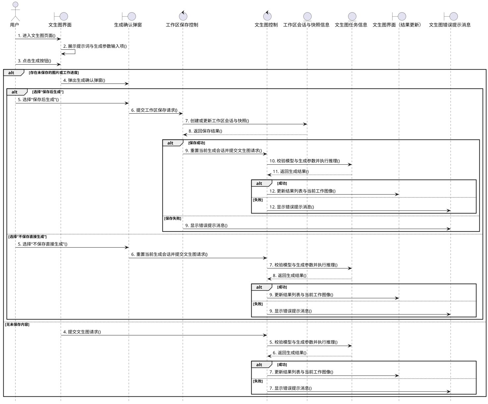

图 4.2 文生图生成序列图

文生图创作模块涉及系统接口控制器（Api）类、图像生成任务（Txt2ImgRequest）类、模型管理器（ModelManager）类、模型信息（ModelInfo）类、扩散修复模型（DiffusionInpaintModel）类和文生图模型（SDXLBase）类，其相关类设计如图 4.3 所示。

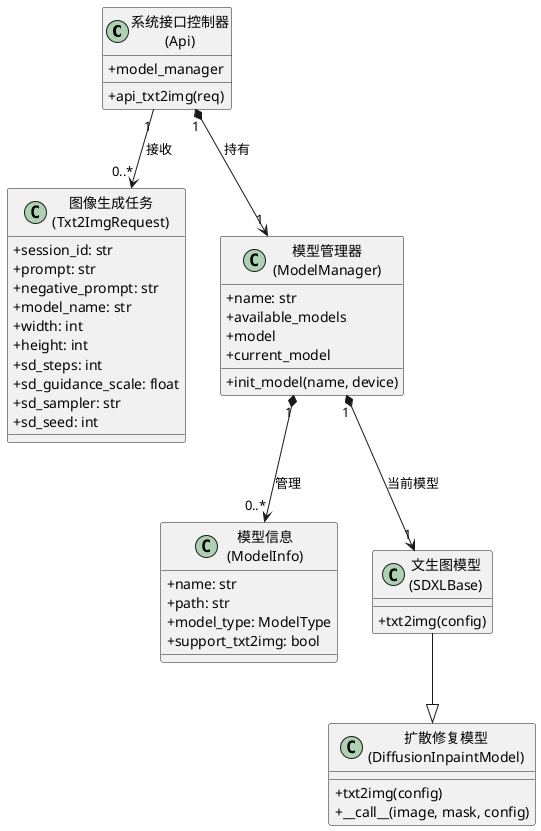

图 4.3 文生图创作模块相关类图

### 4.3.2 AI擦除模块设计

AI擦除模块涉及的功能包括加载当前工作图像、绘制蒙版、提交擦除请求和更新处理结果。由于该模块的核心业务集中在擦除处理环节，本部分在 AI擦除模块设计中选择 AI擦除功能进行详细描述。

1. AI擦除：AI擦除用于移除图像中不需要的局部内容并完成智能补全。首先，用户访问 AI擦除界面，系统在 AI擦除界面中加载当前工作图像。然后，用户在画布中绘制待处理区域的蒙版，并点击执行按钮提交 AI擦除请求。系统校验当前图像、蒙版和相关参数后，调用编辑类接口执行局部修复推理。处理成功后，系统仍停留在当前 AI擦除界面，并直接更新当前画布、图像结果和渲染历史；处理失败时，前端在当前界面显示错误提示消息。AI擦除序列图如图 4.4 所示。

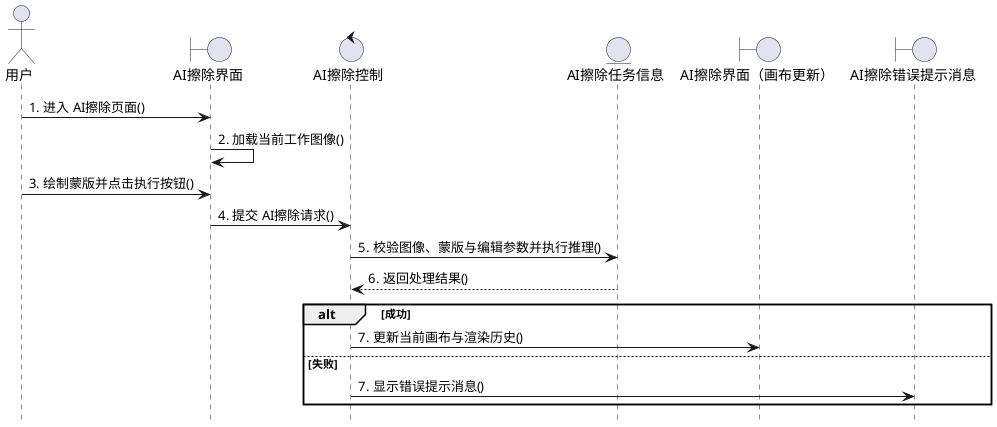

图 4.4 AI擦除序列图

AI擦除模块涉及系统接口控制器（Api）类、图像编辑任务（InpaintRequest）类、模型管理器（ModelManager）类、图像修复模型（InpaintModel）类和扩散修复模型（DiffusionInpaintModel）类，其相关类设计如图 4.5 所示。

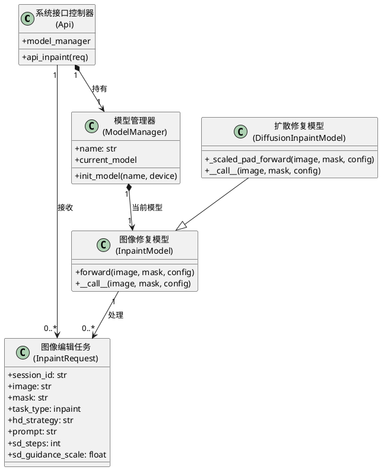

图 4.5 AI擦除模块相关类图

### 4.3.3 AI扩图模块设计

AI扩图模块涉及的功能包括加载原始图像、设置扩展方向与范围、提交扩图请求以及更新扩图结果。由于该模块的核心业务集中在扩图处理环节，本部分在 AI扩图模块设计中选择 AI扩图功能进行详细描述。

1. AI扩图：AI扩图用于在保持原始图像主体内容相对稳定的前提下，对图像边界进行扩展和补全。首先，用户访问 AI扩图界面，系统在 AI扩图界面中加载当前工作图像。然后，用户在界面中设置扩展方向、扩展范围和相关提示词信息，并点击执行按钮提交 AI扩图请求。系统校验扩展区域、图像状态和扩图所需模型可用性后，执行扩图推理。处理成功后，系统仍停留在当前 AI扩图界面，并直接更新当前画布、图像尺寸和渲染历史；处理失败时，前端在当前界面显示错误提示消息。AI扩图序列图如图 4.6 所示。

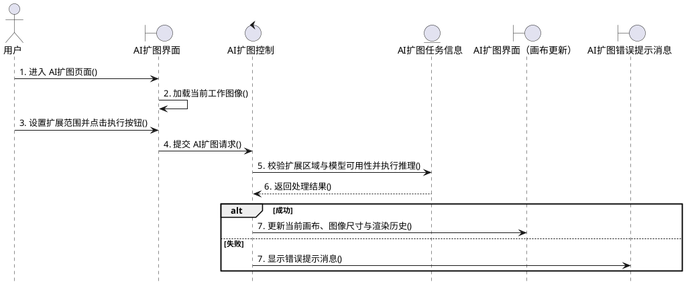

图 4.6 AI扩图序列图

AI扩图模块涉及系统接口控制器（Api）类、扩图任务（InpaintRequest）类、模型管理器（ModelManager）类、图像修复模型（InpaintModel）类和扩散修复模型（DiffusionInpaintModel）类，其相关类设计如图 4.7 所示。

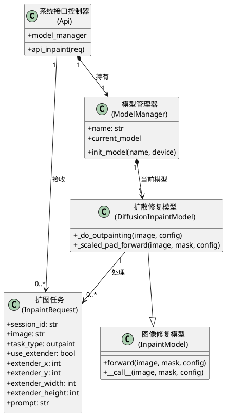

图 4.7 AI扩图模块相关类图

### 4.3.4 AI重绘模块设计

AI重绘模块涉及的功能包括局部区域选定、提示词录入、重绘请求提交和结果替换。由于该模块的核心业务集中在局部重绘处理环节，本部分在 AI重绘模块设计中选择 AI重绘功能进行详细描述。

1. AI重绘：AI重绘用于在局部选区范围内按照新的语义提示重新生成内容。首先，用户访问 AI重绘界面，系统在 AI重绘界面中加载当前工作图像。然后，用户绘制局部蒙版区域，并输入新的重绘提示词和其他参数信息，点击执行按钮提交 AI重绘请求。系统校验当前图像、蒙版和重绘所需模型可用性后，执行局部重绘推理。处理成功后，系统仍停留在当前 AI重绘界面，并直接更新当前画布和渲染历史；处理失败时，前端在当前界面显示错误提示消息。AI重绘序列图如图 4.8 所示。

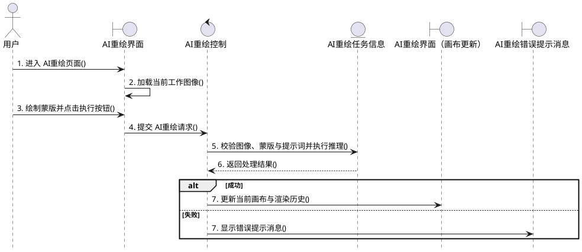

图 4.8 AI重绘序列图

AI重绘模块涉及系统接口控制器（Api）类、重绘任务（InpaintRequest）类、模型管理器（ModelManager）类、图像修复模型（InpaintModel）类和扩散修复模型（DiffusionInpaintModel）类，其相关类设计如图 4.9 所示。

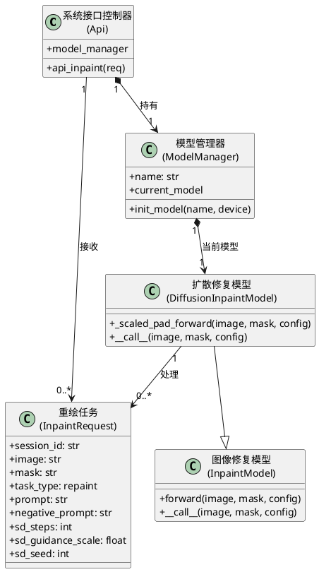

图 4.9 AI重绘模块相关类图

### 4.3.5 去背景模块设计

去背景模块涉及的功能包括当前图像加载、去背景模型选择、插件处理和结果展示。由于该模块的核心业务集中在去背景处理环节，本部分在去背景模块设计中选择去背景功能进行详细描述。

1. 去背景：去背景用于提取图像主体并输出透明背景结果。首先，用户访问去背景界面，系统在当前界面加载工作图像；若当前没有可用图像，则允许用户上传图片作为输入。然后，用户选择去背景模型并点击执行按钮提交去背景请求。系统校验插件和模型信息后，调用 RemoveBG 插件执行主体分离。处理成功后，结果仍显示在当前去背景界面的结果区域中，并同步写入结果历史；处理失败时，前端在当前界面显示错误提示消息。去背景序列图如图 4.10 所示。


图 4.10 去背景序列图

去背景模块涉及系统接口控制器（Api）类、插件处理任务（RunPluginRequest）类、插件基类（BasePlugin）类、去背景插件（RemoveBG）类和去背景模型枚举（RemoveBGModel）类，其相关类设计如图 4.11 所示。

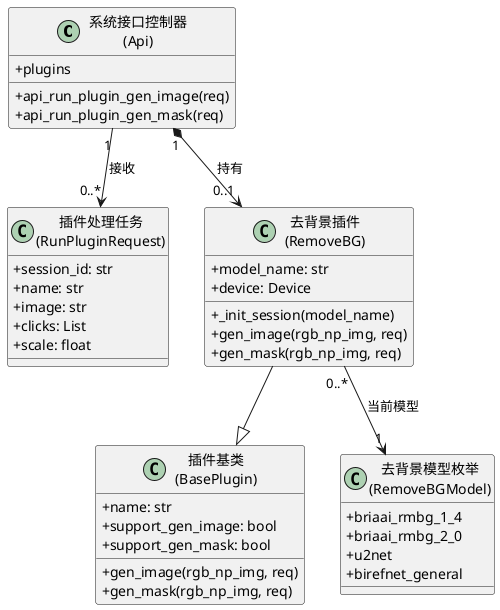

图 4.11 去背景模块相关类图

### 4.3.6 超分辨率模块设计

超分辨率模块涉及的功能包括图像加载、超分模型选择、增强请求提交和增强结果展示。由于该模块的核心业务集中在超分辨率处理环节，本部分在超分辨率模块设计中选择超分辨率功能进行详细描述。

1. 超分辨率：超分辨率用于提升图像清晰度并放大输出尺寸。首先，用户访问超分辨率界面，系统在当前界面加载工作图像；若当前没有可用图像，则允许用户上传图片作为输入。然后，用户选择超分模型并点击执行按钮提交超分请求。系统校验插件和模型信息后，以预设放大倍率调用 Real-ESRGAN 插件执行图像增强。处理成功后，结果仍显示在当前超分辨率界面的结果区域中，并同步写入结果历史；处理失败时，前端在当前界面显示错误提示消息。超分辨率序列图如图 4.12 所示。

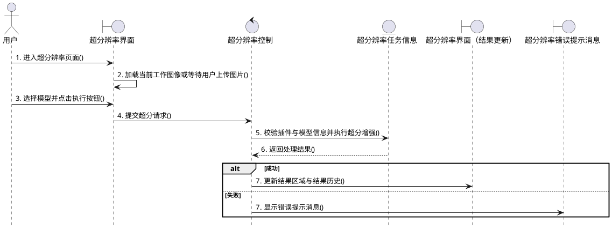

图 4.12 超分辨率序列图

超分辨率模块涉及系统接口控制器（Api）类、插件处理任务（RunPluginRequest）类、插件基类（BasePlugin）类、超分插件（RealESRGANUpscaler）类和超分模型枚举（RealESRGANModel）类，其相关类设计如图 4.13 所示。

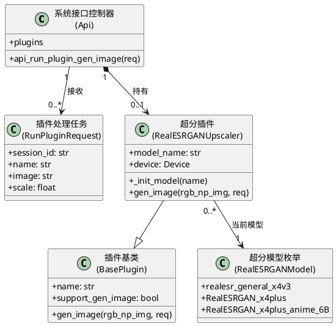

图 4.13 超分辨率模块相关类图

### 4.3.7 修复人脸模块设计

修复人脸模块涉及的功能包括当前图像加载、修复插件选择、修复请求提交和结果回写。由于该模块的核心业务集中在修复人脸处理环节，本部分在修复人脸模块设计中选择修复人脸功能进行详细描述。

1. 修复人脸：修复人脸用于改善图像中人物面部细节失真问题。首先，用户访问修复人脸界面，系统在当前界面加载工作图像；若当前没有可用图像，则允许用户上传图片作为输入。然后，用户点击 GFPGAN 或 RestoreFormer 对应按钮提交人脸修复请求。系统校验可用插件信息后，调用对应的人脸修复插件执行增强处理。处理成功后，结果仍显示在当前修复人脸界面的结果区域中，并同步写入结果历史；处理失败时，前端在当前界面显示错误提示消息。修复人脸序列图如图 4.14 所示。


图 4.14 修复人脸序列图

修复人脸模块涉及系统接口控制器（Api）类、插件处理任务（RunPluginRequest）类、插件基类（BasePlugin）类、GFPGAN 插件（GFPGANPlugin）类、RestoreFormer 插件（RestoreFormerPlugin）类和超分插件（RealESRGANUpscaler）类，其相关类设计如图 4.15 所示。

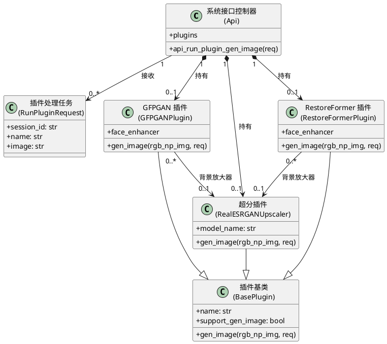

图 4.15 修复人脸模块相关类图

### 4.3.8 智能选区模块设计

智能选区模块涉及的功能包括当前图像加载、前景点与背景点标注、分割请求提交和选区确认。由于该模块的核心业务集中在选区生成环节，本部分在智能选区模块设计中选择智能选区功能进行详细描述。

1. 智能选区：智能选区用于通过点击交互方式快速生成候选蒙版区域。首先，用户访问智能选区界面，系统在智能选区界面中加载当前工作图像并开启点击交互。然后，用户在图像中点击前景点和背景点，前端将点击点信息发送给交互式分割插件。系统返回候选蒙版后，前端先在当前界面更新候选选区预览；用户确认结果可用后，再点击接受按钮将候选蒙版写入当前编辑状态。若插件执行失败，则前端在当前界面显示错误提示消息。智能选区序列图如图 4.16 所示。

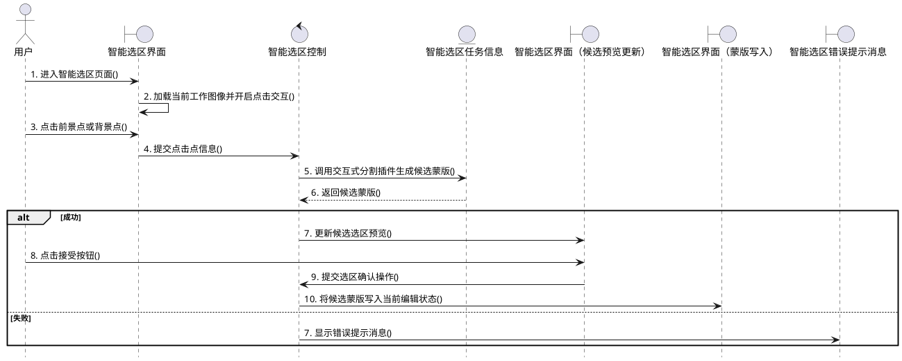

图 4.16 智能选区序列图

智能选区模块涉及系统接口控制器（Api）类、插件处理任务（RunPluginRequest）类、插件基类（BasePlugin）类、交互分割插件（InteractiveSeg）类和交互分割模型枚举（InteractiveSegModel）类，其相关类设计如图 4.17 所示。

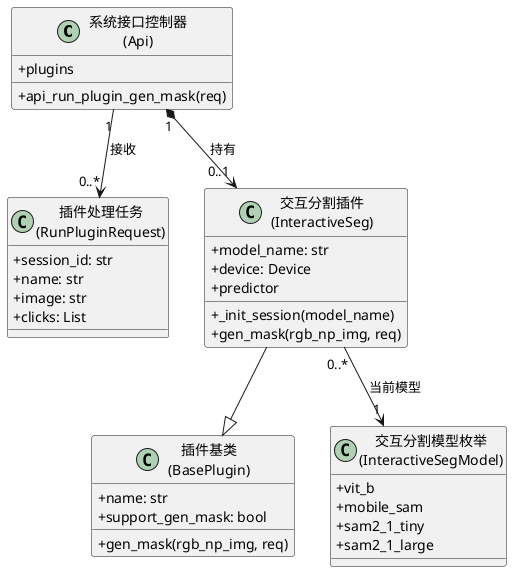

图 4.17 智能选区模块相关类图

### 4.3.9 用户工作区模块设计

用户工作区模块涉及的功能包括查看工作区列表、保存工作区、恢复工作区和删除工作区。由于用户工作区模块涉及到的功能较多，此部分在用户工作区模块设计中选择查看工作区列表、保存工作区、恢复工作区和删除工作区功能进行详细描述。

1. 查看工作区列表：查看工作区列表是用户管理个人创作记录的基础功能。首先，用户访问“我的作品”界面。然后，前端会自动向后端发起工作区列表加载请求。系统校验当前用户身份后，查询该用户对应的工作区记录并返回列表结果。加载成功后，系统在当前“我的作品”界面更新工作区列表；若列表加载失败，当前界面不会跳转到新的失败页面，而是结束加载并保持原有页面状态。查看工作区列表序列图如图 4.18 所示。

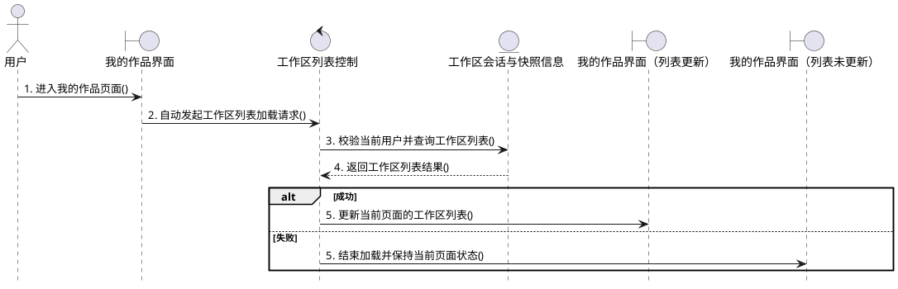

图 4.18 工作区列表查询序列图

2. 保存工作区：保存工作区用于持久化保存用户当前的图片、参数和处理状态。首先，用户在任意功能页完成生成或编辑后点击顶栏保存按钮。然后，前端整理当前标签页、主图、蒙版、预览图和各功能参数状态，并向后端提交工作区保存信息。系统创建或更新工作区会话、快照和资源文件后返回最新会话信息。保存成功后，系统仍停留在当前功能界面，仅更新当前会话编号和未保存标记，并通过提示消息反馈保存完成；同时，前端会刷新“我的作品”列表数据。保存失败时，前端在当前界面显示错误提示消息。保存工作区序列图如图 4.19 所示。

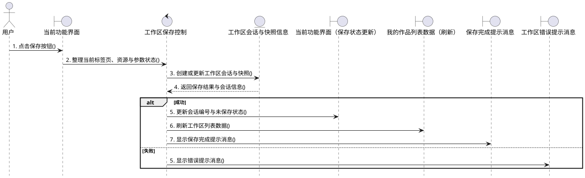

图 4.19 工作区保存序列图

3. 恢复工作区：恢复工作区用于把历史创作记录重新加载到当前编辑现场。首先，用户访问“我的作品”界面并选择需要恢复的工作区记录。然后，点击继续编辑按钮提交工作区恢复请求。系统读取对应工作区的快照、资源和功能状态信息后，将结果返回给前端。恢复成功后，前端会重建本地状态并切换到对应的目标功能页继续创作；恢复失败时，前端在当前界面显示错误提示消息。恢复工作区序列图如图 4.20 所示。

```plantuml
@startuml
hide footbox
actor 用户
boundary "我的作品界面" as B11
control "工作区恢复控制" as C11
entity "工作区会话与快照信息" as E11
boundary "目标功能界面（状态恢复）" as BS11
boundary "工作区错误提示消息" as BF11

用户 -> B11 : 1. 选择工作区并点击继续编辑()
B11 -> C11 : 2. 提交工作区恢复请求()
C11 -> E11 : 3. 读取工作区快照、资源与功能状态()
E11 --> C11 : 4. 返回恢复所需数据()
alt 成功
  C11 -> BS11 : 5. 重建前端状态并切换到目标功能页()
else 失败
  C11 -> BF11 : 5. 显示错误提示消息()
end
@enduml
```

图 4.20 工作区恢复序列图

4. 删除工作区：删除工作区用于清理用户不再需要的工作区记录。首先，用户访问“我的作品”界面并选择需要删除的工作区记录。然后，点击删除按钮提交工作区删除请求。系统校验工作区记录信息后，对对应工作区执行软删除处理。删除成功后，系统不会跳转到新的成功页面，而是在当前“我的作品”界面同步更新列表和详情状态；删除失败时，前端在当前界面显示错误提示消息。删除工作区序列图如图 4.21 所示。

```plantuml
@startuml
hide footbox
actor 用户
boundary "我的作品界面" as B12
control "工作区删除控制" as C12
entity "工作区会话与快照信息" as E12
boundary "我的作品界面（列表更新）" as BS12
boundary "工作区错误提示消息" as BF12

用户 -> B12 : 1. 选择工作区并点击删除按钮()
B12 -> C12 : 2. 提交工作区删除请求()
C12 -> E12 : 3. 校验记录信息并执行软删除()
E12 --> C12 : 4. 返回删除结果()
alt 成功
  C12 -> BS12 : 5. 更新当前页面的列表与详情状态()
else 失败
  C12 -> BF12 : 5. 显示错误提示消息()
end
@enduml
```

图 4.21 工作区删除序列图

用户工作区模块涉及用户（User）类、工作区会话（WorkspaceSession）类、会话快照（SessionSnapshot）类、功能状态（SessionFeatureState）类、资源（Asset）类、资源文件（AssetFile）类、操作记录（OperationRun）类、操作资源关联（OperationRunAsset）类和活动事件（ActivityEvent）类，其相关类设计如图 4.22 所示。

```plantuml
@startuml
skinparam classAttributeIconSize 0

class "用户\n(User)" as User {
  +id: str
  +username: str
  +email: str
  +created_at: datetime
  +last_login: datetime
}

class "工作区会话\n(WorkspaceSession)" as WorkspaceSession {
  +id: str
  +user_id: str
  +title: str
  +status: str
  +source_feature: str
  +current_feature: str
  +updated_at: datetime
}

class "会话快照\n(SessionSnapshot)" as SessionSnapshot {
  +id: str
  +session_id: str
  +active_tab: str
  +primary_asset_id: str
  +mask_asset_id: str
  +preview_asset_id: str
}

class "功能状态\n(SessionFeatureState)" as SessionFeatureState {
  +id: str
  +session_id: str
  +feature_key: str
  +state_json: str
}

class "资源\n(Asset)" as Asset {
  +id: str
  +user_id: str
  +session_id: str
  +kind: str
  +origin_feature: str
  +mime_type: str
}

class "资源文件\n(AssetFile)" as AssetFile {
  +id: str
  +asset_id: str
  +role: str
  +filename: str
  +storage_path: str
}

class "操作记录\n(OperationRun)" as OperationRun {
  +id: str
  +session_id: str
  +feature: str
  +operation: str
  +status: str
  +duration_ms: int
}

class "操作资源关联\n(OperationRunAsset)" as OperationRunAsset {
  +id: str
  +operation_run_id: str
  +asset_id: str
  +role: str
}

class "活动事件\n(ActivityEvent)" as ActivityEvent {
  +id: str
  +user_id: str
  +session_id: str
  +event_type: str
  +feature: str
}

User "1" *--> "0..*" WorkspaceSession : 拥有
User "1" *--> "0..*" Asset : 拥有
User "1" *--> "0..*" OperationRun : 产生
User "1" *--> "0..*" ActivityEvent : 触发
WorkspaceSession "1" *--> "0..*" SessionSnapshot : 包含
WorkspaceSession "1" *--> "0..*" SessionFeatureState : 保存
WorkspaceSession "0..1" --> "0..*" Asset : 关联
WorkspaceSession "0..1" --> "0..*" OperationRun : 记录
WorkspaceSession "0..1" --> "0..*" ActivityEvent : 记录
Asset "1" *--> "0..*" AssetFile : 包含
OperationRun "1" *--> "0..*" OperationRunAsset : 包含
Asset "1" --> "0..*" OperationRunAsset : 被引用
@enduml
```

图 4.22 用户工作区模块相关类图

### 4.3.10 登录支撑模块设计

登录支撑模块是通用支撑能力中的关键组成部分。通用支撑模块涉及登录鉴权、进度提示、任务取消和结果下载等功能。由于通用支撑模块涉及到的功能较多，此部分在登录支撑模块设计中选择登录功能进行详细描述。

1. 登录：登录是用户正常访问和操作系统的前提条件。用户只有在成功登录系统后，才能够继续使用文生图、图像编辑和工作区管理等相关业务功能。首先，用户访问登录界面，并在登录界面中输入用户名与密码。然后，点击登录按钮提交登录信息。系统校验用户名和密码后生成访问令牌，并继续拉取当前用户信息与工作区列表。登录成功后，前端不会停留在独立的成功页面，而是直接进入系统主界面，默认显示文生图 Tab；登录失败时，前端在当前界面显示错误提示消息。登录序列图如图 4.23 所示。

```plantuml
@startuml
hide footbox
actor 用户
boundary "登录界面" as B13
control "登录控制" as C13
entity "用户信息" as E13
boundary "系统主界面（文生图Tab）" as BS13
boundary "登录错误提示消息" as BF13

用户 -> B13 : 1. 进入登录页面()
B13 -> B13 : 2. 展示用户名与密码输入项()
用户 -> B13 : 3. 提交登录信息()
B13 -> C13 : 4. 发起登录请求()
C13 -> E13 : 5. 校验用户名密码并生成访问令牌()
E13 --> C13 : 6. 返回登录结果与令牌()
alt 成功
  C13 -> E13 : 7. 读取当前用户信息与工作区列表()
  E13 --> C13 : 8. 返回登录所需状态数据()
  C13 -> BS13 : 9. 进入系统主界面（默认文生图 Tab）()
else 失败
  C13 -> BF13 : 7. 显示错误提示消息()
end
@enduml
```

图 4.23 登录序列图

登录支撑模块涉及系统接口控制器（Api）类、登录请求（UserLogin）类、用户（User）类、登录令牌（TokenResponse）类和活动事件（ActivityEvent）类，其相关类设计如图 4.24 所示。

```plantuml
@startuml
skinparam classAttributeIconSize 0

class "系统接口控制器\n(Api)" as Api {
  +api_login(req)
  +api_me()
}

class "登录请求\n(UserLogin)" as UserLogin {
  +username: str
  +password: str
}

class "用户\n(User)" as User {
  +id: str
  +username: str
  +email: str
  +hashed_password: str
  +last_login: datetime
}

class "登录令牌\n(TokenResponse)" as TokenResponse {
  +access_token: str
  +token_type: str
}

class "活动事件\n(ActivityEvent)" as ActivityEvent {
  +id: str
  +user_id: str
  +event_type: str
  +feature: str
  +created_at: datetime
}

Api "1" --> "0..*" UserLogin : 接收
Api "1" --> "0..*" User : 校验
Api "1" --> "0..*" TokenResponse : 返回
Api "1" --> "0..*" ActivityEvent : 记录
User "1" *--> "0..*" ActivityEvent : 触发
@enduml
```

图 4.24 登录支撑模块相关类图

## 4.4 接口设计

本系统采用前后端分离架构，接口设计以 RESTful 风格为主，长耗时图像任务通过 HTTP 接口发起，并结合 Socket.IO 推送进度与完成事件。除注册、登录等认证接口外，当前系统主要业务接口均在登录后由前端携带 `Authorization: Bearer 访问令牌` 请求头访问。与传统文件上传型系统不同，本系统多数图像处理接口使用 `application/json` 承载请求数据，图像内容以 Base64 Data URL 的形式封装在 JSON 字段中，以支持文生图、编辑类功能、插件类功能和工作区之间的统一衔接。

### 4.4.1 创作型模块接口设计

文生图模块涉及的接口主要包括文生图生成接口。该模块的核心业务集中在根据提示词生成图像，因此本节选择文生图生成接口进行描述。

1. 文生图接口
   接口说明：用户在“文生图”Tab 中输入提示词、模型和采样参数后，通过该接口生成新的图像结果。
   请求方法：POST。
   请求路径：`/api/v1/txt2img`。
   请求参数：请求体数据结构如表 4.1 所示。

表 4.1 文生图接口请求体数据结构表

| 属性 | 类型 | 说明 |
| --- | --- | --- |
| `session_id` | String | 当前工作区会话编号，可为空 |
| `prompt` | String | 正向提示词，描述生成内容，非空 |
| `negative_prompt` | String | 反向提示词，可为空 |
| `model_name` | String | 指定的文生图模型名称，可为空 |
| `width` | Integer | 输出图像宽度，取值范围为 64 到 2048 |
| `height` | Integer | 输出图像高度，取值范围为 64 到 2048 |
| `sd_steps` | Integer | 扩散采样步数 |
| `sd_guidance_scale` | Float | 文本引导强度 |
| `sd_sampler` | String | 采样器名称 |
| `sd_seed` | Integer | 随机种子，取值为 `-1` 时表示自动生成随机种子 |
| `sd_lcm_lora` | Boolean | 是否启用 LCM-LoRA 加速 |

   响应参数：请求成功状态下，响应体及关键响应头字段数据结构如表 4.2 所示。

表 4.2 文生图接口响应参数数据结构表

| 属性 | 类型 | 说明 |
| --- | --- | --- |
| `响应体` | Binary | 生成成功后返回 PNG 图像二进制数据 |
| `X-Seed` | String | 本次生成实际使用的随机种子 |

   补充说明：该接口在用户主动取消生成任务时返回 `409`；在指定模型不存在或当前模型不支持文生图时返回 `422`。

### 4.4.2 编辑类模块接口设计

编辑类模块涉及的接口包括 AI擦除接口、AI扩图接口、AI重绘接口和智能选区接口。其中，AI擦除、AI扩图和 AI重绘共用 `POST /api/v1/inpaint` 入口，智能选区则通过 `POST /api/v1/run_plugin_gen_mask` 接口生成候选蒙版。由于各功能在业务语义和关键参数上存在差异，本节分别进行描述。

1. AI擦除接口
   接口说明：用户在 AI擦除页面提交原图与蒙版后，系统对蒙版区域执行局部修复，返回擦除后的图像结果。
   请求方法：POST。
   请求路径：`/api/v1/inpaint`。
   请求参数：请求体数据结构如表 4.3 所示。

表 4.3 AI擦除接口请求体数据结构表

| 属性 | 类型 | 说明 |
| --- | --- | --- |
| `session_id` | String | 当前工作区会话编号，可为空 |
| `image` | String | Base64 编码的原始图像数据 |
| `mask` | String | Base64 编码的蒙版图像数据 |
| `task_type` | String | 任务类型，固定为 `inpaint` |
| `prompt` | String | 提示词，扩散模型场景下可用 |
| `negative_prompt` | String | 反向提示词 |
| `use_croper` | Boolean | 是否启用局部裁剪处理 |
| `croper_x` | Integer | 裁剪区域左上角横坐标 |
| `croper_y` | Integer | 裁剪区域左上角纵坐标 |
| `croper_width` | Integer | 裁剪区域宽度 |
| `croper_height` | Integer | 裁剪区域高度 |
| `sd_steps` | Integer | 扩散采样步数 |
| `sd_guidance_scale` | Float | 文本引导强度 |
| `sd_seed` | Integer | 随机种子，取值为 `-1` 时表示自动生成 |
| `enable_controlnet` | Boolean | 是否启用 ControlNet |
| `enable_brushnet` | Boolean | 是否启用 BrushNet |
| `enable_powerpaint_v2` | Boolean | 是否启用 PowerPaint V2 |

   响应参数：请求成功状态下，响应体及关键响应头字段数据结构如表 4.4 所示。

表 4.4 AI擦除接口响应参数数据结构表

| 属性 | 类型 | 说明 |
| --- | --- | --- |
| `响应体` | Binary | 返回擦除后的图像二进制数据，媒体类型为 `image/{ext}` |
| `X-Seed` | String | 本次处理实际使用的随机种子 |

   补充说明：当原图与蒙版尺寸不一致时接口返回 `400`；当任务类型非法或所需模型不可用时返回 `422`；用户主动取消任务时返回 `409`。

2. AI扩图接口
   接口说明：用户在 AI扩图页面提交原图、扩展范围与相关参数后，系统对图像边界进行补全并返回扩图结果。
   请求方法：POST。
   请求路径：`/api/v1/inpaint`。
   请求参数：请求体数据结构如表 4.5 所示。

表 4.5 AI扩图接口请求体数据结构表

| 属性 | 类型 | 说明 |
| --- | --- | --- |
| `session_id` | String | 当前工作区会话编号，可为空 |
| `image` | String | Base64 编码的原始图像数据 |
| `mask` | String | Base64 编码的蒙版图像数据 |
| `task_type` | String | 任务类型，固定为 `outpaint` |
| `use_extender` | Boolean | 是否启用扩图扩展区域，通常为 `true` |
| `extender_x` | Integer | 扩展区域左上角横坐标 |
| `extender_y` | Integer | 扩展区域左上角纵坐标 |
| `extender_width` | Integer | 扩展区域宽度 |
| `extender_height` | Integer | 扩展区域高度 |
| `sd_steps` | Integer | 扩散采样步数 |
| `sd_seed` | Integer | 随机种子，取值为 `-1` 时表示自动生成 |
| `enable_controlnet` | Boolean | 是否启用 ControlNet |
| `enable_brushnet` | Boolean | 是否启用 BrushNet |
| `enable_powerpaint_v2` | Boolean | 是否启用 PowerPaint V2 |

   响应参数：请求成功状态下，响应体及关键响应头字段数据结构如表 4.6 所示。

表 4.6 AI扩图接口响应参数数据结构表

| 属性 | 类型 | 说明 |
| --- | --- | --- |
| `响应体` | Binary | 返回扩图后的图像二进制数据，媒体类型为 `image/{ext}` |
| `X-Seed` | String | 本次处理实际使用的随机种子 |

   补充说明：当当前模型不支持扩图或扩图任务所需模型不可用时接口返回 `422`；用户主动取消任务时返回 `409`。

3. AI重绘接口
   接口说明：用户在 AI重绘页面提交原图、蒙版和新的提示词后，系统在指定区域内重新生成内容并返回重绘结果。
   请求方法：POST。
   请求路径：`/api/v1/inpaint`。
   请求参数：请求体数据结构如表 4.7 所示。

表 4.7 AI重绘接口请求体数据结构表

| 属性 | 类型 | 说明 |
| --- | --- | --- |
| `session_id` | String | 当前工作区会话编号，可为空 |
| `image` | String | Base64 编码的原始图像数据 |
| `mask` | String | Base64 编码的蒙版图像数据 |
| `task_type` | String | 任务类型，固定为 `repaint` |
| `prompt` | String | 重绘提示词 |
| `negative_prompt` | String | 反向提示词 |
| `use_croper` | Boolean | 是否启用局部裁剪处理 |
| `croper_x` | Integer | 裁剪区域左上角横坐标 |
| `croper_y` | Integer | 裁剪区域左上角纵坐标 |
| `croper_width` | Integer | 裁剪区域宽度 |
| `croper_height` | Integer | 裁剪区域高度 |
| `sd_steps` | Integer | 扩散采样步数 |
| `sd_guidance_scale` | Float | 文本引导强度 |
| `sd_seed` | Integer | 随机种子，取值为 `-1` 时表示自动生成 |
| `enable_controlnet` | Boolean | 是否启用 ControlNet |
| `enable_brushnet` | Boolean | 是否启用 BrushNet |
| `enable_powerpaint_v2` | Boolean | 是否启用 PowerPaint V2 |

   响应参数：请求成功状态下，响应体及关键响应头字段数据结构如表 4.8 所示。

表 4.8 AI重绘接口响应参数数据结构表

| 属性 | 类型 | 说明 |
| --- | --- | --- |
| `响应体` | Binary | 返回重绘后的图像二进制数据，媒体类型为 `image/{ext}` |
| `X-Seed` | String | 本次处理实际使用的随机种子 |

   补充说明：当任务类型非法、模型不支持该任务或所需模型不可用时接口返回 `422`；用户主动取消任务时返回 `409`。

4. 智能选区接口
   接口说明：用户在智能选区页面点击前景点和背景点后，通过该接口生成候选蒙版结果，并在前端写回编辑状态。
   请求方法：POST。
   请求路径：`/api/v1/run_plugin_gen_mask`。
   请求参数：请求体数据结构如表 4.9 所示。

表 4.9 智能选区接口请求体数据结构表

| 属性 | 类型 | 说明 |
| --- | --- | --- |
| `session_id` | String | 当前工作区会话编号，可为空 |
| `name` | String | 插件名称，当前功能中固定为 `InteractiveSeg` |
| `image` | String | Base64 编码的原始图像数据 |
| `clicks` | Array | 点击点集合，元素格式为 `[x, y, 前景或背景标记]` |

   响应参数：请求成功状态下，响应体数据结构如表 4.10 所示。

表 4.10 智能选区接口响应参数数据结构表

| 属性 | 类型 | 说明 |
| --- | --- | --- |
| `响应体` | Binary | 返回候选蒙版 PNG 图像二进制数据 |

   补充说明：当插件不存在或插件不支持蒙版输出时接口返回 `422`。

### 4.4.3 非编辑类模块接口设计

非编辑类模块涉及的接口包括去背景接口、超分辨率接口和修复人脸接口。三项功能均通过 `POST /api/v1/run_plugin_gen_image` 完成处理，但不同功能依赖的插件名称与参数存在差异，因此本节分别进行描述。对于去背景与超分辨率功能，当前系统还提供 `POST /api/v1/switch_plugin_model` 用于切换插件模型，但该接口仅承担模型切换职责，本节不再展开。

1. 去背景接口
   接口说明：用户在去背景页面提交当前图像后，系统调用 RemoveBG 插件去除背景并返回透明背景图像。
   请求方法：POST。
   请求路径：`/api/v1/run_plugin_gen_image`。
   请求参数：请求体数据结构如表 4.11 所示。

表 4.11 去背景接口请求体数据结构表

| 属性 | 类型 | 说明 |
| --- | --- | --- |
| `session_id` | String | 当前工作区会话编号，可为空 |
| `name` | String | 插件名称，固定为 `RemoveBG` |
| `image` | String | Base64 编码的输入图像数据 |

   响应参数：请求成功状态下，响应体数据结构如表 4.12 所示。

表 4.12 去背景接口响应参数数据结构表

| 属性 | 类型 | 说明 |
| --- | --- | --- |
| `响应体` | Binary | 返回去背景后的 PNG 图像二进制数据 |

   补充说明：当插件不存在或插件不支持图像输出时接口返回 `422`。

2. 超分辨率接口
   接口说明：用户在超分辨率页面提交当前图像并指定放大倍率后，系统调用 RealESRGAN 插件返回增强后的高分辨率图像。
   请求方法：POST。
   请求路径：`/api/v1/run_plugin_gen_image`。
   请求参数：请求体数据结构如表 4.13 所示。

表 4.13 超分辨率接口请求体数据结构表

| 属性 | 类型 | 说明 |
| --- | --- | --- |
| `session_id` | String | 当前工作区会话编号，可为空 |
| `name` | String | 插件名称，固定为 `RealESRGAN` |
| `image` | String | Base64 编码的输入图像数据 |
| `scale` | Float | 图像放大倍数 |

   响应参数：请求成功状态下，响应体数据结构如表 4.14 所示。

表 4.14 超分辨率接口响应参数数据结构表

| 属性 | 类型 | 说明 |
| --- | --- | --- |
| `响应体` | Binary | 返回超分辨率处理后的 PNG 图像二进制数据 |

   补充说明：当插件不存在或插件不支持图像输出时接口返回 `422`。

3. 修复人脸接口
   接口说明：用户在修复人脸页面提交当前图像后，系统调用 GFPGAN 或 RestoreFormer 插件增强人脸区域并返回处理结果。
   请求方法：POST。
   请求路径：`/api/v1/run_plugin_gen_image`。
   请求参数：请求体数据结构如表 4.15 所示。

表 4.15 修复人脸接口请求体数据结构表

| 属性 | 类型 | 说明 |
| --- | --- | --- |
| `session_id` | String | 当前工作区会话编号，可为空 |
| `name` | String | 插件名称，可取 `GFPGAN` 或 `RestoreFormer` |
| `image` | String | Base64 编码的输入图像数据 |

   响应参数：请求成功状态下，响应体数据结构如表 4.16 所示。

表 4.16 修复人脸接口响应参数数据结构表

| 属性 | 类型 | 说明 |
| --- | --- | --- |
| `响应体` | Binary | 返回修复人脸后的 PNG 图像二进制数据 |

   补充说明：当插件不存在或插件不支持图像输出时接口返回 `422`。

### 4.4.4 工作区模块接口设计

工作区模块涉及的接口包括保存工作区接口、获取工作区接口、恢复工作区接口和删除工作区接口。当前系统还提供工作区导入接口和工作区操作记录查询接口，但由于本节重点描述核心工作流，因此不再展开。

1. 保存工作区接口
   接口说明：用户在任意功能页完成生成或编辑后，可通过该接口保存当前工作区会话、快照、功能状态和关联资源。
   请求方法：POST。
   请求路径：`/api/v1/workspaces/save`。
   请求参数：请求体数据结构如表 4.17 所示。

表 4.17 保存工作区接口请求体数据结构表

| 属性 | 类型 | 说明 |
| --- | --- | --- |
| `session_id` | String | 工作区会话编号，可为空；为空时表示新建会话 |
| `title` | String | 工作区标题，可为空 |
| `active_tab` | String | 当前激活的功能页标识 |
| `settings_by_feature` | Object | 各功能页独立保存的参数状态集合 |
| `workspace_state` | Object | 当前工作区整体状态数据 |
| `assets` | Array | 当前工作区资源列表，数组元素包含 `role`、`kind`、`data`、`filename`、`label`、`mime_type`、`width`、`height` 和 `metadata` 等字段 |

   响应参数：请求成功状态下，响应体数据结构如表 4.18 所示。

表 4.18 保存工作区接口响应参数数据结构表

| 属性 | 类型 | 说明 |
| --- | --- | --- |
| `session` | Object | 当前工作区会话摘要信息 |
| `latest_snapshot` | Object | 最新保存生成的工作区快照信息，可为空 |
| `feature_states` | Object | 按功能页划分的状态映射 |
| `operations` | Array | 当前工作区最近操作记录列表 |

2. 获取工作区接口
   接口说明：用户在“我的作品”页面中，可通过该模块完成工作区列表获取和指定工作区详情获取。

   工作区列表获取：
   请求方法：GET。
   请求路径：`/api/v1/workspaces`。
   请求参数：查询参数数据结构如表 4.19 所示。

表 4.19 获取工作区列表接口请求参数数据结构表

| 属性 | 类型 | 说明 |
| --- | --- | --- |
| `search` | String | 工作区标题模糊查询条件，可为空 |
| `feature` | String | 按功能来源筛选工作区的条件，可为空 |

   响应参数：请求成功状态下，响应体为工作区摘要数组，其数组元素数据结构如表 4.20 所示。

表 4.20 获取工作区列表接口响应参数数据结构表

| 属性 | 类型 | 说明 |
| --- | --- | --- |
| `id` | String | 工作区会话编号 |
| `title` | String | 工作区标题 |
| `status` | String | 工作区当前状态 |
| `source_feature` | String | 工作区来源功能标识 |
| `current_feature` | String | 工作区当前功能标识 |
| `current_snapshot_id` | String | 当前快照编号，可为空 |
| `primary_asset_id` | String | 当前主图资源编号，可为空 |
| `preview_asset_id` | String | 当前预览图资源编号，可为空 |
| `last_operation_id` | String | 最近一次操作记录编号，可为空 |
| `last_operation` | Object | 最近一次操作记录摘要，可为空 |
| `created_at` | String | 工作区创建时间 |
| `updated_at` | String | 工作区更新时间 |

   工作区详情获取：
   请求方法：GET。
   请求路径：`/api/v1/workspaces/{session_id}`。
   请求参数：路径参数数据结构如表 4.21 所示。

表 4.21 获取工作区详情接口请求参数数据结构表

| 属性 | 类型 | 说明 |
| --- | --- | --- |
| `session_id` | String | 目标工作区会话编号，非空 |

   响应参数：请求成功状态下，响应体数据结构如表 4.22 所示。

表 4.22 获取工作区详情接口响应参数数据结构表

| 属性 | 类型 | 说明 |
| --- | --- | --- |
| `session` | Object | 工作区会话摘要信息 |
| `latest_snapshot` | Object | 当前工作区最新快照信息，可为空 |
| `feature_states` | Object | 按功能页划分的状态映射 |
| `operations` | Array | 当前工作区操作记录列表 |

3. 恢复工作区接口
   接口说明：用户选择历史工作区继续编辑时，通过该接口恢复快照、功能状态与相关资源。
   请求方法：POST。
   请求路径：`/api/v1/workspaces/{session_id}/resume`。
   请求参数：路径参数数据结构如表 4.23 所示。

表 4.23 恢复工作区接口请求参数数据结构表

| 属性 | 类型 | 说明 |
| --- | --- | --- |
| `session_id` | String | 目标工作区会话编号，非空 |

   响应参数：请求成功状态下，响应体数据结构如表 4.24 所示。

表 4.24 恢复工作区接口响应参数数据结构表

| 属性 | 类型 | 说明 |
| --- | --- | --- |
| `session` | Object | 工作区会话摘要信息 |
| `snapshot` | Object | 当前恢复使用的工作区快照信息 |
| `feature_states` | Object | 按功能页划分的状态映射 |
| `assets` | Object | 与当前快照相关的资源信息映射 |

   补充说明：当目标工作区没有可恢复的当前快照时接口返回 `404`。

4. 删除工作区接口
   接口说明：用户在“我的作品”页面中删除不再需要的工作区时，通过该接口对工作区执行软删除处理。
   请求方法：DELETE。
   请求路径：`/api/v1/workspaces/{session_id}`。
   请求参数：路径参数数据结构如表 4.25 所示。

表 4.25 删除工作区接口请求参数数据结构表

| 属性 | 类型 | 说明 |
| --- | --- | --- |
| `session_id` | String | 目标工作区会话编号，非空 |

   响应参数：请求成功状态下，响应体数据结构如表 4.26 所示。

表 4.26 删除工作区接口响应参数数据结构表

| 属性 | 类型 | 说明 |
| --- | --- | --- |
| `ok` | Boolean | 删除成功时返回 `true` |

### 4.4.5 登录功能接口设计

系统认证相关接口还包括 `POST /api/v1/auth/register` 和 `GET /api/v1/auth/me`，其中注册接口用于创建新用户，当前用户信息接口用于前端恢复登录态。本节仅对登录接口进行描述。

1. 登录接口
   接口说明：用户在登录页面输入用户名和密码后，通过该接口完成身份认证并获取访问令牌。
   请求方法：POST。
   请求路径：`/api/v1/auth/login`。
   请求参数：请求体数据结构如表 4.27 所示。

表 4.27 登录接口请求体数据结构表

| 属性 | 类型 | 说明 |
| --- | --- | --- |
| `username` | String | 用户名，非空 |
| `password` | String | 用户密码，非空 |

   响应参数：请求成功状态下，响应体数据结构如表 4.28 所示。

表 4.28 登录接口响应参数数据结构表

| 属性 | 类型 | 说明 |
| --- | --- | --- |
| `access_token` | String | 登录成功后返回的访问令牌 |
| `token_type` | String | 令牌类型，当前固定为 `bearer` |

   补充说明：当前系统登录成功后，前端会继续调用 `GET /api/v1/auth/me` 和 `GET /api/v1/workspaces` 恢复当前用户信息与工作区列表；当用户名或密码错误时，该接口返回 `401`。

## 4.5 数据库设计

### 4.5.1 CDM图

结合系统的认证、工作区保存、资源管理和操作记录需求，数据库概念模型共包含以下 9 个核心实体：用户、工作区会话、会话快照、功能状态、资源、资源文件、操作记录、操作资源关联、活动事件。

各实体主要属性如下：

用户：`id`、`username`、`email`、`hashed_password`、`created_at`、`last_login`。

工作区会话：`id`、`user_id`、`title`、`description`、`status`、`source_feature`、`current_feature`、`current_snapshot_id`、`current_asset_id`、`current_mask_asset_id`、`current_preview_asset_id`、`last_operation_id`、`created_at`、`updated_at`、`deleted_at`。

会话快照：`id`、`session_id`、`user_id`、`title`、`active_tab`、`primary_asset_id`、`mask_asset_id`、`preview_asset_id`、`asset_roles_json`、`workspace_state_json`、`created_at`。

功能状态：`id`、`session_id`、`feature_key`、`state_json`、`created_at`、`updated_at`。

资源：`id`、`user_id`、`session_id`、`kind`、`origin_feature`、`label`、`mime_type`、`width`、`height`、`metadata_json`、`created_at`。

资源文件：`id`、`asset_id`、`role`、`filename`、`storage_path`、`file_ext`、`mime_type`、`byte_size`、`sha256`、`width`、`height`、`created_at`。

操作记录：`id`、`user_id`、`session_id`、`feature`、`operation`、`model_name`、`plugin_name`、`status`、`duration_ms`、`request_json`、`response_json`、`error_message`、`started_at`、`finished_at`。

操作资源关联：`id`、`operation_run_id`、`asset_id`、`role`、`created_at`。

活动事件：`id`、`user_id`、`session_id`、`event_type`、`feature`、`detail_json`、`created_at`。

实体关系可概括如下：

1. 一个用户与多个工作区会话、一组资源、多条操作记录、多条活动事件之间均为一对多关系。
2. 一个工作区会话与多个会话快照、多个功能状态、多个资源、多个操作记录、多条活动事件之间均为一对多关系。
3. 一个资源与多个资源文件之间为一对多关系。
4. 操作记录与资源之间通过操作资源关联实体形成多对多关系。

系统 CDM 如图 4.25 所示，对应表示如下。

```mermaid
erDiagram
    User ||--o{ WorkspaceSession : owns
    User ||--o{ Asset : uploads
    User ||--o{ OperationRun : creates
    User ||--o{ ActivityEvent : triggers
    WorkspaceSession ||--o{ SessionSnapshot : contains
    WorkspaceSession ||--o{ SessionFeatureState : stores
    WorkspaceSession ||--o{ Asset : includes
    WorkspaceSession ||--o{ OperationRun : records
    WorkspaceSession ||--o{ ActivityEvent : logs
    Asset ||--o{ AssetFile : has
    OperationRun ||--o{ OperationRunAsset : links
    Asset ||--o{ OperationRunAsset : referenced_by
```

图 4.25 系统 CDM 图

### 4.5.2 数据库表结构设计

本系统使用 SQLite 作为默认数据库，并通过 SQLAlchemy ORM 定义数据模型。本系统共设计有 9 张核心业务表，其分别为：用户表（`users`）、工作区会话表（`workspace_sessions`）、会话快照表（`session_snapshots`）、功能状态表（`session_feature_states`）、资源表（`assets`）、资源文件表（`asset_files`）、操作记录表（`operation_runs`）、操作资源关联表（`operation_run_assets`）、活动事件表（`activity_events`）。各表数据结构如下：

用户表（`users`）：用于存储系统注册用户的基础信息和登录状态，包含用户 ID、用户名、邮箱、密码哈希、创建时间、最近登录时间共计 6 个字段。用户表详细信息如表 4.29 所示。

表 4.29 用户表（users）

| 字段名 | 类型 | 是否为主键 | 是否为空 | 说明 |
| --- | --- | --- | --- | --- |
| `id` | varchar(36) | 是 | 否 | 用户 ID |
| `username` | varchar(64) | 否 | 否 | 用户名 |
| `email` | varchar(255) | 否 | 否 | 用户邮箱 |
| `hashed_password` | varchar(255) | 否 | 否 | 加密后的密码 |
| `created_at` | datetime | 否 | 否 | 创建时间 |
| `last_login` | datetime | 否 | 是 | 最近登录时间 |

工作区会话表（`workspace_sessions`）：用于存储用户工作区的主会话信息，包含会话 ID、所属用户 ID、标题、描述、状态、来源功能、当前功能、当前快照 ID、当前主资源 ID、当前蒙版资源 ID、当前预览资源 ID、最近操作记录 ID、创建时间、更新时间、软删除时间共计 15 个字段。工作区会话表详细信息如表 4.30 所示。

表 4.30 工作区会话表（workspace_sessions）

| 字段名 | 类型 | 是否为主键 | 是否为空 | 说明 |
| --- | --- | --- | --- | --- |
| `id` | varchar(36) | 是 | 否 | 工作区会话 ID |
| `user_id` | varchar(36) | 否 | 否 | 所属用户 ID |
| `title` | varchar(255) | 否 | 否 | 工作区标题 |
| `description` | text | 否 | 是 | 工作区描述 |
| `status` | varchar(32) | 否 | 否 | 工作区状态 |
| `source_feature` | varchar(64) | 否 | 否 | 工作区来源功能标识 |
| `current_feature` | varchar(64) | 否 | 否 | 当前功能标识 |
| `current_snapshot_id` | varchar(36) | 否 | 是 | 当前快照 ID |
| `current_asset_id` | varchar(36) | 否 | 是 | 当前主资源 ID |
| `current_mask_asset_id` | varchar(36) | 否 | 是 | 当前蒙版资源 ID |
| `current_preview_asset_id` | varchar(36) | 否 | 是 | 当前预览资源 ID |
| `last_operation_id` | varchar(36) | 否 | 是 | 最近操作记录 ID |
| `created_at` | datetime | 否 | 否 | 创建时间 |
| `updated_at` | datetime | 否 | 否 | 更新时间 |
| `deleted_at` | datetime | 否 | 是 | 软删除时间 |

会话快照表（`session_snapshots`）：用于存储某次保存时的工作区快照信息，包含快照 ID、所属工作区会话 ID、所属用户 ID、快照标题、激活功能页、主图资源 ID、蒙版资源 ID、预览资源 ID、资源角色映射、工作区状态、创建时间共计 11 个字段。会话快照表详细信息如表 4.31 所示。

表 4.31 会话快照表（session_snapshots）

| 字段名 | 类型 | 是否为主键 | 是否为空 | 说明 |
| --- | --- | --- | --- | --- |
| `id` | varchar(36) | 是 | 否 | 快照 ID |
| `session_id` | varchar(36) | 否 | 否 | 所属工作区会话 ID |
| `user_id` | varchar(36) | 否 | 否 | 所属用户 ID |
| `title` | varchar(255) | 否 | 是 | 快照标题 |
| `active_tab` | varchar(64) | 否 | 否 | 保存时激活的功能页 |
| `primary_asset_id` | varchar(36) | 否 | 是 | 主图资源 ID |
| `mask_asset_id` | varchar(36) | 否 | 是 | 蒙版资源 ID |
| `preview_asset_id` | varchar(36) | 否 | 是 | 预览资源 ID |
| `asset_roles_json` | text | 否 | 否 | 资源角色映射 JSON |
| `workspace_state_json` | text | 否 | 否 | 工作区状态 JSON |
| `created_at` | datetime | 否 | 否 | 创建时间 |

功能状态表（`session_feature_states`）：用于存储各功能页独立保存的参数状态，包含状态 ID、所属工作区会话 ID、功能标识、状态 JSON、创建时间、更新时间共计 6 个字段。功能状态表详细信息如表 4.32 所示。

表 4.32 功能状态表（session_feature_states）

| 字段名 | 类型 | 是否为主键 | 是否为空 | 说明 |
| --- | --- | --- | --- | --- |
| `id` | varchar(36) | 是 | 否 | 功能状态 ID |
| `session_id` | varchar(36) | 否 | 否 | 所属工作区会话 ID |
| `feature_key` | varchar(64) | 否 | 否 | 功能标识 |
| `state_json` | text | 否 | 否 | 功能状态 JSON |
| `created_at` | datetime | 否 | 否 | 创建时间 |
| `updated_at` | datetime | 否 | 否 | 更新时间 |

资源表（`assets`）：用于存储工作区中的图片资源业务信息，包含资源 ID、所属用户 ID、所属工作区会话 ID、资源类型、来源功能、资源标签、MIME 类型、宽度、高度、元数据、创建时间共计 11 个字段。资源表详细信息如表 4.33 所示。

表 4.33 资源表（assets）

| 字段名 | 类型 | 是否为主键 | 是否为空 | 说明 |
| --- | --- | --- | --- | --- |
| `id` | varchar(36) | 是 | 否 | 资源 ID |
| `user_id` | varchar(36) | 否 | 否 | 所属用户 ID |
| `session_id` | varchar(36) | 否 | 是 | 所属工作区会话 ID |
| `kind` | varchar(64) | 否 | 否 | 资源类型 |
| `origin_feature` | varchar(64) | 否 | 是 | 来源功能标识 |
| `label` | varchar(255) | 否 | 是 | 资源标签 |
| `mime_type` | varchar(128) | 否 | 是 | 资源 MIME 类型 |
| `width` | int | 否 | 是 | 图像宽度 |
| `height` | int | 否 | 是 | 图像高度 |
| `metadata_json` | text | 否 | 否 | 资源元数据 JSON |
| `created_at` | datetime | 否 | 否 | 创建时间 |

资源文件表（`asset_files`）：用于存储资源在磁盘上的文件信息，包含文件 ID、所属资源 ID、文件角色、文件名、存储路径、文件扩展名、MIME 类型、文件大小、哈希值、宽度、高度、创建时间共计 12 个字段。资源文件表详细信息如表 4.34 所示。

表 4.34 资源文件表（asset_files）

| 字段名 | 类型 | 是否为主键 | 是否为空 | 说明 |
| --- | --- | --- | --- | --- |
| `id` | varchar(36) | 是 | 否 | 文件 ID |
| `asset_id` | varchar(36) | 否 | 否 | 所属资源 ID |
| `role` | varchar(64) | 否 | 否 | 文件角色 |
| `filename` | varchar(255) | 否 | 否 | 文件名 |
| `storage_path` | varchar(512) | 否 | 否 | 文件存储路径 |
| `file_ext` | varchar(16) | 否 | 是 | 文件扩展名 |
| `mime_type` | varchar(128) | 否 | 是 | 文件 MIME 类型 |
| `byte_size` | int | 否 | 是 | 文件大小（字节） |
| `sha256` | varchar(64) | 否 | 是 | 文件哈希值 |
| `width` | int | 否 | 是 | 图像宽度 |
| `height` | int | 否 | 是 | 图像高度 |
| `created_at` | datetime | 否 | 否 | 创建时间 |

操作记录表（`operation_runs`）：用于存储一次模型推理或插件执行的运行记录，包含操作记录 ID、所属用户 ID、所属工作区会话 ID、功能标识、操作类型、模型名称、插件名称、执行状态、执行耗时、请求摘要、响应摘要、错误信息、开始时间、结束时间共计 14 个字段。操作记录表详细信息如表 4.35 所示。

表 4.35 操作记录表（operation_runs）

| 字段名 | 类型 | 是否为主键 | 是否为空 | 说明 |
| --- | --- | --- | --- | --- |
| `id` | varchar(36) | 是 | 否 | 操作记录 ID |
| `user_id` | varchar(36) | 否 | 否 | 所属用户 ID |
| `session_id` | varchar(36) | 否 | 是 | 所属工作区会话 ID |
| `feature` | varchar(64) | 否 | 否 | 功能标识 |
| `operation` | varchar(64) | 否 | 否 | 操作类型 |
| `model_name` | varchar(255) | 否 | 是 | 模型名称 |
| `plugin_name` | varchar(255) | 否 | 是 | 插件名称 |
| `status` | varchar(32) | 否 | 否 | 执行状态 |
| `duration_ms` | int | 否 | 是 | 执行耗时（毫秒） |
| `request_json` | text | 否 | 否 | 请求摘要 JSON |
| `response_json` | text | 否 | 否 | 响应摘要 JSON |
| `error_message` | text | 否 | 是 | 错误信息 |
| `started_at` | datetime | 否 | 否 | 开始时间 |
| `finished_at` | datetime | 否 | 是 | 结束时间 |

操作资源关联表（`operation_run_assets`）：用于建立操作记录与资源之间的关联关系，包含关联 ID、所属操作记录 ID、所属资源 ID、资源角色、创建时间共计 5 个字段。操作资源关联表详细信息如表 4.36 所示。

表 4.36 操作资源关联表（operation_run_assets）

| 字段名 | 类型 | 是否为主键 | 是否为空 | 说明 |
| --- | --- | --- | --- | --- |
| `id` | varchar(36) | 是 | 否 | 关联 ID |
| `operation_run_id` | varchar(36) | 否 | 否 | 所属操作记录 ID |
| `asset_id` | varchar(36) | 否 | 否 | 所属资源 ID |
| `role` | varchar(64) | 否 | 否 | 资源在操作中的角色 |
| `created_at` | datetime | 否 | 否 | 创建时间 |

活动事件表（`activity_events`）：用于存储登录、恢复工作区、删除工作区等用户活动事件，包含事件 ID、所属用户 ID、所属工作区会话 ID、事件类型、关联功能标识、事件详情、创建时间共计 7 个字段。活动事件表详细信息如表 4.37 所示。

表 4.37 活动事件表（activity_events）

| 字段名 | 类型 | 是否为主键 | 是否为空 | 说明 |
| --- | --- | --- | --- | --- |
| `id` | varchar(36) | 是 | 否 | 活动事件 ID |
| `user_id` | varchar(36) | 否 | 否 | 所属用户 ID |
| `session_id` | varchar(36) | 否 | 是 | 所属工作区会话 ID |
| `event_type` | varchar(64) | 否 | 否 | 事件类型 |
| `feature` | varchar(64) | 否 | 是 | 关联功能标识 |
| `detail_json` | text | 否 | 否 | 事件详情 JSON |
| `created_at` | datetime | 否 | 否 | 创建时间 |

从系统实现角度看，上述 9 张表与当前 ORM 模型保持一致，能够完整支撑用户认证、工作区保存与恢复、图像资源管理、操作过程记录以及活动事件审计等核心业务需求。

# **第5章 系统实现**

本系统采用前后端分离架构实现，服务端负责模型调度、插件执行、认证鉴权和工作区持久化，前端负责交互画布、状态管理、任务发起以及结果展示。系统既要支持文生图，又要支持多种图像编辑与增强功能，因此在实现上强调统一状态、统一资源表示和统一工作流衔接。

## 5.1 开发环境与工程结构实现

### 5.1.1 服务端工程结构

服务端代码位于 `artie/` 目录，整体围绕接口处理、模型调度、插件执行、认证鉴权和工作区持久化组织。后端工程结构并非传统分层 Java 项目，而是以 Python 模块和目录包共同构成业务实现。各核心包和关键模块说明如下：

1. `main.py` 模块：系统本地启动入口模块，负责调用项目入口函数并启动后端服务。
2. `api.py` 模块：接口控制核心模块，负责注册 FastAPI 路由、处理图像生成与编辑请求、封装插件调用逻辑，并提供认证接口、工作区接口和资源访问接口。
3. `schema.py` 模块：数据协议模块，负责定义文生图、编辑类功能、插件调用、认证、工作区等请求体和响应体模型，是前后端交互协议的核心依据。
4. `auth.py` 模块：认证鉴权模块，负责 JWT 令牌生成、令牌校验、当前用户解析和登录态保护。
5. `runtime.py` 模块：运行时初始化模块，负责系统启动时的模型目录、设备环境、配置参数等初始化工作。
6. `model_manager.py` 模块：模型调度模块，负责模型加载、模型切换、缓存管理以及运行时资源复用。
7. `model` 包：模型实现模块，负责文生图、AI擦除、AI扩图、AI重绘等核心模型能力的具体实现。
8. `plugins` 包：插件功能模块，负责去背景、超分辨率、修复人脸、智能选区等独立能力的封装与调用。
9. `db` 包：数据持久化模块，负责数据库初始化、ORM 模型定义、工作区数据读写和资源记录管理。
10. `tests` 包：测试模块，负责后端相关测试用例、测试资源和功能验证。
11. `web_app` 目录：后端静态资源目录，用于存放构建后的前端页面资源，并由后端统一对外提供访问。

本系统后端工程结构如图 5.1 所示。


图 5.1 后端代码结构图

### 5.1.2 前端工程结构

前端代码位于 `web_app/src/` 目录，基于 React、TypeScript 和 Vite 构建。前端不仅负责页面展示，还承担状态管理、接口通信、图像资源衔接和多功能 Tab 协同等职责。各核心包和关键模块说明如下：

1. `main.tsx` 模块：前端入口模块，负责挂载 React 应用并完成页面初始化。
2. `App.tsx` 模块：应用根模块，负责应用整体布局、登录态恢复、全局对话框和主要页面装配。
3. `components` 包：界面组件模块，负责各功能 Tab、通用组件、工具条、弹窗和工作区页面等界面元素的渲染。
4. `hooks` 包：前端复用逻辑模块，负责输入图像加载、图像分辨率处理、状态同步等通用逻辑封装。
5. `lib/api.ts` 模块：接口通信模块，负责与后端文生图、编辑类、插件类、工作区和认证接口进行交互。
6. `lib/states.ts` 模块：状态管理模块，负责统一维护当前工作图像、功能参数、工作区、登录态和跨 Tab 衔接状态。
7. `lib/utils.ts` 模块：工具模块，负责文件转换、请求辅助、图像 URL 处理和其他通用工具方法。

本系统前端工程结构如图 5.2 所示。


图 5.2 前端代码结构图

前端实现的核心特点在于围绕统一工作图像和统一状态中心组织多功能协同界面。文生图、AI擦除、AI扩图、AI重绘、去背景、超分辨率、修复人脸、智能选区以及工作区管理共享同一套状态流转机制，从而实现不同功能页之间的自动衔接。

### 5.1.3 运行环境与启动流程

本系统可运行于 Windows 环境下的 Python 与 Node.js 运行时中。当前系统采用前后端分离实现，因此启动流程应先完成前端构建，再通过 Python 启动后端服务。以 CPU 方式运行系统时，推荐流程如下：

1. 进入前端目录并安装依赖，确保前端构建环境完整。
   命令如下：

   ```powershell
   cd web_app
   npm install
   ```

2. 在前端目录中执行构建命令，生成可被后端托管的静态资源。
   命令如下：

   ```powershell
   npm run build
   ```

3. 将构建后的前端产物发布到后端静态资源目录 `artie/web_app/`，以便由后端统一提供页面访问。

4. 返回项目根目录后创建 Python 虚拟环境。
   命令如下：

   ```powershell
   cd ..
   python -m venv .venv
   ```

5. 进入虚拟环境，准备安装后端依赖。
   命令如下：

   ```powershell
   .\.venv\Scripts\Activate.ps1
   ```

6. 在虚拟环境中通过 Python 安装后端依赖，以下流程以 CPU 运行方式为例。
   命令如下：

   ```powershell
   python -m pip install -r requirements.txt
   ```

7. 安装完成后，在项目根目录启动系统后端服务，并指定 CPU 设备和端口号。
   命令如下：

   ```powershell
   python main.py start --device cpu --port 8080
   ```

8. 启动成功后，可通过 `http://127.0.0.1:8080` 访问系统，前端页面资源由后端统一托管并加载。

上述流程与当前系统结构大体一致：前端通过 `npm run build` 构建静态页面，后端通过 `main.py` 启动 FastAPI 服务，并以 `artie/web_app/` 中的构建结果作为前端访问入口。

## 5.2 服务端核心实现

### 5.2.1 FastAPI 路由与请求校验实现

服务端接口统一集中在 `artie/api.py` 的 `Api` 类中注册。系统启动后，`Api.__init__` 会将文生图、编辑类、插件类、工作区类、认证类和资源访问类接口一次性挂载到 `/api/v1` 路由前缀下。这样的实现方式有两个直接收益：其一，前端所有功能都可以通过统一的 API 前缀进行访问；其二，后续增加新能力时只需要在同一入口补充路由和处理函数即可。

服务端集中注册路由的核心代码如下：

```python
class Api:
    def __init__(self, app: FastAPI, config: ApiConfig):
        self.add_api_route("/api/v1/inpaint", self.api_inpaint, methods=["POST"])
        self.add_api_route("/api/v1/txt2img", self.api_txt2img, methods=["POST"])
        self.add_api_route("/api/v1/run_plugin_gen_mask", self.api_run_plugin_gen_mask, methods=["POST"])
        self.add_api_route("/api/v1/run_plugin_gen_image", self.api_run_plugin_gen_image, methods=["POST"])
        self.add_api_route("/api/v1/auth/register", self.api_register, methods=["POST"], response_model=UserResponse)
        self.add_api_route("/api/v1/auth/login", self.api_login, methods=["POST"], response_model=TokenResponse)
        self.add_api_route("/api/v1/auth/me", self.api_me, methods=["GET"], response_model=UserResponse)
        self.add_api_route("/api/v1/workspaces", self.api_list_workspaces, methods=["GET"])
        self.add_api_route("/api/v1/workspaces/save", self.api_save_workspace, methods=["POST"], response_model=WorkspaceDetailResponse)
        self.add_api_route("/api/v1/workspaces/import", self.api_import_workspace, methods=["POST"], response_model=WorkspaceImportResponse)
        self.add_api_route("/api/v1/workspaces/{session_id}/resume", self.api_resume_workspace, methods=["POST"], response_model=WorkspaceResumeResponse)
        self.add_api_route("/api/v1/assets/{asset_id}/file", self.api_get_asset_file, methods=["GET"])
```

在请求校验方面，系统没有把参数约束散落到各个处理函数中，而是借助 `schema.py` 中的 Pydantic 模型统一完成协议定义和数据校验。以文生图请求为例，`Txt2ImgRequest` 不仅约束了提示词、尺寸、采样步数和引导系数，还在随机种子为 `-1` 时自动生成真实随机种子。这样可以保证前端传参不完整时，后端仍然能得到结构稳定的请求对象。

文生图请求校验的核心代码如下：

```python
class Txt2ImgRequest(BaseModel):
    session_id: Optional[str] = Field(None, description="Active workspace session")
    prompt: str = Field(..., description="Text prompt for image generation")
    negative_prompt: str = Field("", description="Negative prompt")
    model_name: Optional[str] = Field(None, description="Target model name for text-to-image generation")
    width: int = Field(512, ge=64, le=2048, description="Output image width")
    height: int = Field(512, ge=64, le=2048, description="Output image height")
    sd_steps: int = Field(50, description="Number of denoising steps")
    sd_guidance_scale: float = Field(7.5, description="Guidance scale")
    sd_sampler: str = Field(SDSampler.uni_pc, description="Sampler for diffusion model")
    sd_seed: int = Field(42, description="Seed for generation. -1 means random seed")
    sd_lcm_lora: bool = Field(False, description="Enable LCM-LoRA acceleration")

    @model_validator(mode="after")
    def validate_field(cls, values: "Txt2ImgRequest"):
        if values.sd_seed == -1:
            values.sd_seed = random.randint(1, 99999999)
            logger.info(f"Generate random seed: {values.sd_seed}")
        return values
```

在真正执行业务时，`api_txt2img` 会先校验目标模型是否支持文生图，再根据请求参数完成模型切换和生成；`api_inpaint` 则会根据 `task_type` 在 AI 擦除、AI 扩图和 AI 重绘之间分流。由此可以看出，系统虽然前端存在多个不同功能页，但服务端最终仍然通过统一协议完成处理。

文生图接口处理的核心代码如下：

```python
def api_txt2img(
    self,
    req: Txt2ImgRequest,
    current_user: Optional[User] = Depends(get_optional_user),
    db: Session = Depends(get_db),
):
    start = time.time()
    with self.queue_lock:
        self._start_cancelable_task("txt2img")
        try:
            before_model = self.model_manager.name
            target_model = req.model_name or self.model_manager.name
            switched = False
            if req.model_name:
                if req.model_name not in self.model_manager.available_models:
                    raise HTTPException(status_code=422, detail=f"Requested model is not available: {req.model_name}")
                if not self.model_manager.available_models[req.model_name].support_txt2img:
                    raise HTTPException(status_code=422, detail=f"Requested model {req.model_name} does not support text-to-image generation")
                if req.model_name != self.model_manager.name:
                    self.model_manager.switch(req.model_name)
                    switched = True
            if not self.model_manager.current_model.support_txt2img:
                raise HTTPException(status_code=422, detail=f"Current model {self.model_manager.name} does not support text-to-image generation")
            if self.cancel_event.is_set():
                raise TaskCancelledError("Txt2img canceled by user")
            bgr_np_img = self.model_manager.txt2img(req)
        except TaskCancelledError:
            asyncio.run(self.sio.emit("diffusion_finish"))
            raise HTTPException(status_code=409, detail="Text-to-image generation canceled by user")
        finally:
            self._finish_cancelable_task()
```

### 5.2.2 模型调度与显存缓存实现

本系统同时集成了 LaMa、Stable Diffusion、SDXL 以及 PowerPaint 等多类模型。如果每次切换功能时都重新加载模型，不仅会显著拉长等待时间，还会造成显存频繁抖动。为解决这一问题，系统在 `artie/model_manager.py` 中实现了 `ModelCache`，使用近似 LRU 的缓存策略来复用最近使用的模型实例。

`ModelCache` 的核心职责包括缓存读取、缓存写入、按容量和显存上限淘汰旧模型，以及记录各模型的显存占用估计值。其实现并非简单地按模型名称缓存，而是通过缓存键把模型名称与变体信息一起编码，因而能够兼容 ControlNet、BrushNet 等扩展场景。

模型缓存的核心代码节选如下：

```python
class ModelCache:
    def __init__(
        self,
        device: torch.device,
        max_models: int = 3,
        max_vram_gb: Optional[float] = None,
    ):
        self.device = device
        self.max_models = max(1, max_models)
        self.max_vram_gb = max_vram_gb or self._detect_vram_limit()
        self._cache: OrderedDict = OrderedDict()
        self._model_vram_gb: Dict[str, float] = {}

    def get(self, key: str):
        if key in self._cache:
            self._cache.move_to_end(key)
            return self._cache[key]
        return None

    def put(self, key: str, model, vram_gb: float):
        if key in self._cache:
            self._cache.move_to_end(key)
            self._cache[key] = model
            self._model_vram_gb[key] = vram_gb
            return

        self._evict_if_needed(vram_gb)
        self._cache[key] = model
        self._model_vram_gb[key] = vram_gb

    def _evict_if_needed(self, needed_gb: float):
        while self._cache and (
            len(self._cache) >= self.max_models
            or self._current_allocated_gb() + needed_gb > self.max_vram_gb
        ):
            evicted_key, evicted_model = self._cache.popitem(last=False)
            self._model_vram_gb.pop(evicted_key, 0.0)
            del evicted_model
            gc.collect()
            torch_gc()
```

在接口执行过程中，模型切换是按任务类型动态触发的。文生图接口会根据 `req.model_name` 决定是否切换模型；编辑接口则会根据任务类型把 AI 擦除映射到 `lama`，把 AI 扩图和 AI 重绘映射到重绘模型。这样的设计保证了前端只需要表达“我要做什么”，而具体使用哪一个底层模型由后端统一决定。

任务驱动模型切换的核心代码如下：

```python
if req.model_name:
    if req.model_name != self.model_manager.name:
        self.model_manager.switch(req.model_name)
        switched = True

task_model_map = {"inpaint": "lama", "outpaint": REPAINT_MODEL, "repaint": REPAINT_MODEL}
if target_model != self.model_manager.name:
    switch_variant = "default"
    if (
        task_type == "repaint"
        and self.model_manager.available_models[target_model].model_type == ModelType.DIFFUSERS_SDXL
    ):
        switch_variant = "inpaint_compat"
    self.model_manager.switch(target_model, variant=switch_variant)
    switched = True
```

从运行日志可以看到，系统在文生图与编辑类任务之间切换时会输出 `ModelCache stored`、`ModelCache hit` 和 `ModelCache evicted LRU` 等信息，说明该缓存机制已经在当前系统中真实生效。

### 5.2.3 插件式图像处理实现

去背景、超分辨率、修复人脸和智能选区并没有与文生图模型耦合在一起，而是统一实现为插件。服务端启动时，`Api._build_plugins()` 会根据配置构建插件集合，之后前端无论调用去背景、超分辨率还是智能选区，最终都通过统一的插件接口进入服务端。

插件调用的第一层统一入口在 `api_run_plugin_gen_image` 和 `api_run_plugin_gen_mask` 中。这两个接口负责检查插件是否存在、是否支持当前输出类型、解码前端上传的图像，并在插件执行完成后把结果重新封装为前端可直接显示的 PNG 数据。

插件统一调度的核心代码节选如下：

```python
def api_run_plugin_gen_image(
    self,
    req: RunPluginRequest,
    current_user: Optional[User] = Depends(get_optional_user),
    db: Session = Depends(get_db),
):
    if req.name not in self.plugins:
        raise HTTPException(status_code=422, detail="Plugin not found")
    plugin = self.plugins[req.name]
    if not plugin.support_gen_image:
        raise HTTPException(status_code=422, detail="Plugin does not support output image")
    rgb_np_img, alpha_channel, infos, _ = decode_base64_to_image(req.image)
    bgr_or_rgba_np_img = plugin.gen_image(rgb_np_img, req)
    torch_gc()
    if bgr_or_rgba_np_img.shape[2] == 4:
        rgba_np_img = bgr_or_rgba_np_img
    else:
        rgba_np_img = cv2.cvtColor(bgr_or_rgba_np_img, cv2.COLOR_BGR2RGB)
        rgba_np_img = concat_alpha_channel(rgba_np_img, alpha_channel)
    # 省略操作日志写入逻辑
    return Response(
        content=pil_to_bytes(Image.fromarray(rgba_np_img), ext="png", quality=self.config.quality, infos=infos),
        media_type="image/png",
    )

def api_run_plugin_gen_mask(
    self,
    req: RunPluginRequest,
    current_user: Optional[User] = Depends(get_optional_user),
    db: Session = Depends(get_db),
):
    if req.name not in self.plugins:
        raise HTTPException(status_code=422, detail="Plugin not found")
    plugin = self.plugins[req.name]
    if not plugin.support_gen_mask:
        raise HTTPException(status_code=422, detail="Plugin does not support output image")
    rgb_np_img, _, _, _ = decode_base64_to_image(req.image)
    bgr_or_gray_mask = plugin.gen_mask(rgb_np_img, req)
    return Response(content=numpy_to_bytes(gen_frontend_mask(bgr_or_gray_mask), "png"), media_type="image/png")
```

在插件内部，不同能力又各自保留了独立的模型初始化和推理逻辑。例如，RemoveBG 会根据选择的模型决定使用 Bria RMBG 还是 rembg 的会话；InteractiveSeg 会读取前端点击点集合并即时返回分割掩码。这种结构使得插件既保留了通用接入方式，又不会损失算法自身的独立性。

去背景与智能选区插件的核心代码节选如下：

```python
class RemoveBG(BasePlugin):
    name = "RemoveBG"
    support_gen_mask = True
    support_gen_image = True

    def _init_session(self, model_name: str):
        if model_name == RemoveBGModel.briaai_rmbg_1_4:
            from artie.plugins.briarmbg import create_briarmbg_session, briarmbg_process
            self.session = create_briarmbg_session(local_files_only=self.local_files_only).to(self.device)
            self.remove = briarmbg_process
        elif model_name == RemoveBGModel.briaai_rmbg_2_0:
            # 省略 RMBG 2.0 初始化逻辑，结构与 1.4 分支一致
            ...
        else:
            from rembg import new_session
            self.session = new_session(model_name=model_name)
            self.remove = _rmbg_remove

    @torch.inference_mode()
    def gen_image(self, rgb_np_img, req: RunPluginRequest) -> np.ndarray:
        bgr_np_img = cv2.cvtColor(rgb_np_img, cv2.COLOR_RGB2BGR)
        output = self.remove(self.device, bgr_np_img, session=self.session)
        return cv2.cvtColor(output, cv2.COLOR_BGRA2RGBA)

class InteractiveSeg(BasePlugin):
    name = "InteractiveSeg"
    support_gen_mask = True

    def gen_mask(self, rgb_np_img, req: RunPluginRequest) -> np.ndarray:
        img_md5 = hashlib.md5(req.image.encode("utf-8")).hexdigest()
        return self.forward(rgb_np_img, req.clicks, img_md5)

    @torch.inference_mode()
    def forward(self, rgb_np_img, clicks: List[List], img_md5: str):
        input_point = [[float(click[0]), float(click[1])] for click in clicks]
        input_label = [int(round(click[2])) for click in clicks]
        if img_md5 and img_md5 != self.prev_img_md5:
            self.prev_img_md5 = img_md5
            self.predictor.set_image(rgb_np_img)
        masks, _, _ = self.predictor.predict(
            point_coords=np.array(input_point),
            point_labels=np.array(input_label),
            multimask_output=False,
        )
        return masks[0].astype(np.uint8) * 255
```

超分辨率与修复人脸也采用同样的插件组织方式。前者通过 `RealESRGANUpscaler` 对输入图像进行 4 倍放大，后者则通过 `GFPGANPlugin` 或 `RestoreFormerPlugin` 完成人脸细节恢复。这样一来，四类非扩散能力都可以在同一框架下被管理、切换和记录。

超分辨率与人脸修复的核心代码如下：

```python
class RealESRGANUpscaler(BasePlugin):
    def gen_image(self, rgb_np_img, req: RunPluginRequest) -> np.ndarray:
        bgr_np_img = cv2.cvtColor(rgb_np_img, cv2.COLOR_RGB2BGR)
        logger.info(f"RealESRGAN input shape: {bgr_np_img.shape}, scale: {req.scale}")
        result = self.forward(bgr_np_img, req.scale)
        logger.info(f"RealESRGAN output shape: {result.shape}")
        return result

class GFPGANPlugin(BasePlugin):
    def gen_image(self, rgb_np_img, req: RunPluginRequest) -> np.ndarray:
        weight = 0.5
        bgr_np_img = cv2.cvtColor(rgb_np_img, cv2.COLOR_RGB2BGR)
        logger.info(f"GFPGAN input shape: {bgr_np_img.shape}")
        _, _, bgr_output = self.face_enhancer.enhance(
            bgr_np_img,
            has_aligned=False,
            only_center_face=False,
            paste_back=True,
            weight=weight,
        )
        logger.info(f"GFPGAN output shape: {bgr_output.shape}")
        return bgr_output
```

### 5.2.4 工作区持久化与资源管理实现

工作区是本系统区别于普通单次图像处理工具的重要实现点。系统不仅保存最终图片，还同时保存当前功能页、各功能参数、蒙版、预览图以及会话操作记录。当前端点击“保存到我的作品”时，会将当前状态封装为 `SaveWorkspaceRequest` 并提交给 `/api/v1/workspaces/save`，服务端随后创建或更新工作区会话、写入资源、生成快照并更新当前快照指针。

工作区保存的服务端核心代码节选如下：

```python
def api_save_workspace(
    self,
    req: SaveWorkspaceRequest,
    current_user: User = Depends(get_current_user),
    db: Session = Depends(get_db),
) -> WorkspaceDetailResponse:
    session = self._require_workspace_session(db, current_user, req.session_id)
    if session is None:
        session = db_crud.create_workspace_session(
            db=db, user_id=current_user.id,
            title=self._workspace_title(req.active_tab, req.title),
            source_feature=req.active_tab, current_feature=req.active_tab,
        )
    else:
        db_crud.touch_workspace_session(
            db, session,
            title=self._workspace_title(req.active_tab, req.title), current_feature=req.active_tab,
        )
    asset_roles: dict[str, str] = {}
    for asset in req.assets:
        created = self._create_asset_from_upload(
            db=db, user=current_user, session_id=session.id,
            active_tab=req.active_tab, role=asset.role,
            kind=asset.kind, data_url=asset.data,
            # 省略文件名、尺寸与元数据等参数
        )
        asset_roles[asset.role] = created.id

    primary_asset_id = asset_roles.get("primary") or asset_roles.get("result") or asset_roles.get("source")
    mask_asset_id = asset_roles.get("mask")
    preview_asset_id = asset_roles.get("preview") or primary_asset_id

    snapshot = db_crud.create_snapshot(
        db=db,
        session_id=session.id,
        user_id=current_user.id,
        title=req.title,
        active_tab=req.active_tab,
        primary_asset_id=primary_asset_id,
        mask_asset_id=mask_asset_id,
        preview_asset_id=preview_asset_id,
        asset_roles=asset_roles,
        workspace_state=req.workspace_state,
    )
    db_crud.upsert_feature_states(db, session.id, req.settings_by_feature)
    db_crud.touch_workspace_session(
        db, session,
        current_snapshot_id=snapshot.id,
        current_asset_id=primary_asset_id,
        current_mask_asset_id=mask_asset_id,
        current_preview_asset_id=preview_asset_id,
    )
    # 省略操作日志、活动记录与响应封装逻辑
```

除了保存，系统还支持直接上传图片创建新工作区。前端在“我的作品”页点击“上传新图片”时，会调用 `/api/v1/workspaces/import`，服务端会立即创建一个新的工作区会话，并把上传图片同时记录为 `primary`、`source` 和 `preview` 资产，从而使该图片能够立刻被恢复到编辑场景中。

工作区导入的服务端核心代码如下：

```python
def api_import_workspace(
    self,
    file: UploadFile,
    title: Optional[str] = Query(None),
    current_user: User = Depends(get_current_user),
    db: Session = Depends(get_db),
) -> WorkspaceImportResponse:
    content = file.file.read()
    guessed_type = file.content_type or "image/png"
    data_url = f"data:{guessed_type};base64,{base64.b64encode(content).decode('utf-8')}"
    session = db_crud.create_workspace_session(
        db=db,
        user_id=current_user.id,
        title=self._workspace_title("inpaint", title or file.filename),
        source_feature="inpaint",
        current_feature="inpaint",
    )
    asset = self._create_asset_from_upload(
        db=db,
        user=current_user,
        session_id=session.id,
        active_tab="inpaint",
        role="primary",
        kind="uploaded",
        data_url=data_url,
        filename=file.filename,
        label=file.filename,
        width=None,
        height=None,
        mime_type=guessed_type,
        metadata={},
    )
    snapshot = db_crud.create_snapshot(
        db=db,
        session_id=session.id,
        user_id=current_user.id,
        title=title,
        active_tab="inpaint",
        primary_asset_id=asset.id,
        mask_asset_id=None,
        preview_asset_id=asset.id,
        asset_roles={"primary": asset.id, "source": asset.id, "preview": asset.id},
        workspace_state={"imported": True},
    )
```

当用户从“我的作品”点击“继续编辑”时，前端会调用 `/api/v1/workspaces/{session_id}/resume`。服务端并不是简单地返回一张图片，而是返回会话摘要、当前快照、各功能状态以及角色化资产映射。这样一来，前端既能恢复图像，也能恢复文生图结果索引、去背景选定模型、超分辨率选定模型以及蒙版等上下文状态。

工作区恢复的服务端核心代码如下：

```python
def api_resume_workspace(
    self,
    session_id: str,
    current_user: User = Depends(get_current_user),
    db: Session = Depends(get_db),
) -> WorkspaceResumeResponse:
    session = self._require_workspace_session(db, current_user, session_id)
    snapshot = next((item for item in session.snapshots if item.id == session.current_snapshot_id), None)
    if snapshot is None:
        raise HTTPException(status_code=404, detail="Workspace snapshot not found")
    asset_ids = set(db_crud.loads_json(snapshot.asset_roles_json, {}).values())
    assets: dict[str, WorkspaceAssetInfo] = {}
    for asset_id in asset_ids:
        asset = db_crud.get_asset(db, asset_id, current_user.id)
        if asset:
            assets[asset.id] = self._asset_to_response(asset)
    self._create_activity(db=db, user=current_user, session_id=session.id, event_type="resume", feature=snapshot.active_tab, detail={"snapshot_id": snapshot.id})
    return WorkspaceResumeResponse(
        session=self._session_to_summary(session),
        snapshot=self._snapshot_to_response(snapshot),
        feature_states=db_crud.get_feature_states_map(session),
        assets=assets,
    )
```

### 5.2.5 JWT 鉴权与资源访问控制实现

系统要求用户注册并登录后方可使用，因此服务端在 `artie/auth.py` 中实现了基于 JWT 的鉴权方案。用户登录成功后，后端会以用户 ID 为 `sub` 字段生成访问令牌；后续接口通过 `Authorization: Bearer <token>` 请求头解析当前用户。若令牌缺失、失效或用户不存在，接口将直接返回 `401`。

JWT 生成与鉴权的核心代码如下：

```python
def create_access_token(user_id: str, expires_delta: Optional[timedelta] = None) -> str:
    from jose import jwt
    expire = datetime.utcnow() + (expires_delta or timedelta(minutes=_ACCESS_TOKEN_EXPIRE_MINUTES))
    payload = {"sub": user_id, "exp": expire}
    return jwt.encode(payload, _SECRET_KEY, algorithm=_ALGORITHM)

def get_current_user(
    credentials: Optional[HTTPAuthorizationCredentials] = Depends(bearer_scheme),
    db: Session = Depends(get_db),
) -> User:
    if credentials is None:
        raise HTTPException(
            status_code=status.HTTP_401_UNAUTHORIZED,
            detail="Not authenticated",
            headers={"WWW-Authenticate": "Bearer"},
        )

    user_id = decode_access_token(credentials.credentials)
    if user_id is None:
        raise HTTPException(
            status_code=status.HTTP_401_UNAUTHORIZED,
            detail="Invalid or expired token",
            headers={"WWW-Authenticate": "Bearer"},
        )

    from artie.db.crud import get_user_by_id
    user = get_user_by_id(db, user_id)
    if user is None:
        raise HTTPException(
            status_code=status.HTTP_401_UNAUTHORIZED,
            detail="User not found",
        )
    return user
```

登录接口本身比较简洁：先校验用户名和密码，再更新最近登录时间并返回令牌。前端拿到令牌后会保存到状态仓库，并继续调用 `/api/v1/auth/me` 获取用户信息，从而完成登录状态建立。

登录接口的核心代码如下：

```python
def api_login(self, req: UserLogin, db: Session = Depends(get_db)):
    user = db_crud.get_user_by_username(db, req.username)
    if not user or not verify_password(req.password, user.hashed_password):
        raise HTTPException(status_code=401, detail="Incorrect username or password")
    db_crud.update_user_last_login(db, user)
    self._create_activity(db=db, user=user, session_id=None, event_type="login", feature=None, detail={})
    return TokenResponse(access_token=create_access_token(user.id))
```

由于工作区中的预览图和结果图需要被浏览器直接显示，系统还对资源访问做了额外处理。资源文件接口既支持从 `Authorization` 请求头读取令牌，也支持从查询参数 `token` 中读取令牌。这样一来，普通 JSON 接口和图片文件接口都能遵守同一套用户隔离规则。

资源访问控制的核心代码如下：

```python
def _resolve_asset_request_user(self, request: Request, db: Session) -> User:
    token = request.query_params.get("token")
    auth_header = request.headers.get("Authorization", "")
    if auth_header.lower().startswith("bearer "):
        token = auth_header.split(" ", 1)[1]
    if not token:
        raise HTTPException(status_code=401, detail="Not authenticated")
    user_id = decode_access_token(token)
    if not user_id:
        raise HTTPException(status_code=401, detail="Invalid or expired token")
    user = db_crud.get_user_by_id(db, user_id)
    if user is None:
        raise HTTPException(status_code=401, detail="User not found")
    return user

def api_get_asset_file(self, asset_id: str, request: Request, db: Session = Depends(get_db)):
    current_user = self._resolve_asset_request_user(request, db)
    asset = db_crud.get_asset(db, asset_id, current_user.id)
    if asset is None:
        raise HTTPException(status_code=404, detail="Asset not found")
    asset_file = db_crud.get_asset_primary_file(asset)
    if asset_file is None:
        raise HTTPException(status_code=404, detail="Asset file not found")
    file_path = Path(asset_file.storage_path)
    if not file_path.exists():
        raise HTTPException(status_code=404, detail="Asset file missing on disk")
    return FileResponse(file_path, media_type=asset_file.mime_type or "image/png", filename=asset_file.filename)
```

## 5.3 前端交互与状态管理实现

### 5.3.1 页面框架与功能 Tab 实现

前端主界面由 `Header`、左侧功能导航栏和右侧内容区组成，核心装配逻辑位于 `MainLayout.tsx`。系统把八大功能和“我的作品”全部组织为独立 Tab，并通过 `visible` 回调控制功能是否显示。例如，当服务端未启用去背景插件时，去背景标签不会在左侧栏中出现；当当前服务器存在可用文生图模型时，“文生图”标签才会展示。

图 5.3 系统主界面与功能导航图（此处放截图）

功能 Tab 组织的核心代码节选如下：

```tsx
const TAB_DEFS: TabDef[] = [
  {
    id: WorkspaceTab.GENERATE,
    label: "文生图",
    icon: <Wand2 className="h-5 w-5" />,
    visible: (ctx) => ctx.supportTxt2img || ctx.hasAnyTxt2imgModel,
  },
  {
    id: WorkspaceTab.INPAINT,
    label: "AI擦除",
    icon: <Pencil className="h-5 w-5" />,
    visible: () => true,
  },
  {
    id: WorkspaceTab.REMOVE_BG,
    label: "去背景",
    icon: <Scissors className="h-5 w-5" />,
    visible: (ctx) => ctx.hasRemoveBG,
  },
  // 省略 AI扩图、AI重绘、超分辨率、修复人脸与智能选区等定义
  {
    id: WorkspaceTab.MY_WORKSPACE,
    label: "我的作品",
    icon: <FolderOpen className="h-5 w-5" />,
    visible: () => true,
  },
]
```

主内容区则根据当前选中的标签页渲染不同功能组件。编辑类功能采用全屏画布局，插件类功能采用上下滚动布局，工作区页采用左右分栏布局。这种布局方式既复用了通用框架，又保留了各类功能的交互差异。

主内容区渲染的核心代码节选如下：

```tsx
const renderContent = () => {
  switch (effectiveTab) {
    case WorkspaceTab.GENERATE:
      return (
        <div className="absolute top-[60px] left-[64px] right-0 bottom-0 overflow-y-auto">
          <DiffusionProgress />
          <GenerateTab />
        </div>
      )
    case WorkspaceTab.INPAINT:
      return (
        <div className="absolute top-0 left-[64px] right-0 bottom-0">
          <InpaintTab />
        </div>
      )
    case WorkspaceTab.REMOVE_BG:
      return (
        <div className="absolute top-[60px] left-[64px] right-0 bottom-0 overflow-y-auto">
          <RemoveBGTab />
        </div>
      )
    // 省略 AI扩图、AI重绘、超分辨率、修复人脸与智能选区等分支
    case WorkspaceTab.MY_WORKSPACE:
      return (
        <div className="absolute top-[60px] left-[64px] right-0 bottom-0 overflow-hidden">
          <MyWorkspaceTab />
        </div>
      )
  }
}
```

在默认状态设置方面，系统把“文生图”设为用户登录后的默认入口，这一点也和当前产品流程完全一致。对应状态初始值如下：

```tsx
settings: createDefaultSettingsForTab(WorkspaceTab.GENERATE),
settingsByFeature: createDefaultSettingsByFeature(),
activeTab: WorkspaceTab.GENERATE,
generatedImages: [],
selectedGeneratedImageIndex: 0,
pendingGeneratedHandoff: false,
```

### 5.3.2 交互式画布与蒙版编辑实现

AI 擦除、AI 扩图、AI 重绘和智能选区都围绕同一个编辑画布工作。以 `InpaintTab` 为例，其本身并不直接实现绘制逻辑，而是组合 `Editor`、`SidePanel`、`InteractiveSeg` 和 `DiffusionProgress` 等子组件，从而形成完整的编辑工作台。这种实现方式说明，真正的图像编辑状态不是分散在页面中，而是统一托管在前端 store 和 `Editor` 画布组件里。

图 5.4 编辑类功能画布界面图（此处放截图）

编辑页装配的核心代码如下：

```tsx
const InpaintTab = () => {
  const file = useStore((state) => state.file)

  return (
    <>
      <div className="flex gap-3 absolute top-[68px] left-[24px] items-center">
        <Plugins />
        <ImageSize />
      </div>
      <InteractiveSeg />
      <DiffusionProgress />
      <SidePanel />
      {file ? <Editor file={file} /> : <></>}
    </>
  )
}
```

`Editor` 组件内部通过双层 Canvas 和额外状态层叠的方式组织显示内容。底层图像区负责渲染原图或最新结果图，上层遮罩区负责渲染临时遮罩、历史遮罩、智能选区掩码以及当前笔画。由此，用户看到的是连续可交互的统一画布，而不是多个松散的图片组件。

画布分层渲染的核心代码如下：

```tsx
const render = renders.length === 0 ? original : renders[renders.length - 1]
imageContext.clearRect(0, 0, imageContext.canvas.width, imageContext.canvas.height)
imageContext.drawImage(render, 0, 0, imageWidth, imageHeight)

context.clearRect(0, 0, context.canvas.width, context.canvas.height)
temporaryMasks.forEach((maskImage) => {
  context.drawImage(maskImage, 0, 0, imageWidth, imageHeight)
})
extraMasks.forEach((maskImage) => {
  context.drawImage(maskImage, 0, 0, imageWidth, imageHeight)
})

if (
  interactiveSegState.isInteractiveSeg &&
  interactiveSegState.tmpInteractiveSegMask
) {
  context.drawImage(
    interactiveSegState.tmpInteractiveSegMask,
    0,
    0,
    imageWidth,
    imageHeight
  )
}
drawLines(context, curLineGroup)
```

当前端真正执行 AI 擦除、AI 扩图或 AI 重绘时，`states.ts` 中的 `runInpainting` 会把当前画布笔画、额外遮罩和扩图参数转换为统一的蒙版图像，再根据当前标签页推导出实际任务类型。这意味着三个编辑类功能虽然页面文案不同，但底层仍共享同一套任务提交链路。

编辑任务提交的核心代码如下：

```tsx
const inpaintTaskType =
  activeTab === WorkspaceTab.AI_REPAINT
    ? "repaint"
    : activeTab === WorkspaceTab.OUTPAINT
    ? "outpaint"
    : "inpaint"

const maskCanvas = generateMask(
  imageWidth,
  imageHeight,
  [maskLineGroup],
  maskImages,
  BRUSH_COLOR
)

const res = await inpaint(
  targetFile,
  settings,
  inpaintTaskType,
  cropperState,
  extenderState,
  dataURItoBlob(maskCanvas.toDataURL()),
  paintByExampleFile,
  get().currentWorkspaceSessionId ?? undefined
)
```

### 5.3.3 功能联动与自动衔接实现

多功能图像工作台能否真正好用，很大程度上取决于不同功能之间能否无缝衔接。当前系统在 `states.ts` 中维护了 `workingImage`、`generatedImages`、`pendingGeneratedHandoff`、`removeBgState`、`superResState` 和 `faceRestoreState` 等状态，用于描述“当前工作图像”“文生图候选结果”“一次性衔接标记”以及各插件页自己的源图/结果图。

图 5.5 跨功能自动衔接效果图（此处放截图）

当用户切换标签页时，`setActiveTab` 会根据“前一个标签页”和“目标标签页”的组合关系决定是否执行图像同步。例如，插件页结果可以自动衔接回编辑页，编辑页结果可以衔接到插件页，而文生图结果只有在刚完成生成、且 `pendingGeneratedHandoff` 为真时，才允许自动衔接到其他七项功能。这正是前期多轮迭代中重点修复的逻辑之一。

跨功能衔接判断的核心代码节选如下：

```tsx
setActiveTab: (tab: WorkspaceTab) => {
  const prevTab = get().activeTab
  const canSyncFromGenerate = prevTab === WorkspaceTab.GENERATE && get().pendingGeneratedHandoff
  const shouldSyncToFeatureTab =
    prevTab !== tab &&
    FEATURE_RESULT_TABS.includes(tab) &&
    (prevTab !== WorkspaceTab.GENERATE || canSyncFromGenerate)
  const shouldSyncToEditorTab =
    prevTab !== tab &&
    EDITOR_TABS.includes(tab) &&
    (FEATURE_RESULT_TABS.includes(prevTab) || canSyncFromGenerate)
  if (!(shouldSyncToFeatureTab || shouldSyncToEditorTab)) {
    return
  }

  const resolveCurrentTabImage = async (): Promise<File | null> => {
    if (prevTab === WorkspaceTab.GENERATE) {
      const selected = get().generatedImages[get().selectedGeneratedImageIndex] ?? get().generatedImages[0]
      if (!selected) {
        return get().workingImage?.file ?? null
      }
      if (selected.file) {
        return selected.file
      }
      const response = await fetch(selected.url)
      const blob = await response.blob()
      return new File([blob], "generated.png", {
        type: blob.type || "image/png",
      })
    }
    return get().workingImage?.file ?? get().file ?? null
  }

  resolveCurrentTabImage()
    .then((sourceFile) => {
      if (!sourceFile) {
        return
      }
      return get().loadImageForTab(sourceFile, tab).then(() => {
        if (canSyncFromGenerate) {
          set((state) => {
            state.pendingGeneratedHandoff = false
          })
        }
      })
    })
    .catch(console.error)
}
```

文生图结果的一次性衔接标记则在生成成功后设置。前端会把新图加入 `generatedImages`，同时把 `pendingGeneratedHandoff` 设为 `true`。之后只有第一次离开文生图进入其他功能页时才会消费该标记，避免每次进入文生图页面都覆盖当前工作现场。

文生图衔接标记设置的核心代码如下：

```tsx
if (result) {
  const response = await fetch(result.blob)
  const blob = await response.blob()
  const file = new File([blob], "generated.png", {
    type: blob.type || "image/png",
  })

  set((state) => {
    state.generatedImages.unshift({
      url: result.blob,
      seed: result.seed ?? "0",
      file,
    })
    state.selectedGeneratedImageIndex = 0
    state.pendingGeneratedHandoff = true
    state.workspaceDirty = true
  })
  get().setWorkingImage(file)
}
```

### 5.3.4 工作区保存、恢复与无缝衔接实现

前端工作区实现的关键，不在于“把图片发给后端保存”这么简单，而在于把不同功能的结果、当前工作现场、功能参数和保存状态统一组织起来。为此，`states.ts` 中维护了 `currentWorkspaceSessionId`、`workspaceItems`、`workspaceDetail`、`workspaceDirty` 和 `isSavingWorkspace` 等字段，用于表达当前工作是否已经被保存、当前保存的是哪个工作区会话，以及前端工作区列表和详情的加载状态。

图 5.6 我的作品与工作恢复界面图（此处放截图）

在保存阶段，前端会根据当前功能页动态组装资源。例如，文生图页保存的是选中的生成结果；编辑类页保存的是当前画布结果、原图和可能存在的蒙版；去背景、超分辨率和修复人脸页保存的是源图和结果图。若当前保存的 `session_id` 已失效，前端还会自动退回到“创建新工作区会话”流程。

前端保存工作区的核心代码如下：

```tsx
const buildSavePayload = (sessionId?: string | null) => ({
  session_id: sessionId,
  active_tab: activeTab,
  settings_by_feature: state.settingsByFeature,
  workspace_state: workspaceState,
  assets,
})

let detail: WorkspaceDetail
try {
  detail = await saveWorkspaceApi(
    buildSavePayload(state.currentWorkspaceSessionId)
  )
} catch (e: any) {
  const missingSession =
    axios.isAxiosError(e) &&
    e.response?.status === 404 &&
    state.currentWorkspaceSessionId
  if (!missingSession) {
    throw e
  }

  set((draft) => {
    draft.currentWorkspaceSessionId = null
    draft.workspaceDetail = null
  })

  detail = await saveWorkspaceApi(buildSavePayload(null))
}
```

在恢复阶段，前端会根据快照里的 `asset_roles` 重新装配 `primary`、`source`、`result` 和 `mask` 资源，再按目标功能页恢复相应状态。例如，若目标页是文生图，则恢复 `generatedImages`；若目标页是去背景，则恢复去背景功能专属的 `sourceImage` 与 `resultImage`；若目标页是编辑类，则恢复原图、当前图和蒙版。

前端恢复工作区的核心代码节选如下：

```tsx
resumeWorkspace: async (id: string) => {
  const payload: WorkspaceResumePayload = await resumeWorkspaceApi(id)
  const roleMap = payload.snapshot.asset_roles || {}
  const loadAssetFile = async (assetId?: string) => {
    if (!assetId) return null
    const res = await fetch(getAssetFileUrl(assetId))
    const blob = await res.blob()
    const type = res.headers.get("Content-Type") || "image/png"
    return new File([blob], `${assetId}.${type.split("/")[1] || "png"}`, { type })
  }
  const primaryFile = await loadAssetFile(roleMap.primary)
  const sourceFile = await loadAssetFile(roleMap.source)
  const resultFile = await loadAssetFile(roleMap.result)
  const maskFile = await loadAssetFile(roleMap.mask)
  const targetTab = payload.snapshot.active_tab as WorkspaceTab

  if (targetTab === WorkspaceTab.GENERATE) {
    const file = primaryFile ?? sourceFile
    if (file) {
      const imageRef = makeImageRef(file)
      set((state) => {
        state.generatedImages = [{ url: imageRef.url, seed: "", file }]
        state.selectedGeneratedImageIndex = 0
        state.pendingGeneratedHandoff = false
        // 省略旧 workingImage 的 URL 回收逻辑
        state.workingImage = castDraft(imageRef)
        state.file = null
      })
    }
  } else if (targetTab === WorkspaceTab.REMOVE_BG) {
    if (sourceFile ?? primaryFile) get().setFeatureSourceImage(WorkspaceTab.REMOVE_BG, (sourceFile ?? primaryFile)!)
    if (resultFile) get().setFeatureResultImage(WorkspaceTab.REMOVE_BG, resultFile)
    // 省略 SUPER_RES 与 FACE_RESTORE 的同类恢复逻辑
  } else {
    const file = primaryFile ?? sourceFile
    if (file) {
      await get().setFile(file)
      get().setWorkingImage(file)
    }
    if (maskFile) {
      const img = await blobToImage(maskFile)
      set((state) => {
        state.editorState.extraMasks = [castDraft(img)]
      })
    }
  }
  get().setActiveTab(targetTab)
  get().resetWorkspaceDirty()
}
```

对应到“我的作品”页面，前端还提供了工作列表检索、详情预览、继续编辑和删除功能，形成了完整的工作区闭环。

工作区页面操作的核心代码如下：

```tsx
const handleOpen = async (id: string) => {
  try {
    await resumeWorkspace(id)
  } catch (e: any) {
    toast({
      variant: "destructive",
      description: e.message ? e.message : e.toString(),
    })
  }
}

const handleDelete = async (id: string) => {
  try {
    await deleteWorkspaceItem(id)
    if (selectedId === id) {
      setSelectedId(null)
    }
  } catch (e: any) {
    toast({
      variant: "destructive",
      description: e.message ? e.message : e.toString(),
    })
  }
}
```

### 5.3.5 登录页与会话恢复实现

由于系统强制要求用户注册并登录后使用，因此登录页本身也是前端实现中的重要组成部分。`AuthPage.tsx` 负责渲染登录/注册界面、采集用户名、邮箱和密码，并根据当前模式调用 `login` 或 `register`。登录成功后，前端会保存令牌并立刻拉取当前用户信息，从而在界面上建立完整的登录态。

图 5.7 登录与注册界面图（此处放截图）

登录页提交逻辑的核心代码如下：

```tsx
const handleSubmit = async (e: FormEvent) => {
  e.preventDefault()
  if (!username || !password) return
  if (isRegistering && !email) return
  setIsLoading(true)
  try {
    if (isRegistering) {
      await register(username, email, password)
      toast({ description: "注册成功，已自动登录！" })
    } else {
      await login(username, password)
      toast({ description: "登录成功！" })
    }
  } catch (err: any) {
    toast({
      variant: "destructive",
      description: err?.response?.data?.detail || err.message || "操作失败，请重试",
    })
  } finally {
    setIsLoading(false)
  }
}
```

在状态仓库中，系统把登录、注册、退出和会话恢复也都统一收拢到了 `states.ts`。这样一来，应用启动时 `App.tsx` 只需要调用 `restoreSession()` 就能完成会话恢复，而不需要每个页面各自管理用户状态。

登录态维护的核心代码如下：

```tsx
login: async (username: string, password: string) => {
  const data = await authLogin(username, password)
  setAuthToken(data.access_token)
  const user = await authMe()
  set((state) => {
    state.token = data.access_token
    state.user = user
    state.isAuthenticated = true
  })
  await get().fetchWorkspaces()
},

register: async (username: string, email: string, password: string) => {
  await authRegister(username, email, password)
  await get().login(username, password)
},

restoreSession: async () => {
  const token = get().token
  if (!token) return
  try {
    setAuthToken(token)
    const user = await authMe()
    set((state) => {
      state.user = user
      state.isAuthenticated = true
    })
    await get().fetchWorkspaces()
  } catch {
    get().logout()
  }
}
```

## 5.4 实时反馈与体验优化实现

### 5.4.1 实时进度推送与任务结束通知

文生图和部分基于扩散模型的编辑任务具有明显的耗时特征，因此系统没有采用单纯的“提交请求后无反馈等待”模式，而是引入了基于 Socket.IO 的实时进度推送。服务端在扩散模型的回调函数中持续发送 `diffusion_progress` 事件，在任务结束或取消时发送 `diffusion_finish` 事件；前端则在 `DiffusionProgress.tsx` 中监听这些事件并实时刷新进度条。

图 5.8 文生图实时进度提示图（此处放截图）

服务端进度推送的核心代码如下：

```python
global_sio: socketio.AsyncServer = None
global_api: "Api" = None

def diffuser_callback(pipe, step: int, timestep: int, callback_kwargs: Dict = {}):
    if global_api is not None and global_api.cancel_event.is_set():
        raise TaskCancelledError("Task canceled by user")
    asyncio.run(global_sio.emit("diffusion_progress", {"step": step}))
    if global_api is not None and global_api.cancel_event.is_set():
        raise TaskCancelledError("Task canceled by user")
    return {}
```

前端进度订阅与展示的核心代码如下：

```tsx
React.useEffect(() => {
  if (!shouldTrackProgress) {
    socketRef.current?.disconnect()
    socketRef.current = null
    setIsConnected(false)
    setStep(0)
    return
  }

  const socket = io(API_ENDPOINT, {
    transports: ["websocket"],
  })
  socketRef.current = socket

  socket.on("connect", () => {
    setIsConnected(true)
  })

  socket.on("diffusion_progress", (data) => {
    if (data) {
      setStep(data.step + 1)
    }
  })

  socket.on("diffusion_finish", () => {
    setStep(0)
  })
}, [shouldTrackProgress])
```

这种实现方式的价值主要体现在两个方面：一方面，用户可以及时感知扩散任务是否仍在执行；另一方面，系统还能够自然地把“停止任务”操作嵌入同一个状态面板中，使长时任务控制更加直观。

### 5.4.2 保存确认、异常提示与取消任务机制

为了降低误操作对用户工作进度造成的影响，系统对“上传新图片”和“文生图重新生成”两类高风险动作都增加了未保存确认逻辑。当用户当前存在可保存内容且 `workspaceDirty` 为真时，系统不会直接覆盖现场，而是先弹出确认框，询问是否需要先保存再继续。这个设计与系统的工作区机制是强绑定的，也与当前产品的真实交互完全一致。

图 5.9 保存确认与异常提示图（此处放截图）

前端上传确认弹窗核心代码如下：

```tsx
<AlertDialog
  open={showReplaceImageConfirm}
  onOpenChange={(open) => {
    if (!open) {
      cancelReplaceImage()
    }
  }}
>
  <AlertDialogContent>
    <AlertDialogHeader>
      <AlertDialogTitle>检测到未保存的图片或工作进度</AlertDialogTitle>
      <AlertDialogDescription>
        是否先保存之前的图片和工作进度，再上传新的图片？
      </AlertDialogDescription>
    </AlertDialogHeader>
    <AlertDialogFooter>
      <AlertDialogCancel disabled={isSavingWorkspace}>
        取消
      </AlertDialogCancel>
      <AlertDialogCancel
        disabled={isSavingWorkspace}
        onClick={() => {
          void confirmReplaceImageWithoutSave()
        }}
      >
        不保存直接上传
      </AlertDialogCancel>
      <AlertDialogAction
        disabled={isSavingWorkspace}
        onClick={(ev) => {
          ev.preventDefault()
          void confirmReplaceImageWithSave()
        }}
      >
        {isSavingWorkspace ? "保存中…" : "保存后上传"}
      </AlertDialogAction>
    </AlertDialogFooter>
  </AlertDialogContent>
</AlertDialog>
```

前端文生图确认弹窗核心代码如下：

```tsx
<AlertDialog open={showGenerateConfirm} onOpenChange={setShowGenerateConfirm}>
  <AlertDialogContent>
    <AlertDialogHeader>
      <AlertDialogTitle>检测到未保存的图片或工作进度</AlertDialogTitle>
      <AlertDialogDescription>
        是否先保存之前的图片和工作进度，再开始新的生成？
      </AlertDialogDescription>
    </AlertDialogHeader>
    <AlertDialogFooter>
      <AlertDialogCancel disabled={isSavingWorkspace}>
        取消
      </AlertDialogCancel>
      <AlertDialogCancel
        disabled={isSavingWorkspace}
        onClick={handleGenerateWithoutSaving}
      >
        不保存直接生成
      </AlertDialogCancel>
      <AlertDialogAction
        disabled={isSavingWorkspace}
        onClick={(ev) => {
          ev.preventDefault()
          void handleSaveAndGenerate()
        }}
      >
        {isSavingWorkspace ? "保存中…" : "保存后生成"}
      </AlertDialogAction>
    </AlertDialogFooter>
  </AlertDialogContent>
</AlertDialog>
```

而在任务控制方面，系统支持前端主动停止当前扩散任务。前端点击 `DiffusionProgress` 面板中的“停止”按钮后，会调用 `/api/v1/cancel-current-task`；服务端收到请求后会设置 `cancel_event`，后续推理回调检测到该标记时立即中断任务执行。

后端取消任务核心代码如下：

```python
def api_cancel_current_task(self):
    with self.task_state_lock:
        if self.current_task is None:
            return {"cancel_requested": False, "task": None}
        self.cancel_event.set()
        task = self.current_task
    logger.info(f"Cancel requested for current task: {task}")
    return {"cancel_requested": True, "task": task}
```

前端停止任务核心代码如下：

```tsx
<Button
  size="sm"
  variant="destructive"
  className="h-7 px-2 text-xs gap-1"
  disabled={isCancelingTask}
  onClick={() => {
    cancelCurrentTask()
  }}
>
  <Square className="h-3 w-3" />
  {isCancelingTask ? "停止中..." : "停止"}
</Button>
```

在异常反馈方面，系统前端统一使用 Toast 组件提示请求失败、取消成功或参数不合法等情况，保证用户在各种异常场景下都能得到即时反馈，而不会出现“点击了按钮却不知道系统发生了什么”的情况。

## 5.5 系统功能演示

为了验证前述实现设计是否真正落地，本节结合当前系统实际界面，对登录、八大核心功能以及工作区功能进行演示说明。各小节均给出界面截图，并分别列出前端与后端核心代码，使功能演示与系统实现形成一一对应关系。

### 5.5.1 登录功能演示

登录功能是用户进入系统后的第一步。用户在登录页输入用户名和密码后点击“登录”，前端会调用 `login` 动作，随后通过 `/api/v1/auth/login` 获取访问令牌，再调用 `/api/v1/auth/me` 恢复当前用户资料。若用户处于注册模式，则系统会先注册再自动登录。

图 5.10 登录功能界面图（此处放截图）

前端登录功能核心代码如下：

```tsx
const handleSubmit = async (e: FormEvent) => {
  e.preventDefault()
  if (!username || !password) return
  if (isRegistering && !email) return
  setIsLoading(true)
  try {
    if (isRegistering) {
      await register(username, email, password)
      toast({ description: "注册成功，已自动登录！" })
    } else {
      await login(username, password)
      toast({ description: "登录成功！" })
    }
  } catch (err: any) {
    toast({
      variant: "destructive",
      description: err?.response?.data?.detail || err.message || "操作失败，请重试",
    })
  } finally {
    setIsLoading(false)
  }
}
```

后端登录功能核心代码如下：

```python
def api_login(self, req: UserLogin, db: Session = Depends(get_db)):
    user = db_crud.get_user_by_username(db, req.username)
    if not user or not verify_password(req.password, user.hashed_password):
        raise HTTPException(status_code=401, detail="Incorrect username or password")
    db_crud.update_user_last_login(db, user)
    self._create_activity(db=db, user=user, session_id=None, event_type="login", feature=None, detail={})
    return TokenResponse(access_token=create_access_token(user.id))
```

### 5.5.2 文生图功能演示

文生图功能允许用户输入提示词、反向提示词、分辨率、采样步数和随机种子后生成图像。系统还额外加入了未保存进度确认逻辑，当当前存在未保存图片或工作现场时，用户点击“生成”会先弹出确认对话框，避免直接覆盖既有工作。

图 5.11 文生图功能界面图（此处放截图）

前端文生图功能核心代码节选如下：

```tsx
const handleGenerate = useCallback(() => {
  if (isDisabled || !settings.prompt.trim()) {
    return
  }
  if (hasSavableWorkspaceContent() && hasUnsavedWorkspaceChanges()) {
    setShowGenerateConfirm(true)
    return
  }
  runTxt2Img()
}, [hasSavableWorkspaceContent, hasUnsavedWorkspaceChanges, isDisabled, settings.prompt, runTxt2Img])

runTxt2Img: async () => {
  const result = await txt2img({
    prompt: settings.prompt,
    negativePrompt: settings.negativePrompt,
    modelName: selectedModel.name,
    width: settings.txt2imgWidth,
    height: settings.txt2imgHeight,
    steps: settings.sdSteps,
    sessionId: currentWorkspaceSessionId ?? undefined,
    seed: settings.seed,
    // 省略 guidanceScale、sampler、seedFixed、LCM-LoRA 等参数
  })
  if (!result) {
    return
  }
  const response = await fetch(result.blob)
  const blob = await response.blob()
  const file = new File([blob], "generated.png", {
    type: blob.type || "image/png",
  })
  set((state) => {
    state.generatedImages.unshift({
      url: result.blob,
      seed: result.seed ?? "0",
      file,
    })
    state.selectedGeneratedImageIndex = 0
    state.pendingGeneratedHandoff = true
    state.workspaceDirty = true
  })
  get().setWorkingImage(file)
}
```

后端文生图功能核心代码如下：

```python
def api_txt2img(
    self,
    req: Txt2ImgRequest,
    current_user: Optional[User] = Depends(get_optional_user),
    db: Session = Depends(get_db),
):
    start = time.time()
    with self.queue_lock:
        self._start_cancelable_task("txt2img")
        try:
            if req.model_name and req.model_name != self.model_manager.name:
                self.model_manager.switch(req.model_name)
            if self.cancel_event.is_set():
                raise TaskCancelledError("Txt2img canceled by user")
            bgr_np_img = self.model_manager.txt2img(req)
        except TaskCancelledError:
            asyncio.run(self.sio.emit("diffusion_finish"))
            raise HTTPException(status_code=409, detail="Text-to-image generation canceled by user")
        finally:
            self._finish_cancelable_task()

    duration_ms = int((time.time() - start) * 1000)
    rgb_np_img = cv2.cvtColor(bgr_np_img.astype(np.uint8), cv2.COLOR_BGR2RGB)
    res_img_bytes = pil_to_bytes(Image.fromarray(rgb_np_img), ext="png", quality=self.config.quality, infos={})
    self._create_operation_log(
        db=db,
        user=current_user,
        session_id=req.session_id,
        feature="generate",
        operation="txt2img",
        model_name=self.model_manager.name,
        plugin_name=None,
        duration_ms=duration_ms,
        request_data=self._safe_json(req),
        response_data={"seed": req.sd_seed, "width": req.width, "height": req.height},
    )
    return Response(content=res_img_bytes, media_type="image/png", headers={"X-Seed": str(req.sd_seed)})
```

### 5.5.3 AI 擦除功能演示

AI 擦除功能面向局部内容移除场景。用户上传图片后，在画布中直接涂抹待擦除区域，然后点击运行按钮，系统会把当前蒙版与图像一起提交给 `/api/v1/inpaint`，并在服务端使用 LaMa 模型完成区域修复。

图 5.12 AI 擦除功能界面图（此处放截图）

前端 AI 擦除功能核心代码如下：

```tsx
const inpaintTaskType =
  activeTab === WorkspaceTab.AI_REPAINT
    ? "repaint"
    : activeTab === WorkspaceTab.OUTPAINT
    ? "outpaint"
    : "inpaint"

const res = await inpaint(
  targetFile,
  settings,
  inpaintTaskType,
  cropperState,
  extenderState,
  dataURItoBlob(maskCanvas.toDataURL()),
  paintByExampleFile,
  get().currentWorkspaceSessionId ?? undefined
)
```

后端 AI 擦除功能核心代码如下：

```python
def api_inpaint(
    self,
    req: InpaintRequest,
    current_user: Optional[User] = Depends(get_optional_user),
    db: Session = Depends(get_db),
):
    image, alpha_channel, infos, ext = decode_base64_to_image(req.image)
    mask, _, _, _ = decode_base64_to_image(req.mask, gray=True)
    mask = cv2.threshold(mask, 127, 255, cv2.THRESH_BINARY)[1]
    task_type = req.task_type or ("outpaint" if req.use_extender else "inpaint")

    with self.queue_lock:
        self._start_cancelable_task(f"inpaint:{task_type}")
        try:
            if self.model_manager.name != "lama":
                self.model_manager.switch("lama")
            rgb_np_img = self.model_manager(image, mask, req)
        finally:
            self._finish_cancelable_task()

    rgb_np_img = cv2.cvtColor(rgb_np_img.astype(np.uint8), cv2.COLOR_BGR2RGB)
    rgb_res = concat_alpha_channel(rgb_np_img, alpha_channel)
    res_img_bytes = pil_to_bytes(Image.fromarray(rgb_res), ext=ext, quality=self.config.quality, infos=infos)
    return Response(content=res_img_bytes, media_type=f"image/{ext}", headers={"X-Seed": str(req.sd_seed)})
```

### 5.5.4 AI 扩图功能演示

AI 扩图功能用于在原图四周自动扩展画面内容。用户进入 AI 扩图页后，系统会自动开启扩图器并切换到专用扩图模型；随后用户可以拖拽扩图边界并点击运行，让系统根据扩图区域生成新的外延内容。

图 5.13 AI 扩图功能界面图（此处放截图）

前端 AI 扩图功能核心代码如下：

```tsx
useEffect(() => {
  updateSettings({ showExtender: true }, { markDirty: false })
  updateExtenderDirection(ExtenderDirection.xy, { markDirty: false })
  const outpaintModel = serverConfig.modelInfos.find(
    (m) => m.name === OUTPAINT_MODEL
  )
  if (outpaintModel && outpaintModel.name !== settings.model.name) {
    updateSettings({ model: outpaintModel }, { markDirty: false })
  }
}, [])
```

后端 AI 扩图功能核心代码如下：

```python
task_type = req.task_type or ("outpaint" if req.use_extender else "inpaint")
if task_type == "outpaint":
    req.prompt = ""
    req.negative_prompt = ""

task_model_map = {"inpaint": "lama", "outpaint": REPAINT_MODEL, "repaint": REPAINT_MODEL}
target_model = task_model_map[task_type]
if target_model != self.model_manager.name:
    self.model_manager.switch(target_model)
if task_type == "outpaint" and not self.model_manager.current_model.support_outpainting:
    raise HTTPException(status_code=422, detail=f"Model {self.model_manager.name} does not support outpainting")
rgb_np_img = self.model_manager(image, mask, req)
```

### 5.5.5 AI 重绘功能演示

AI 重绘功能用于在指定遮罩区域内重新生成内容。与 AI 擦除不同，AI 重绘要求用户在画布上涂抹目标区域后，再输入新的提示词，系统随后会按照提示词语义重新绘制遮罩区域内容。

图 5.14 AI 重绘功能界面图（此处放截图）

前端 AI 重绘功能核心代码如下：

```tsx
<Textarea
  value={settings.prompt}
  placeholder="例如：a wooden table with a vase of white flowers, realistic lighting"
  className="min-h-[64px] resize-none"
  onInput={(e) => {
    updateSettings({
      prompt: (e.target as HTMLTextAreaElement).value,
    })
  }}
/>
<Button
  className="h-[64px] min-w-[88px]"
  disabled={isProcessing || !file || !settings.prompt.trim()}
  onClick={runInpainting}
>
  运行
</Button>
```

后端 AI 重绘功能核心代码如下：

```python
task_type = req.task_type or ("outpaint" if req.use_extender else "inpaint")
target_model = REPAINT_MODEL
if target_model != self.model_manager.name:
    switch_variant = "default"
    if (
        task_type == "repaint"
        and self.model_manager.available_models[target_model].model_type == ModelType.DIFFUSERS_SDXL
    ):
        switch_variant = "inpaint_compat"
    self.model_manager.switch(target_model, variant=switch_variant)
rgb_np_img = self.model_manager(image, mask, req)
```

### 5.5.6 去背景功能演示

去背景功能主要面向商品抠图、人物抠图等场景。用户上传图片后，可以在下拉框中选择当前去背景模型，点击“AI 去背景”后系统会通过统一插件接口调用 RemoveBG 插件，返回带透明通道的结果图。

图 5.15 去背景功能界面图（此处放截图）

前端去背景功能核心代码如下：

```tsx
const handleRemoveBG = async () => {
  if (!sourceImage) return
  setIsProcessing(true)
  try {
    await switchPluginModel(PluginName.RemoveBG, selectedModel)
    const res = await runPlugin(
      false,
      PluginName.RemoveBG,
      sourceImage.file,
      undefined,
      undefined,
      currentWorkspaceSessionId ?? undefined
    )
    const blob = await fetch(res.blob).then((r) => r.blob())
    const file = new File([blob], "removed_bg.png", { type: blob.type || "image/png" })
    setFeatureResultImage(WorkspaceTab.REMOVE_BG, file)
  } catch (e: any) {
    toast({
      variant: "destructive",
      description: e.message ? e.message : e.toString(),
    })
  } finally {
    setIsProcessing(false)
  }
}
```

后端去背景功能核心代码如下：

```python
def api_run_plugin_gen_image(
    self,
    req: RunPluginRequest,
    current_user: Optional[User] = Depends(get_optional_user),
    db: Session = Depends(get_db),
):
    rgb_np_img, alpha_channel, infos, _ = decode_base64_to_image(req.image)
    bgr_or_rgba_np_img = self.plugins[req.name].gen_image(rgb_np_img, req)
    if bgr_or_rgba_np_img.shape[2] == 4:
        rgba_np_img = bgr_or_rgba_np_img
    else:
        rgba_np_img = cv2.cvtColor(bgr_or_rgba_np_img, cv2.COLOR_BGR2RGB)
        rgba_np_img = concat_alpha_channel(rgba_np_img, alpha_channel)
    return Response(
        content=pil_to_bytes(Image.fromarray(rgba_np_img), ext="png", quality=self.config.quality, infos=infos),
        media_type="image/png",
    )

class RemoveBG(BasePlugin):
    @torch.inference_mode()
    def gen_image(self, rgb_np_img, req: RunPluginRequest) -> np.ndarray:
        bgr_np_img = cv2.cvtColor(rgb_np_img, cv2.COLOR_RGB2BGR)
        output = self.remove(self.device, bgr_np_img, session=self.session)
        return cv2.cvtColor(output, cv2.COLOR_BGRA2RGBA)
```

### 5.5.7 超分辨率功能演示

超分辨率功能面向低清图片放大场景。用户上传图片后，系统会调用 RealESRGAN 插件对图像执行 4 倍放大，并在页面右侧显示放大结果。同时，该页面也支持结果撤销、重做和下载。

图 5.16 超分辨率功能界面图（此处放截图）

前端超分辨率功能核心代码如下：

```tsx
const handleUpscale = async () => {
  if (!sourceImage) return
  setIsProcessing(true)
  try {
    await switchPluginModel(PluginName.RealESRGAN, selectedModel)
    const res = await runPlugin(
      false,
      PluginName.RealESRGAN,
      sourceImage.file,
      4,
      undefined,
      currentWorkspaceSessionId ?? undefined
    )
    const blob = await fetch(res.blob).then((r) => r.blob())
    const file = new File([blob], "upscaled.png", { type: blob.type || "image/png" })
    setFeatureResultImage(WorkspaceTab.SUPER_RES, file)
  } catch (e: any) {
    toast({
      variant: "destructive",
      description: e.message ? e.message : e.toString(),
    })
  } finally {
    setIsProcessing(false)
  }
}
```

后端超分辨率功能核心代码如下：

```python
class RealESRGANUpscaler(BasePlugin):
    def gen_image(self, rgb_np_img, req: RunPluginRequest) -> np.ndarray:
        bgr_np_img = cv2.cvtColor(rgb_np_img, cv2.COLOR_RGB2BGR)
        logger.info(f"RealESRGAN input shape: {bgr_np_img.shape}, scale: {req.scale}")
        result = self.forward(bgr_np_img, req.scale)
        logger.info(f"RealESRGAN output shape: {result.shape}")
        return result

    @torch.inference_mode()
    def forward(self, bgr_np_img, scale: float):
        upsampled = self.model.enhance(bgr_np_img, outscale=scale)[0]
        return upsampled
```

### 5.5.8 修复人脸功能演示

修复人脸功能用于恢复模糊、低清或受损的人脸细节。若服务端同时启用了 GFPGAN 和 RestoreFormer，前端会同时展示两个按钮供用户切换；若只启用了其中一个，则只显示对应能力。用户点击后系统会调用对应插件，并把结果保存到人脸修复状态中。

图 5.17 修复人脸功能界面图（此处放截图）

前端修复人脸功能核心代码如下：

```tsx
const handleRestore = async (pluginName: string) => {
  if (!sourceImage) return
  setIsProcessing(true)
  try {
    const res = await runPlugin(
      false,
      pluginName,
      sourceImage.file,
      undefined,
      undefined,
      currentWorkspaceSessionId ?? undefined
    )
    const blob = await fetch(res.blob).then((r) => r.blob())
    const file = new File([blob], "face_restored.png", { type: blob.type || "image/png" })
    setFeatureSelectedModel(WorkspaceTab.FACE_RESTORE, pluginName)
    setFeatureResultImage(WorkspaceTab.FACE_RESTORE, file)
  } catch (e: any) {
    toast({
      variant: "destructive",
      description: e.message ? e.message : e.toString(),
    })
  } finally {
    setIsProcessing(false)
  }
}
```

后端修复人脸功能核心代码如下：

```python
class GFPGANPlugin(BasePlugin):
    def gen_image(self, rgb_np_img, req: RunPluginRequest) -> np.ndarray:
        weight = 0.5
        bgr_np_img = cv2.cvtColor(rgb_np_img, cv2.COLOR_RGB2BGR)
        logger.info(f"GFPGAN input shape: {bgr_np_img.shape}")
        _, _, bgr_output = self.face_enhancer.enhance(
            bgr_np_img,
            has_aligned=False,
            only_center_face=False,
            paste_back=True,
            weight=weight,
        )
        logger.info(f"GFPGAN output shape: {bgr_output.shape}")
        return bgr_output
```

### 5.5.9 智能选区功能演示

智能选区功能用于快速生成前景掩码。用户进入智能选区页面后，可以使用左键添加前景点、右键添加背景点，系统会在每次点击后立即调用智能分割插件并刷新临时掩码。用户确认无误后点击 Accept，即可把该掩码无缝衔接到 AI 擦除或 AI 重绘等编辑功能中。

图 5.18 智能选区功能界面图（此处放截图）

前端智能选区功能核心代码如下：

```tsx
useEffect(() => {
  updateInteractiveSegState({ isInteractiveSeg: true })
  return () => {
    resetInteractiveSegState()
  }
}, [file, updateInteractiveSegState, resetInteractiveSegState])

<div className="z-10 absolute top-[112px] rounded-xl border-solid border px-3 py-1.5 left-1/2 translate-x-[-50%] text-xs text-muted-foreground bg-background/90 pointer-events-none">
  左键添加前景点，右键添加背景点；每次点击会实时更新，完成后点上方 Accept 应用遮罩
</div>
```

后端智能选区功能核心代码如下：

```python
def api_run_plugin_gen_mask(
    self,
    req: RunPluginRequest,
    current_user: Optional[User] = Depends(get_optional_user),
    db: Session = Depends(get_db),
):
    rgb_np_img, _, _, _ = decode_base64_to_image(req.image)
    bgr_or_gray_mask = self.plugins[req.name].gen_mask(rgb_np_img, req)
    return Response(content=numpy_to_bytes(gen_frontend_mask(bgr_or_gray_mask), "png"), media_type="image/png")

class InteractiveSeg(BasePlugin):
    def gen_mask(self, rgb_np_img, req: RunPluginRequest) -> np.ndarray:
        img_md5 = hashlib.md5(req.image.encode("utf-8")).hexdigest()
        return self.forward(rgb_np_img, req.clicks, img_md5)

    @torch.inference_mode()
    def forward(self, rgb_np_img, clicks: List[List], img_md5: str):
        input_point = []
        input_label = []
        for click in clicks:
            x = float(click[0])
            y = float(click[1])
            input_point.append([x, y])
            input_label.append(int(round(click[2])))
        if img_md5 and img_md5 != self.prev_img_md5:
            self.prev_img_md5 = img_md5
            self.predictor.set_image(rgb_np_img)
        masks, _, _ = self.predictor.predict(
            point_coords=np.array(input_point),
            point_labels=np.array(input_label),
            multimask_output=False,
        )
        return masks[0].astype(np.uint8) * 255
```

### 5.5.10 工作区功能演示

工作区功能用于保存、管理和恢复用户的创作过程。用户可以在任意功能页点击保存，把当前图像、功能参数和工作状态写入“我的作品”；之后在工作区页中可以按标题搜索工作、查看预览、继续编辑或删除记录，也可以直接上传图片创建新的工作会话。

图 5.19 工作区功能界面图（此处放截图）

前端工作区功能核心代码如下：

```tsx
useEffect(() => {
  fetchWorkspaces()
}, [fetchWorkspaces])

const handleOpen = async (id: string) => {
  try {
    await resumeWorkspace(id)
  } catch (e: any) {
    toast({
      variant: "destructive",
      description: e.message ? e.message : e.toString(),
    })
  }
}

<ImageUploadButton
  tooltip="上传图片并创建工作"
  onFileUpload={(file) => void importFileToWorkspace(file)}
>
  <Upload className="h-4 w-4 mr-2" />
  上传新图片
</ImageUploadButton>

<Button onClick={() => handleOpen(workspaceDetail.session.id)} className="gap-2">
  <Play className="h-4 w-4" />
  继续编辑
</Button>
```

后端工作区功能核心代码节选如下：

保存工作区的核心代码节选如下：

```python
def api_save_workspace(
    self,
    req: SaveWorkspaceRequest,
    current_user: User = Depends(get_current_user),
    db: Session = Depends(get_db),
) -> WorkspaceDetailResponse:
    session = self._require_workspace_session(db, current_user, req.session_id)
    if session is None:
        session = db_crud.create_workspace_session(
            db=db, user_id=current_user.id,
            title=self._workspace_title(req.active_tab, req.title),
            source_feature=req.active_tab, current_feature=req.active_tab,
        )
    else:
        db_crud.touch_workspace_session(
            db, session,
            title=self._workspace_title(req.active_tab, req.title), current_feature=req.active_tab,
        )
    asset_roles: dict[str, str] = {}
    for asset in req.assets:
        created = self._create_asset_from_upload(
            db=db, user=current_user, session_id=session.id,
            active_tab=req.active_tab, role=asset.role,
            kind=asset.kind, data_url=asset.data,
            # 省略文件名、尺寸与元数据等参数
        )
        asset_roles[asset.role] = created.id
    primary_asset_id = asset_roles.get("primary") or asset_roles.get("result") or asset_roles.get("source")
    mask_asset_id = asset_roles.get("mask")
    preview_asset_id = asset_roles.get("preview") or primary_asset_id
    snapshot = db_crud.create_snapshot(
        db=db,
        session_id=session.id,
        user_id=current_user.id,
        title=req.title,
        active_tab=req.active_tab,
        primary_asset_id=primary_asset_id,
        mask_asset_id=mask_asset_id,
        preview_asset_id=preview_asset_id,
        asset_roles=asset_roles,
        workspace_state=req.workspace_state,
    )
    db_crud.upsert_feature_states(db, session.id, req.settings_by_feature)
    db_crud.touch_workspace_session(
        db, session,
        title=self._workspace_title(req.active_tab, req.title),
        current_feature=req.active_tab,
        current_snapshot_id=snapshot.id,
        current_asset_id=primary_asset_id,
        current_mask_asset_id=mask_asset_id,
        current_preview_asset_id=preview_asset_id,
    )
    # 省略操作日志、活动记录与响应封装逻辑
```

导入工作区的核心代码节选如下：

```python
def api_import_workspace(
    self,
    file: UploadFile,
    title: Optional[str] = Query(None),
    current_user: User = Depends(get_current_user),
    db: Session = Depends(get_db),
) -> WorkspaceImportResponse:
    content = file.file.read()
    guessed_type = file.content_type or "image/png"
    data_url = f"data:{guessed_type};base64,{base64.b64encode(content).decode('utf-8')}"
    session = db_crud.create_workspace_session(
        db=db,
        user_id=current_user.id,
        title=self._workspace_title("inpaint", title or file.filename),
        source_feature="inpaint",
        current_feature="inpaint",
    )
    asset = self._create_asset_from_upload(
        db=db, user=current_user, session_id=session.id,
        active_tab="inpaint", role="primary", kind="uploaded",
        data_url=data_url,
        # 省略文件名、尺寸与元数据等参数
    )
    snapshot = db_crud.create_snapshot(
        db=db,
        session_id=session.id,
        user_id=current_user.id,
        title=title,
        active_tab="inpaint",
        primary_asset_id=asset.id,
        mask_asset_id=None,
        preview_asset_id=asset.id,
        asset_roles={"primary": asset.id, "source": asset.id, "preview": asset.id},
        workspace_state={"imported": True},
    )
    return WorkspaceImportResponse(id=snapshot.id, name=file.filename or "uploaded", session_id=session.id, asset_id=asset.id, created_at=snapshot.created_at)
```

恢复工作区的核心代码节选如下：

```python
def api_resume_workspace(
    self,
    session_id: str,
    current_user: User = Depends(get_current_user),
    db: Session = Depends(get_db),
) -> WorkspaceResumeResponse:
    session = self._require_workspace_session(db, current_user, session_id)
    snapshot = next((item for item in session.snapshots if item.id == session.current_snapshot_id), None)
    if snapshot is None:
        raise HTTPException(status_code=404, detail="Workspace snapshot not found")
    asset_ids = set(db_crud.loads_json(snapshot.asset_roles_json, {}).values())
    assets: dict[str, WorkspaceAssetInfo] = {}
    for asset_id in asset_ids:
        asset = db_crud.get_asset(db, asset_id, current_user.id)
        if asset:
            assets[asset.id] = self._asset_to_response(asset)
    # 省略恢复活动记录逻辑
    return WorkspaceResumeResponse(
        session=self._session_to_summary(session),
        snapshot=self._snapshot_to_response(snapshot),
        feature_states=db_crud.get_feature_states_map(session),
        assets=assets,
    )
```

# **第6章 系统测试**

## 6.1 测试环境与测试方法

### 6.1.1 测试环境

为验证系统在实际运行条件下的可用性与稳定性，本文在本地部署环境下对系统进行了功能测试。测试环境如表 6.1 所示。

表 6.1 测试环境

| 项目 | 配置 |
| :--- | :--- |
| 操作系统 | Windows 10 64 位 |
| Python 环境 | Python 3.10 |
| 前端技术栈 | React、TypeScript、Vite |
| 后端技术栈 | FastAPI、Pydantic |
| 深度学习框架 | PyTorch |
| 数据存储 | SQLite + 本地文件系统 |
| 浏览器 | Chrome/Edge（Chromium 内核） |
| 测试方式 | 本地部署后进行浏览器交互测试 |

### 6.1.2 测试方法

本章主要采用黑盒测试方法对系统进行验证。测试过程中不关注内部函数实现细节，而是从用户视角出发，围绕输入条件、界面交互、接口响应、异常提示以及结果保存与恢复情况，验证系统是否能够正确完成既定业务流程。

结合本系统的实际特点，测试重点包括注册登录、文生图、AI擦除、AI扩图、AI重绘、去背景、超分辨率、修复人脸、智能选区和工作区管理等核心功能，同时也覆盖了未保存进度确认、结果撤回重做、跨功能衔接、任务取消和工作区恢复等关键交互逻辑。

虽然项目仓库中已包含 `artie/tests` 下的模型与插件级自动化测试，但这些测试更偏向底层推理能力和插件调用验证，不属于面向最终用户的业务验收测试。因此，本文第 6 章不再单独展开白盒测试，而以黑盒测试结果作为系统功能达标的主要依据。

## 6.2 测试用例

### 6.2.1 登录与注册模块

如表 6.2 所示，对登录与注册模块进行测试。

表 6.2 登录与注册模块测试用例

| 用例编号 | 测试项 | 测试标题 | 用例操作 | 用例数据 | 预期结果 |
| :--- | :--- | :--- | :--- | :--- | :--- |
| TC001 | 用户注册 | 正常注册 | 1. 进入登录页。<br>2. 切换到“注册”页签。<br>3. 输入用户名、邮箱和密码。<br>4. 点击“注册并登录”。 | 用户名：artie_user01<br>邮箱：artie_user01@example.com<br>密码：123456 | 提示注册成功并自动登录，进入系统主界面，默认定位到“文生图”Tab。 |
| TC002 | 用户注册 | 用户名重复 | 1. 进入注册界面。<br>2. 输入已存在的用户名、未注册邮箱和密码。<br>3. 点击“注册并登录”。 | 用户名：artie_user01<br>邮箱：artie_user02@example.com<br>密码：123456 | 系统拒绝注册，并在当前界面提示用户名已被注册。 |
| TC003 | 用户注册 | 邮箱重复 | 1. 进入注册界面。<br>2. 输入未注册用户名、已存在邮箱和密码。<br>3. 点击“注册并登录”。 | 用户名：artie_user02<br>邮箱：artie_user01@example.com<br>密码：123456 | 系统拒绝注册，并在当前界面提示邮箱已被注册。 |
| TC004 | 用户登录 | 正常登录 | 1. 进入登录界面。<br>2. 输入正确用户名和密码。<br>3. 点击“登录”。 | 用户名：artie_user01<br>密码：123456 | 提示登录成功，进入系统主界面并恢复用户会话。 |
| TC005 | 用户登录 | 用户名或密码错误 | 1. 进入登录界面。<br>2. 输入错误用户名或错误密码。<br>3. 点击“登录”。 | 用户名：artie_user01<br>密码：654321 | 系统拒绝登录，并在当前界面提示用户名或密码错误。 |

### 6.2.2 文生图模块

如表 6.3 所示，对文生图模块进行测试。

表 6.3 文生图模块测试用例

| 用例编号 | 测试项 | 测试标题 | 用例操作 | 用例数据 | 预期结果 |
| :--- | :--- | :--- | :--- | :--- | :--- |
| TC006 | 文生图生成 | 正常生成 | 1. 登录系统后进入“文生图”页。<br>2. 输入提示词、尺寸、采样步数等参数。<br>3. 点击“生成”。 | Prompt：a cozy reading room, warm light<br>尺寸：1024×1024<br>步数：30 | 系统完成文生图推理，结果显示在当前文生图界面，并加入已生成结果列表。 |
| TC007 | 文生图生成 | 提示词为空 | 1. 进入“文生图”页。<br>2. 不输入提示词。<br>3. 尝试点击“生成”。 | Prompt：空 | 生成按钮不可用或系统不提交生成请求，当前页面不产生新结果。 |
| TC008 | 文生图生成 | 未保存进度时选择保存后生成 | 1. 先上传图片或完成一次编辑，使系统存在未保存进度。<br>2. 返回“文生图”页点击“生成”。<br>3. 在确认弹窗中点击“保存后生成”。 | 已存在未保存工作进度<br>Prompt：a futuristic city skyline at dusk | 系统先将当前进度保存到“我的作品”，再重置当前生成会话并开始新的文生图任务，最终在当前页面显示新生成结果。 |
| TC009 | 文生图生成 | 未保存进度时选择不保存直接生成 | 1. 先制造未保存进度。<br>2. 在“文生图”页点击“生成”。<br>3. 在确认弹窗中点击“不保存直接生成”。 | 已存在未保存工作进度<br>Prompt：a watercolor flower field | 系统不保存旧进度，直接重置当前生成会话并开始新的文生图任务，当前页面显示新生成结果。 |
| TC010 | 文生图生成 | 生成过程中取消任务 | 1. 在“文生图”页发起生成任务。<br>2. 在进度面板中点击“停止”。 | Prompt：a large sci-fi city with complex details | 系统发送取消请求，当前任务被中断，界面给出取消或停止提示，不继续输出新结果。 |

### 6.2.3 AI擦除模块

如表 6.4 所示，对 AI擦除模块进行测试。

表 6.4 AI擦除模块测试用例

| 用例编号 | 测试项 | 测试标题 | 用例操作 | 用例数据 | 预期结果 |
| :--- | :--- | :--- | :--- | :--- | :--- |
| TC011 | AI擦除 | 正常擦除 | 1. 上传图片进入 AI擦除页。<br>2. 在画布中涂抹待移除区域。<br>3. 点击运行按钮。 | 图片：street.png<br>遮罩区域：路人 | 系统完成局部修复，结果直接更新在当前画布中，可继续保存或切换至其他功能。 |
| TC012 | AI擦除 | 未上传图片 | 1. 直接进入 AI擦除页。<br>2. 不上传图片，尝试执行擦除。 | 无 | 画布中无可编辑图像，系统不发起擦除请求。 |
| TC013 | AI擦除 | 文生图结果首次衔接进入擦除 | 1. 在“文生图”中生成一张图片。<br>2. 首次点击“AI擦除”Tab。 | Prompt：a fantasy castle on a hill | 生成结果被自动衔接到 AI擦除画布中，用户可直接开始涂抹与擦除。 |

### 6.2.4 AI扩图模块

如表 6.5 所示，对 AI扩图模块进行测试。

表 6.5 AI扩图模块测试用例

| 用例编号 | 测试项 | 测试标题 | 用例操作 | 用例数据 | 预期结果 |
| :--- | :--- | :--- | :--- | :--- | :--- |
| TC014 | AI扩图 | 正常扩图 | 1. 上传图片进入 AI扩图页。<br>2. 调整扩图边界。<br>3. 点击运行外扩。 | 图片：room.png<br>扩展方向：四周扩展 | 系统完成扩图推理，输出包含新增边缘内容的结果图。 |
| TC015 | AI扩图 | 未上传图片 | 1. 直接进入 AI扩图页。<br>2. 不上传图片。 | 无 | 页面显示空状态提示，系统不执行扩图请求。 |
| TC016 | AI扩图 | 扩图结果保存工作区 | 1. 完成一次 AI扩图。<br>2. 点击顶部保存按钮。 | 图片：room.png | 系统提示已保存到“我的作品”，工作区中新增对应保存记录。 |

### 6.2.5 AI重绘模块

如表 6.6 所示，对 AI重绘模块进行测试。

表 6.6 AI重绘模块测试用例

| 用例编号 | 测试项 | 测试标题 | 用例操作 | 用例数据 | 预期结果 |
| :--- | :--- | :--- | :--- | :--- | :--- |
| TC017 | AI重绘 | 正常重绘 | 1. 上传图片进入 AI重绘页。<br>2. 在画布上涂抹重绘区域。<br>3. 输入提示词。<br>4. 点击“运行”。 | 图片：desk.png<br>Prompt：replace with a vase of white flowers | 系统依据提示词对选定区域重新生成内容，并在当前画布中显示结果。 |
| TC018 | AI重绘 | 提示词为空 | 1. 进入 AI重绘页并上传图片。<br>2. 涂抹遮罩，但不输入提示词。<br>3. 尝试点击“运行”。 | Prompt：空 | 运行按钮不可用或系统不提交请求，当前画布保持原状态。 |
| TC019 | AI重绘 | 从工作区恢复后继续重绘 | 1. 在 AI重绘中完成一次操作并保存到工作区。<br>2. 进入“我的作品”。<br>3. 选择该记录并点击“继续编辑”。 | 图片：portrait.png<br>Prompt：add watercolor texture | 系统恢复到 AI重绘对应工作状态，图片与功能参数可继续使用。 |

### 6.2.6 去背景模块

如表 6.7 所示，对去背景模块进行测试。

表 6.7 去背景模块测试用例

| 用例编号 | 测试项 | 测试标题 | 用例操作 | 用例数据 | 预期结果 |
| :--- | :--- | :--- | :--- | :--- | :--- |
| TC020 | 去背景 | 正常去背景 | 1. 进入“去背景”页。<br>2. 上传图片。<br>3. 点击“AI 去背景”。 | 图片：product.png | 系统输出透明背景结果图，并显示在结果区域中。 |
| TC021 | 去背景 | 未上传图片 | 1. 进入“去背景”页。<br>2. 不上传图片直接点击处理按钮。 | 无 | 处理按钮不可执行或系统不发起请求。 |
| TC022 | 去背景 | 结果撤回与前进 | 1. 上传图片并完成至少两次去背景处理。<br>2. 点击撤回按钮。<br>3. 再点击前进按钮。 | 图片：person.png | 结果区域可在不同处理状态间正确切换。 |

### 6.2.7 超分辨率模块

如表 6.8 所示，对超分辨率模块进行测试。

表 6.8 超分辨率模块测试用例

| 用例编号 | 测试项 | 测试标题 | 用例操作 | 用例数据 | 预期结果 |
| :--- | :--- | :--- | :--- | :--- | :--- |
| TC023 | 超分辨率 | 正常超分 | 1. 进入“超分辨率”页。<br>2. 上传图片。<br>3. 点击“AI 提升分辨率 4x”。 | 图片：old_photo.png | 系统输出 4 倍放大结果，结果区域显示增强后的图像。 |
| TC024 | 超分辨率 | 未上传图片 | 1. 进入“超分辨率”页。<br>2. 不上传图片直接执行超分。 | 无 | 系统不提交超分请求，页面保持等待上传状态。 |
| TC025 | 超分辨率 | 结果撤回与前进 | 1. 对同一图片执行多次超分操作。<br>2. 点击撤回。<br>3. 点击前进。 | 图片：building.png | 结果可在历史状态之间正确回退与恢复。 |

### 6.2.8 修复人脸模块

如表 6.9 所示，对修复人脸模块进行测试。

表 6.9 修复人脸模块测试用例

| 用例编号 | 测试项 | 测试标题 | 用例操作 | 用例数据 | 预期结果 |
| :--- | :--- | :--- | :--- | :--- | :--- |
| TC026 | 修复人脸 | 正常修复 | 1. 进入“修复人脸”页。<br>2. 上传人物图片。<br>3. 点击 `GFPGAN` 或 `RestoreFormer` 按钮。 | 图片：face.png | 系统输出人脸修复结果，并在结果区域显示增强后的图像。 |
| TC027 | 修复人脸 | 未上传图片 | 1. 进入“修复人脸”页。<br>2. 不上传图片直接点击修复按钮。 | 无 | 系统不发起修复请求，页面保持等待上传状态。 |
| TC028 | 修复人脸 | 下载修复结果 | 1. 完成人脸修复。<br>2. 点击下载按钮。 | 图片：face.png | 浏览器正常下载修复后的结果图片文件。 |

### 6.2.9 智能选区模块

如表 6.10 所示，对智能选区模块进行测试。

表 6.10 智能选区模块测试用例

| 用例编号 | 测试项 | 测试标题 | 用例操作 | 用例数据 | 预期结果 |
| :--- | :--- | :--- | :--- | :--- | :--- |
| TC029 | 智能选区 | 正常生成选区蒙版 | 1. 上传图片进入“智能选区”页。<br>2. 左键点击前景点，右键点击背景点。<br>3. 观察临时选区更新。 | 图片：cat.png | 系统根据交互点击实时更新临时蒙版，界面可见选区变化。 |
| TC030 | 智能选区 | 未上传图片 | 1. 直接进入“智能选区”页。<br>2. 不上传图片。 | 无 | 页面显示空状态提示，无法执行交互分割。 |
| TC031 | 智能选区 | Accept 后应用蒙版继续编辑 | 1. 在“智能选区”页生成临时蒙版。<br>2. 点击 `Accept`。<br>3. 再切换到 AI擦除页继续处理。 | 图片：cat.png | 临时选区被写入编辑器蒙版状态，进入 AI擦除后可直接基于该蒙版继续编辑。 |

### 6.2.10 工作区模块

如表 6.11 所示，对工作区模块进行测试。

表 6.11 工作区模块测试用例

| 用例编号 | 测试项 | 测试标题 | 用例操作 | 用例数据 | 预期结果 |
| :--- | :--- | :--- | :--- | :--- | :--- |
| TC032 | 工作区管理 | 保存工作成功 | 1. 在任一功能页完成一次图像处理。<br>2. 点击顶部保存按钮。 | 当前已有可保存结果 | 系统提示已保存到“我的作品”，并生成新的工作区记录。 |
| TC033 | 工作区管理 | 恢复工作成功 | 1. 进入“我的作品”。<br>2. 选中一条已保存记录。<br>3. 点击“继续编辑”。 | 已存在工作区记录 | 系统恢复对应会话、图像、参数和快照状态，并返回相应功能页。 |
| TC034 | 工作区管理 | 上传图片创建工作 | 1. 进入“我的作品”。<br>2. 点击“上传新图片”。<br>3. 选择本地图片。 | 图片：new_source.png | 系统导入图片并创建新的工作会话，可继续在编辑页处理。 |
| TC035 | 工作区管理 | 搜索工作记录 | 1. 进入“我的作品”。<br>2. 在搜索框输入关键字。 | 关键字：flower | 左侧列表仅显示标题中包含关键字的工作记录。 |
| TC036 | 工作区管理 | 删除工作记录 | 1. 进入“我的作品”。<br>2. 选择一条工作记录。<br>3. 点击“删除”。 | 目标记录：flower_workspace | 系统删除对应工作记录，列表中不再显示该项。 |

## 6.3 测试结果分析

在上述测试环境下，本文对系统核心功能进行了逐项验证。测试结果表明，系统在注册登录、文生图、AI擦除、AI扩图、AI重绘、超分辨率、智能选区和工作区管理等主要业务链路上运行稳定；但在个别增强类功能中，复杂图像场景下的处理效果仍存在一定波动，尚未完全达到预期。

如表 6.12 所示，对系统测试结果进行汇总。

表 6.12 测试结果

| 用例编号 | 预期结果 | 实际结果 | 测试结果 |
| :--- | :--- | :--- | :--- |
| TC001 | 注册成功并自动登录，进入系统主界面 | 注册成功并自动登录，进入系统主界面 | 测试成功 |
| TC002 | 提示用户名已被注册 | 当前界面提示用户名已被注册 | 测试成功 |
| TC003 | 提示邮箱已被注册 | 当前界面提示邮箱已被注册 | 测试成功 |
| TC004 | 登录成功并进入系统主界面 | 登录成功并进入系统主界面 | 测试成功 |
| TC005 | 提示用户名或密码错误 | 当前界面提示用户名或密码错误 | 测试成功 |
| TC006 | 当前界面显示文生图结果并加入结果列表 | 当前界面显示文生图结果并加入结果列表 | 测试成功 |
| TC007 | 提示词为空时不提交生成请求 | 提示词为空时未提交生成请求 | 测试成功 |
| TC008 | 先保存旧进度，再开始新的生成 | 系统先保存旧进度，再开始新的生成 | 测试成功 |
| TC009 | 不保存旧进度，直接开始新的生成 | 系统未保存旧进度，直接开始新的生成 | 测试成功 |
| TC010 | 生成任务可被取消 | 生成任务被成功取消并停止 | 测试成功 |
| TC011 | 擦除结果更新到当前画布 | 擦除结果正确更新到当前画布 | 测试成功 |
| TC012 | 未上传图片时不执行擦除 | 未上传图片时未执行擦除 | 测试成功 |
| TC013 | 文生图结果首次进入 AI擦除时自动衔接 | 文生图结果首次进入 AI擦除时自动衔接 | 测试成功 |
| TC014 | 生成包含新增边缘内容的扩图结果 | 系统生成包含新增边缘内容的扩图结果 | 测试成功 |
| TC015 | 未上传图片时不执行扩图 | 未上传图片时未执行扩图 | 测试成功 |
| TC016 | 扩图结果可保存到“我的作品” | 扩图结果已成功保存到“我的作品” | 测试成功 |
| TC017 | 根据提示词完成局部重绘 | 系统根据提示词完成局部重绘 | 测试成功 |
| TC018 | 提示词为空时不执行 AI重绘 | 提示词为空时未执行 AI重绘 | 测试成功 |
| TC019 | 从工作区恢复后可继续 AI重绘 | 恢复后可继续 AI重绘 | 测试成功 |
| TC020 | 去背景结果显示在结果区域 | 结果图主体边缘仍残留少量背景，抠图效果未完全达到预期 | 测试失败 |
| TC021 | 未上传图片时不执行去背景 | 未上传图片时未执行去背景 | 测试成功 |
| TC022 | 去背景结果支持撤回与前进 | 去背景结果支持撤回与前进 | 测试成功 |
| TC023 | 输出 4 倍放大的超分结果 | 系统输出 4 倍放大的超分结果 | 测试成功 |
| TC024 | 未上传图片时不执行超分 | 未上传图片时未执行超分 | 测试成功 |
| TC025 | 超分结果支持撤回与前进 | 超分结果支持撤回与前进 | 测试成功 |
| TC026 | 输出人脸修复结果 | 结果图对面部细节恢复有限，局部区域仍存在模糊 | 测试失败 |
| TC027 | 未上传图片时不执行人脸修复 | 未上传图片时未执行人脸修复 | 测试成功 |
| TC028 | 可下载修复后图片 | 浏览器成功下载修复后图片 | 测试成功 |
| TC029 | 点击前景/背景点后实时生成临时蒙版 | 点击前景/背景点后实时生成临时蒙版 | 测试成功 |
| TC030 | 未上传图片时无法进行智能选区 | 未上传图片时无法进行智能选区 | 测试成功 |
| TC031 | Accept 后蒙版写入编辑器并可继续编辑 | Accept 后蒙版已写入编辑器并可继续编辑 | 测试成功 |
| TC032 | 当前结果可保存为工作区记录 | 当前结果已保存为工作区记录 | 测试成功 |
| TC033 | 工作区记录可被恢复并继续编辑 | 工作区记录已被恢复并继续编辑 | 测试成功 |
| TC034 | 上传图片后创建新的工作会话 | 上传图片后创建新的工作会话 | 测试成功 |
| TC035 | 搜索框可筛选匹配的工作记录 | 搜索框已筛选出匹配的工作记录 | 测试成功 |
| TC036 | 删除后列表中不再显示该工作记录 | 删除后列表中不再显示该工作记录 | 测试成功 |

综合来看，本系统在用户登录鉴权、八大功能执行、结果展示、工作区保存恢复以及跨模块状态衔接等方面整体达到了预期目标，绝大多数用例与预期一致。特别是在文生图结果一次性衔接、插件结果撤回重做、未保存进度确认和工作区恢复等细节交互上，系统表现出了较好的完整性和可用性。但测试结果也表明，去背景与修复人脸两个增强类功能在部分图片上的输出质量仍不够稳定，分别表现为主体边缘处理不够干净和面部细节恢复不够充分。与此同时，高分辨率图像处理和多模型切换对本地硬件资源仍有较高要求，后续还需在图像增强效果优化、模型参数调优和异常恢复体验方面继续完善。

# **第7章 结论**

本文围绕 AI 图像创作与编辑场景，设计并实现了一个基于 FastAPI、React、TypeScript、PyTorch 和 SQLite 的图像智能处理系统。系统采用前后端分离架构，前端负责界面交互、画布编辑、功能切换和工作区管理，后端负责接口路由、请求校验、模型调度、插件调用、资源持久化和用户鉴权。通过统一工作区和统一状态管理机制，系统将文生图、编辑处理和增强处理整合到同一条连续创作链路中，使用户能够在单一平台内完成从生成、编辑到保存恢复的完整流程。

在功能实现方面，系统完成了文生图、AI擦除、AI扩图、AI重绘、去背景、超分辨率、修复人脸和智能选区八大核心功能，并提供了注册登录、结果下载、工作区保存、工作区恢复以及跨功能自动衔接等支撑能力。其中，文生图结果与插件处理结果能够在不同功能页之间进行连续流转，工作区模块能够对图像、参数和操作状态进行持久化保存，从而有效提升了连续创作过程中的稳定性和可控性。

在系统设计与实现过程中，本文完成了需求分析、用例规约、模块设计、接口设计、数据库设计以及前后端核心实现，并结合实际交互逻辑对保存确认、任务取消、结果撤回重做和工作区恢复等关键细节进行了多轮完善。第 6 章的黑盒测试结果表明，系统在注册登录、图像生成、局部编辑、插件增强和工作区管理等主要业务环节上均能够按照设计目标正确运行，整体功能满足毕业设计预期要求。

通过本次毕业设计，我进一步掌握了 FastAPI、React、TypeScript、PyTorch、SQLite 等技术在完整工程中的协同使用方式，也加深了对生成式图像系统在业务建模、状态管理、模型调度和用户交互方面设计方法的理解。本课题不仅强化了我在前后端联调和 AI 应用落地方面的工程实践能力，也使我对 AIGC 图像系统的实现流程有了更加系统的认识。

尽管本系统已经实现了较为完整的图像创作与编辑闭环，但仍存在一定不足。首先，系统采用本地部署方式，对显卡显存、内存和模型文件准备情况具有较强依赖，首次模型加载和高分辨率图像处理耗时较长，在低配置环境下用户体验仍会受到影响。其次，部分插件模型在首次运行时仍可能受到网络环境影响，特别是在模型资源未完全缓存的情况下，初始化过程稳定性有待进一步提升。再次，当前系统主要面向桌面端浏览器环境，移动端适配和更细粒度的响应式体验仍不完善。

在功能层面，现有系统已经覆盖生成、擦除、扩图、重绘、去背景、超分辨率、人脸修复和智能选区等核心场景，但在批量处理、多结果对比、工作区版本管理、模型切换策略优化以及异常恢复提示等方面仍有提升空间。未来可进一步引入更完善的本地模型管理机制、断点下载与预检查能力，减少网络波动对系统初始化的影响；同时可围绕多模型协同、资源缓存、任务队列调度和历史版本管理等方向展开深入优化。

后续研究与扩展还可以从三个方面继续推进。其一，在性能方面，可进一步优化模型缓存策略、显存回收机制和任务调度流程，缩短模型切换和高负载场景下的等待时间。其二，在功能方面，可扩展更多生成与编辑能力，例如批量处理、风格模板管理、更丰富的局部控制方式和更细致的工作区版本对比。其三，在交互方面，可继续优化异常提示、保存恢复逻辑和多端适配体验，进一步提升系统的易用性和稳定性。

总体而言，本文完成的 AI 图像创作与编辑系统已经具备较完整的功能体系和较清晰的工程架构，能够为本地部署场景下的图像生成、编辑和增强提供有效支持。随着后续在模型管理、性能优化和交互体验方面的进一步改进，系统仍具有较好的扩展潜力和应用价值。

# **参考文献**

参考文献总体样本：

[1]王中南,王春乐,陈永强. 利用扩散模型解决SAR图像生成高频分量缺失问题[J].科学技术创新,2025,(20):122-126.

[2]何艳芬,侯珏,邱雪琳,等. 基于风格迁移的云锦图像生成系统的构建[J].毛纺科技,2025,53(08):45-53.DOI:10.19333/j.mfkj.20240503801.

[3]王星艺,刘新军,童建民,等. 一种双投影大型车辆检测系统辐射图像库自动生成方法[J].同位素,2025,38(05):470-476.

[4]李亚琴,吴振昊,朱卓晖. GiantAI：面向建筑概念设计的生成式图像智能辅助系统开发与实践[J].华中建筑,2025,43(06):54-59.DOI:10.13942/j.cnki.hzjz.2025.06.036.

[5]李夏童.基于深度学习的半色调图像恢复方法研究[D].北京印刷学院,2025.DOI:10.26968/d.cnki.gbjyc.2025.000108.

[6]孙达.基于手绘草图的唐卡花叶元素图像生成研究及应用[D].青海师范大学,2025.DOI:10.27778/d.cnki.gqhzy.2025.000503.

[7]孙海洋.局部遮挡人脸图像的修复识别系统设计与实现[D].黑龙江大学,2025.DOI:10.27123/d.cnki.ghlju.2025.002097.

[8]张倩. 基于AICG技术的计算机视觉系统图像生成方法研究[J].信息记录材料,2025,26(05):145-147.DOI:10.16009/j.cnki.cn13-1295/tq.2025.05.055.

[9]隆良梁,狄飞. 基于人工智能算法的图像识别与生成研究[J].电子元器件与信息技术,2024,8(09):86-89.DOI:10.19772/j.cnki.2096-4455.2024.9.026.

[10]何金婷.基于扩散模型的沙发概念设计方案智能生成系统构建研究[D].中南林业科技大学,2024.DOI:10.27662/d.cnki.gznlc.2024.000388.

[11]陈思旭.灰度图像色彩生成与评估系统设计与实现[D].北京邮电大学,2024.DOI:10.26969/d.cnki.gbydu.2024.002035.

[12]王丽璇.基于扩散模型文本生成图像的研究与实现[D].兰州交通大学,2024.DOI:10.27205/d.cnki.gltec.2024.000293.

[13]赵善松.基于对抗网络的文本生成图像系统的设计与实现[D].黑龙江大学,2024.DOI:10.27123/d.cnki.ghlju.2024.000375.

[14]钟益华. 一个基于文本智能生成图像技术的英语在线阅读系统的设计与实现[J].电脑知识与技术,2022,18(08):78-80.DOI:10.14004/j.cnki.ckt.2022.0481.

[15] Rombach R, Blattmann A, Lorenz D, et al. High-resolution image synthesis with latent diffusion models[C]//Proceedings of the IEEE/CVF conference on computer vision and pattern recognition. 2022: 10684-10695.

[16] Suvorov R, Logacheva E, Mashikhin A, et al. Resolution-robust large mask inpainting with fourier convolutions[C]//Proceedings of the IEEE/CVF winter conference on applications of computer vision. 2022: 2149-2159.

[17] Wang X, Xie L, Dong C, et al. Real-esrgan: Training real-world blind super-resolution with pure synthetic data[C]//Proceedings of the IEEE/CVF international conference on computer vision. 2021: 1905-1914.

[18] Qin X, Zhang Z, Huang C, et al. U2-Net: Going deeper with nested U-structure for salient object detection[J]. Pattern recognition, 2020, 106: 107404.

[19] Hertz A, Mokady R, Tenenbaum J, et al. Prompt-to-prompt image editing with cross attention control[J]. arXiv preprint arXiv:2208.01626, 2022.

