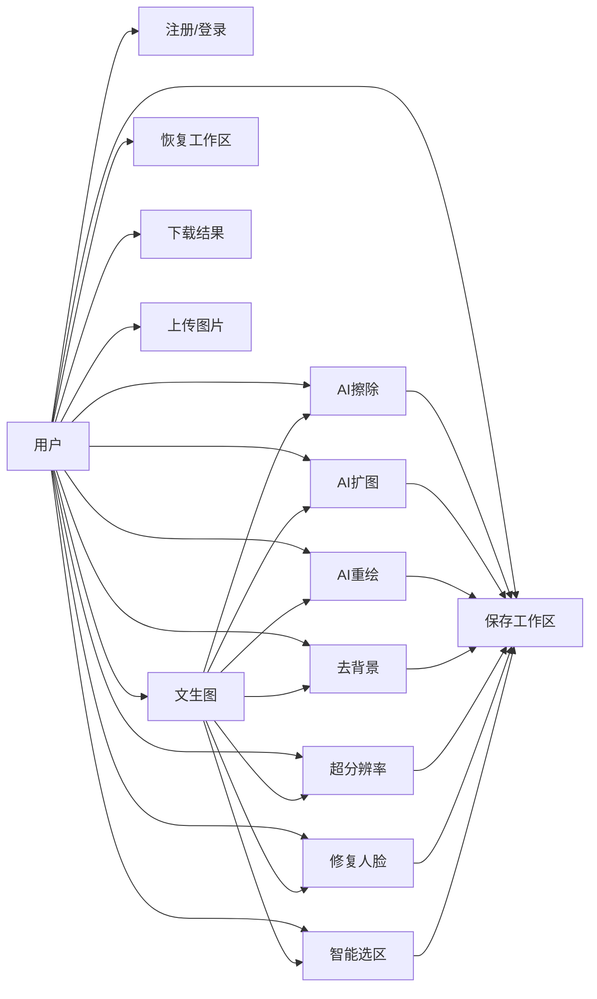
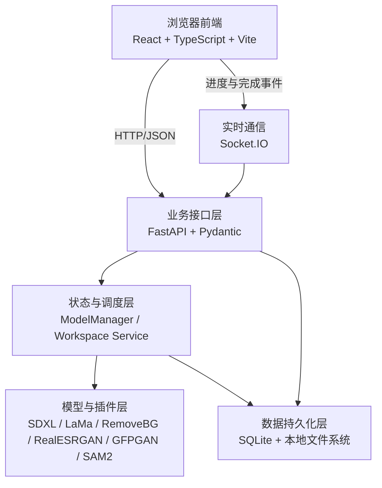
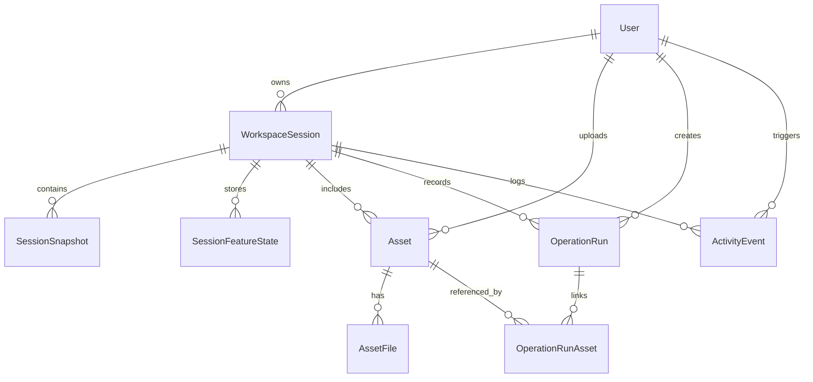

成都东软学院

本科毕业设计报告

题目：基于AI的文生图与图像智能编辑系统的设计与实现

| 学 院：    | 计算机与软件学院 |
|------------|------------------|
| 专 业：    | 软件工程         |
| 班 级：    | 软件工程24301    |
| 学生姓名： | 卢一博           |
| 学生学号： | 24010230127      |
| 指导教师： | 曹旭             |

2026年5月

# 摘 要

随着生成式人工智能（AIGC）技术的快速发展，文生图模型已经从实验性研究成果逐步演变为创意设计、视觉生产和数字内容创作中的重要工具。然而，现有图像生成工具大多强调“生成”能力，而对生成结果的后续修饰、增强、抠图、扩图和局部重绘等能力支持不足，用户往往需要在多个软件之间频繁切换，导致创作链路割裂、工作效率下降。针对上述问题，本文设计并实现了一个集文生图与图像智能编辑于一体的本地化 Web 系统。

本系统采用前后端分离架构。后端基于 Python 与 FastAPI 构建，集成 Stable Diffusion XL、LaMa、Real-ESRGAN、GFPGAN、RestoreFormer、SAM2 以及 RemoveBG 等模型或插件，实现了文生图、AI擦除、AI扩图、AI重绘、去背景、超分辨率、修复人脸和智能选区等功能。前端基于 React、TypeScript 与 Vite 构建，结合交互式画布、全局状态管理和实时进度反馈机制，实现了从文本生成、图像编辑到工作区保存与恢复的一体化操作体验。

在实现过程中，本文重点探讨并解决了多模型本地推理下的显存资源调度、编辑类与非编辑类功能之间的无缝衔接、工作区快照保存与恢复、基于 JWT 的用户鉴权以及实时生成进度反馈等关键问题。经测试验证，系统在 Windows + CUDA 环境下运行稳定，能够完成从创意输入到结果图像保存、增强和再编辑的完整工作流，具有较好的实用价值与工程意义。

**关键词**：人工智能生成内容；扩散模型；图像智能编辑；FastAPI；工作区管理；本地部署

Abstract

With the rapid development of Artificial Intelligence Generated Content (AIGC), text-to-image technology represented by diffusion models has become a significant productivity force in the field of creative design. However, current tools often focus on single-image generation while neglecting the coherence of subsequent refined editing, leading to a severe workflow disconnect between generation and modification for users. Addressing this pain point, this paper designs and implements an integrated, locally deployed AI-based text-to-image and intelligent image editing system.

The system adopts a frontend-backend separated architecture. The backend is built with Python and FastAPI, and integrates Stable Diffusion XL, LaMa, Real-ESRGAN, GFPGAN, RestoreFormer, SAM2, and RemoveBG-related models or plugins, thereby supporting text-to-image generation, AI erasing, AI outpainting, AI repainting, background removal, super-resolution, face restoration, and interactive segmentation. The frontend is developed with React, TypeScript, and Vite. Combined with an interactive canvas, global state management, and real-time progress feedback, it provides an integrated workflow from prompt-based generation to editing, enhancement, and workspace persistence.

During implementation, this work mainly focuses on several key engineering issues, including GPU memory scheduling under local multi-model inference, seamless image handoff across different functional tabs, workspace snapshot persistence and recovery, JWT-based user authentication, and real-time progress notification for long-running generation tasks. Experimental use shows that the system runs stably in a Windows and CUDA environment and supports a complete workflow from prompt input to image generation, enhancement, editing, and saving, demonstrating solid practical and engineering value.

**Key Words**: AIGC; Diffusion Models; Intelligent Image Editing; FastAPI; Workspace Management; Local Deployment

目 录

第1章 绪论

1.1 选题背景

1.2 选题目的

1.3 国内外现状

1.4 主要研究内容

1.4.1 系统概述

1.4.2 功能概述

1.4.3 性能优化与交互逻辑研究

1.5 报告内容组织结构

第2章 关键技术介绍

2.1 关键性开发技术介绍

2.1.1 扩散模型与 Stable Diffusion

2.1.2 FastAPI 异步 Web 框架

2.1.3 基于 React 与 TypeScript 的前端体系

2.2 其它相关技术

2.2.1 Hugging Face diffusers 库

2.2.2 PyTorch 深度学习框架

2.2.3 CUDA 硬件加速

2.2.4 辅助增强插件模型

第3章 系统分析

3.1 系统构架概述

3.2 需求分析

3.2.1 用户需求分析

3.2.2 业务需求分析

3.2.3 功能需求分析

3.2.4 业务建模

3.3 用例规约

3.3.1 创作生成模块用例

3.3.2 编辑类功能模块用例

3.3.3 非编辑类功能模块用例

3.4 系统可行性分析

3.4.1 技术可行性 

3.4.2 经济可行性 

3.4.3 操作可行性

3.4.4 系统安全性分析

3.5 系统开发环境

第4章 系统设计

4.1 系统架构设计

4.2 系统功能模块整体设计

4.3 系统功能模块详细设计

4.3.1 文生图创作模块设计

4.3.2 AI擦除模块设计

4.3.3 AI扩图模块设计

4.3.4 AI重绘模块设计

4.3.5 去背景模块设计

4.3.6 超分辨率模块设计

4.3.7 修复人脸模块设计

4.3.8 智能选区模块设计

4.3.9 用户工作区模块设计

4.4 接口设计

4.4.1 创作型模块接口设计

4.4.2 编辑类模块接口设计

4.4.3 非编辑类模块接口设计

4.5 数据库设计

4.5.1 CDM图

4.5.2 数据库表结构设计

第5章 系统实现

5.1 开发环境与工程结构实现

5.1.1 服务端工程结构

5.1.2 前端工程结构

5.1.3 运行环境与启动流程

5.2 服务端核心实现

5.2.1 FastAPI 路由与请求校验实现

5.2.2 模型调度与显存缓存实现

5.2.3 插件式图像处理实现

5.2.4 工作区持久化与资源管理实现

5.2.5 JWT 鉴权与资源访问控制实现

5.3 前端交互与状态管理实现

5.3.1 页面框架与功能 Tab 实现

5.3.2 交互式画布与蒙版编辑实现

5.3.3 功能联动与自动衔接实现

5.3.4 工作区保存、恢复与无缝衔接实现

5.4 实时反馈与体验优化实现

5.4.1 实时进度推送与任务结束通知

5.4.2 保存确认、异常提示与取消任务机制

第6章 系统测试

6.1 测试方案及测试用例

6.1.1 发送数据

6.1.2 接收数据

6.2测试方法

第7章 结论

参考文献

# **第1章 绪论**

本设计针对当前生成式人工智能应用中“生成能力强、编辑链路弱”的典型问题，围绕文本生成图像与图像智能编辑的一体化协同展开研究。系统以扩散模型为核心算力基础，以本地部署、统一交互、工作区保存和多功能无缝衔接为目标，构建了一个面向个人创作者和轻量级设计场景的 Web 平台。该课题具有较强的工程实践价值，一方面能够验证多模型协同和前后端联动方案的可行性，另一方面也为本地化 AIGC 工具的产品化落地提供了可参考的实现路径。

## 1.1 选题背景

近年来，生成式人工智能在图像创作领域发展迅速。以 Stable Diffusion 为代表的扩散模型使普通用户仅通过自然语言描述就能够获得质量较高的图像结果，极大拓展了视觉创作的边界。与此同时，用户对 AIGC 工具的期待已经从“能生成图像”进一步转向“能围绕生成结果持续编辑、优化和管理”的完整工作流。

当前市面上的工具大致分为两类：一类强调文生图能力，但在局部编辑、智能抠图、图像增强和工作流管理方面支持有限；另一类图像编辑软件虽然具备丰富的处理能力，但缺乏与生成式模型的深度整合。用户在实际创作过程中往往需要在文生图页面、抠图工具、超分工具和本地图像编辑器之间来回切换，既增加了操作复杂度，也容易造成进度丢失和素材管理混乱。

此外，随着个人创作者、学生用户以及小型工作室对本地部署需求的上升，隐私保护和使用成本也成为重要考虑因素。将图像上传到云端处理存在数据泄露风险，而高频订阅式商业服务也会增加长期使用成本。因此，研究并实现一个支持本地运行、账号登录、工作区保存、多功能协同和实时进度反馈的一站式智能图像系统，具有明显的现实意义。

## 1.2 选题目的

本课题的主要目标是设计并实现一个基于 AI 的文生图与图像智能编辑系统，使用户能够在同一平台内完成文本生成图像、图像局部擦除、智能扩图、局部重绘、去背景、超分辨率、人脸修复与智能选区等操作，并通过工作区机制实现历史结果的保存、恢复和二次创作。

具体而言，本课题希望解决以下几个方面的问题：

1. 构建统一的前后端系统架构，将文生图和图像编辑功能整合在同一套业务体系之内。
2. 实现基于本地显卡的多模型协同推理，降低用户对外部云服务的依赖。
3. 优化多功能之间的交互衔接逻辑，使生成结果、编辑结果和增强结果能够在不同功能页之间顺畅流转。
4. 建立工作区保存与恢复机制，使用户的图片、参数和操作状态能够持久化管理。
5. 通过实时进度通知、异常提示和鉴权机制提升系统的可用性、安全性和工程完整度。

## 1.3 国内外现状

在当前的图像生成技术研究领域中，扩散模型已成为生成式人工智能（AIGC）的核心底层架构。扩散模型通常被定义为一个双向的马尔可夫链过程，其核心逻辑在于通过前向扩散阶段逐步向原始图像数据中注入高斯噪声，并利用深度神经网络在逆向去噪阶段学习如何从纯噪声分布中精确还原出高质量的目标图像。这种基于概率分布演变的建模方式，有效克服了传统生成对抗网络（GAN）在训练稳定性与模式坍塌方面的局限，为实现高度复杂的语义映射与图像重构奠定了坚实的理论基础。

作为扩散模型领域最具代表性的工程实践，Stable Diffusion 通过引入潜在扩散模型（Latent Diffusion Model）架构，实现了图像生成效率与质量的平衡。该技术并不直接在像素空间进行高维计算，而是利用变分自编码器（VAE）将图像压缩至低维的潜在空间进行去噪处理，从而显著降低了对硬件推理算力的需求。这一突破使得高质量的图像编辑任务得以在个人计算设备上运行，在本项目的后端架构中，通过对 diffusers 库以及多种高性能采样器的深度集成，充分利用了这一技术特性来实现实时的局部重绘与图像外扩功能。

随着 Stable Diffusion 体系的日益成熟，全球 AIGC 产业正经历从宏观内容生成向微观精确控制的纵深演进。国际上，以 Stability AI 为首的开源力量与以 OpenAI、Adobe 为代表的商业巨头持续在模型底座、语义理解及专业流集成方向发力，研究重点已转向如何通过 ControlNet、BrushNet 等技术实现对图像布局与细节的像素级操控。国内方面，百度、阿里巴巴及腾讯等头部科技公司依托大规模预训练算力，相继推出了具备本土化语义理解优势的大模型，同时国内开源社区在针对特定风格的轻量化微调模型以及针对中文字符生成的 AnyText 算法落地应用上也表现出极高的活跃度。

尽管国内外技术储备已非常雄厚，但在实际应用层面仍面临着显著的门槛。目前主流的专业级 WebUI 工具界面极其复杂且参数冗冗，导致非专业人员的学习成本过高；而现有的商业化云端解决方案则普遍存在用户隐私泄露风险及高昂的订阅费用。因此，针对个人用户和专业创作者的需求，开发一个集成 LaMa 语义填充、交互式目标分割以及高精度图像增强等多种前沿算子的轻量化集成系统，并支持完全的本地化部署，不仅符合当前技术向终端下沉的趋势，也具备极高的应用价值与现实意义。

## 1.4 主要研究内容

### 1.4.1 系统概述

本文设计的系统是一个面向桌面端浏览器环境运行的 AI 图像创作平台。系统采用前后端分离模式，前端负责用户交互、图像预览、画布编辑和工作区管理，后端负责业务路由、模型调度、插件调用、数据持久化和权限控制。系统在逻辑上以“统一工作区”为核心，将文生图结果、编辑结果和增强结果统一纳入同一套状态与数据结构中进行管理。

与单一功能工具不同，本系统强调的是完整的创作闭环。用户既可以从“文生图”开始进行创意生成，也可以从本地上传图片开始进入编辑流程；在任意功能处理中产生的新结果，还可以继续衔接到其他功能模块中做进一步修饰、增强和保存，从而形成连续、可恢复、可保存的图像处理链路。

### 1.4.2 功能概述

系统主要包含以下功能：

1. 文生图功能：支持用户输入提示词、反向提示词、尺寸、步数、采样器和随机种子等参数，调用支持文生图的扩散模型生成图像。
2. AI扩图功能：针对已有图像向四周拓展画面范围，并结合扩散模型完成边界内容补全。
3. AI擦除功能：用户通过蒙版标记需要移除或修复的区域，系统根据上下文生成自然填充结果。
4. AI重绘功能：在局部区域内按照新的提示词进行再生成，实现局部内容替换与风格调整。
5. 去背景功能：调用 RemoveBG 插件自动提取主体并移除背景，适合素材抠图和人物主体分离。
6. 超分辨率功能：调用 Real-ESRGAN 插件对图像进行放大和细节增强，提高输出清晰度。
7. 修复人脸功能：调用 GFPGAN 或 RestoreFormer 对面部区域进行修复，改善人物图像失真问题。
8. 智能选区功能：基于交互式分割模型，根据用户点击点快速生成选区蒙版，为后续编辑提供辅助。

除上述八大功能外，系统还提供用户注册登录、工作区保存、工作区恢复、结果下载、历史作品管理和跨功能自动衔接等支撑能力。

### 1.4.3 性能优化与交互逻辑研究

针对本地部署场景下的性能瓶颈，本文重点研究了多模型协同条件下的资源调度与交互优化问题。后端通过模型缓存和显存回收机制，避免多个大型模型同时常驻显存；在推理阶段结合 CUDA 环境和 PyTorch 推理模式降低资源消耗。对于生成式任务，系统使用 Socket.IO 推送进度与完成事件，以改善长耗时任务的交互体验。

在前端侧，系统围绕统一状态管理和功能页联动进行了设计。编辑类功能、非编辑类功能与文生图结果之间通过共享工作图像与功能状态实现自动衔接，并在必要时通过确认弹窗保护未保存进度。基于交互式画布、撤销重做和工作区保存机制，系统有效提升了连续创作过程中的可控性与稳定性。

## 1.5 报告内容组织结构

本文共分为七个章节，各章节内容安排如下：

第1章为绪论，主要介绍课题的研究背景、研究意义以及国内外研究现状，并对本文的研究内容进行概述；

第2章为相关技术介绍，主要阐述系统开发过程中涉及的关键技术；

第3章为系统分析，对系统的功能需求及可行性进行分析；

第4章为系统设计，介绍系统总体架构及各模块设计；

第5章为系统实现，详细说明各功能模块的实现过程；

第6章为系统测试，对系统功能进行测试与结果分析；

第7章为总结与展望，对全文进行总结并提出后续改进方向。

# **第2章 关键技术介绍**

## 2.1 关键性开发技术介绍

### 2.1.1 扩散模型与 Stable Diffusion

本项目的图像生成逻辑高度依赖于 Stable Diffusion 系列模型及其在 Hugging Face diffusers 库中的实现。diffusers 是目前业界领先的扩散模型集成方案，提供了从调度器（Schedulers）到管道（Pipelines）的完整封装。系统通过集成该技术，实现了 Stable Diffusion XL 1.0 等前沿模型的调用，能够高质量地完成局部重绘（Inpainting）与图像外扩（Outpainting）任务。通过利用 safetensors 格式存储模型权重，系统进一步增强了模型加载的安全性与速度。

### 2.1.2 FastAPI 异步 Web 服务框架

为了保障图像处理请求的高并发处理能力与响应速度，系统后端采用了 FastAPI 作为 Web 服务框架。FastAPI 是一种基于 Python 3.7+ 标准类型提示的现代、高性能 Web 框架，其核心优势在于原生支持异步编程（async/await），极大提升了 I/O 密集型任务的处理效率。本项目通过 FastAPI 定义了标准化的 RESTful API 接口，负责模型加载状态查询、图像上传下载以及推理任务的调度管理。此外，结合 Pydantic 库进行的数据模型校验，确保了前后端数据交互的严格一致性与系统健壮性。

### 2.1.3 基于 React 与 TypeScript 的前端体系

系统前端采用 React 框架构建，并全面使用 TypeScript 编程语言以增强代码的可维护性与类型安全性。React 的组件化开发模式使得复杂的用户交互界面，如实时绘图画布、模型参数调节面板等，能够被高效地解耦与复用。TypeScript 的引入则通过静态类型检查，在开发阶段即能发现潜在的逻辑错误，尤其在处理复杂的图像元数据和异步 API 响应时提供了坚实的基础。在构建工具方面，项目选用了 Vite 进行项目的快速打包与热更新，显著提升了前端开发与线上部署的效率。

## 2.2 其它相关技术

### 2.2.1 Hugging Face diffusers 库

diffusers 是 Hugging Face 提供的扩散模型标准库，是本系统实现模型调度的底层支柱。它将复杂的扩散逻辑封装为标准化的 Pipeline（流水线），支持 Stable Diffusion 1.5、SDXL 等多种开源大模型，并提供了调度器（Schedulers）优化技术，能在保证画质的前提下显著缩短生成时间。

### 2.2.2 PyTorch 深度学习框架

本系统后端核心算法的运行依赖于 PyTorch 深度学习框架。作为目前主流的开源张量计算与神经网络库，PyTorch 提供了强大的自动求导系统以及对算子级别的灵活控制能力，使其能够支撑 LaMa 以及各种扩散模型（Diffusion Models）的高效推理。在本项目的环境配置中，系统要求 Torch 版本需达到 2.0.0 以上，以利用其在模型量化、编译优化及分布式训练方面的最新特性。同时，结合项目中的 accelerate 与 peft 库，系统能够实现对显存占用的精细化管理，并支持在消费级显卡甚至是仅有 CPU 的环境下进行平滑运行。

### 2.2.3 CUDA 硬件加速

由于本系统采用本地部署方案，图像生成极其依赖计算资源。系统通过 NVIDIA CUDA 架构实现深度学习任务的硬件加速。利用 PyTorch 框架直接调用显卡内核，将原本在 CPU 上需耗时数分钟的计算任务缩短至秒级，是实现实时 AI 编辑的前提。

### 2.2.4 辅助增强插件模型

为了扩展图像编辑的功能边界，系统还集成了一系列基于计算机视觉的辅助插件。例如，利用 Segment Anything (SAM) 插件实现快速、精准的目标物体分割；通过 RealESRGAN 技术实现生成图像的超分辨率增强；以及采用 GFPGAN 或 RestoreFormer 插件进行人脸特征的修复与增强。这些辅助技术的加入，使得本系统不再局限于单一的重绘功能，而是进化为一个综合性的 AI 图像编辑平台。

# **第3章 系统分析**

## 3.1 系统构架概述

本系统采用 B/S（Browser/Server）架构，目标是在浏览器环境下为用户提供一站式 AI 图像生成与智能编辑服务。系统整体可划分为展示层、业务逻辑层、模型推理层和数据持久化层。

展示层由 React 前端构成，主要负责用户输入、参数配置、画布交互、结果展示和工作区操作；业务逻辑层由 FastAPI 服务承载，负责路由分发、请求校验、会话控制、模型切换、工作区保存和用户鉴权；模型推理层由 Stable Diffusion、LaMa、Real-ESRGAN、GFPGAN、SAM2 等模型或插件组成，负责具体的图像生成与处理；数据持久化层则基于 SQLite 和本地文件系统，存储用户、工作区、资源文件、操作记录和工作状态快照。

与传统仅依赖单一模型的图像工具不同，本系统以工作区为中心组织用户数据，使得文生图、编辑类功能和非编辑类功能共享统一的数据流。用户在任意模块得到的新图像结果，都可以继续进入其他模块进行处理，形成连续、可恢复、可保存的创作闭环。

## 3.2 需求分析

### 3.2.1 用户需求分析

用户希望通过该平台，仅需输入简单的文本描述即可获得高质量的视觉作品。同时，用户要求在生成图像后能够直接进行无缝编辑，如去除图像中的冗余物体、扩展构图比例、一键抠图或修复模糊画质。此外，由于涉及个人创意，用户对数据的隐私性和系统的运行稳定性有较高要求，倾向于本地化处理以避免数据泄露。

### 3.2.2 业务需求分析

从系统业务流程角度看，本课题需要完成“用户登录-进入工作区-生成或导入图片-多功能处理-保存与恢复-继续创作”的完整闭环。系统既要支持从文本直接开始的创作型流程，也要支持从已有图片开始的编辑型流程；既要支持局部编辑，也要支持插件增强；在结果管理层面，还要支持用户按工作区进行保存、恢复、删除和再次加工。

因此，系统业务上至少需要覆盖以下能力：统一账号体系、统一图片入口、统一状态管理、统一工作区保存机制以及多功能间的结果自动衔接。只有这些环节协同运行，系统才不仅是多个 AI 功能的简单堆叠，而是一个真正可用的图像创作平台。

### 3.2.3 功能需求分析

文生图功能：支持输入提示词、反向提示词、图像尺寸、采样步数、采样器和种子参数，并基于扩散模型生成图像。

AI擦除功能：支持在画布上绘制蒙版，对指定区域进行内容移除与智能修复。

AI扩图功能：支持对图像边界进行扩展，并自动补全新增区域内容。

AI重绘功能：支持用户基于局部提示词对选定区域进行重新生成和风格替换。

去背景功能：支持对上传图像执行主体分离和背景移除，输出透明背景结果。

超分辨率功能：支持调用超分模型对图像进行细节增强和高倍放大。

修复人脸功能：支持对人物图像中的面部区域进行增强和失真修复。

智能选区功能：支持用户通过交互点击快速生成选区，为后续蒙版编辑提供辅助。

进度保存功能：支持将当前工作图像、参数状态和模块结果保存到工作区，并在后续恢复继续编辑。

### 3.2.4 业务建模

从用户视角看，系统中的核心参与者是注册登录用户。用户既可以发起文生图任务，也可以上传已有图像进入编辑流程；在任意处理阶段产生的结果，用户都可以继续发送到其他功能模块，并最终保存为工作区记录。系统的业务建模如图 3.1 所示。

图 3.1 文生图与图像智能编辑系统用例图（Mermaid 草稿）

## 3.3 用例规约

系统的核心用例可概括为：文生图创作、AI擦除、AI扩图、AI重绘、智能选区、去背景、超分辨率、修复人脸、工作区保存与工作区恢复。其中前八项为主要业务功能，工作区保存与恢复贯穿整个处理过程。

### 3.3.1 创作生成模块用例

1. 文生图创作用例规约表

| 组成项目 | 子项描述 |
|------|------|
| 用例编号 | UC01 |
| 用例名称 | 文生图创作 |
| 用例简述 | 用户输入提示词和生成参数，系统调用支持文生图的模型生成对应图像。 |
| 参与者 | 登录用户 |
| 前置条件 | 用户已完成注册并登录系统；服务端存在可用的文生图模型；用户进入“文生图”Tab。 |
| 后置条件 | 生成结果加载到当前工作区状态，并显示在前端页面中；用户可继续下载、保存或自动衔接到其他功能。 |
| 基本路径 | 1. 用户进入文生图页面；2. 输入提示词、反向提示词并设置尺寸、步数、采样器和随机种子等参数；3. 点击“生成”按钮；4. 前端向后端提交文生图请求；5. 系统执行模型推理并通过实时进度提示反馈生成状态；6. 系统返回生成结果并显示在前端；7. 用户选择继续编辑、下载结果或保存到工作区。 |
| 拓展路径 | 5a. 当前存在未保存的图片或工作进度，系统先弹出保存确认对话框；5b. 所选模型不支持文生图，系统提示用户切换模型；6a. 图像生成失败，系统反馈错误信息并记录操作日志；6b. 用户主动取消任务，系统终止生成并提示已取消。 |
| 字段列表 | 1.提示词=用户输入的正向文本描述；2.反向提示词=用于排除不希望出现的画面内容；3.模型=当前选用的文生图模型；4.图像宽度=输出图像宽度；5.图像高度=输出图像高度；6.采样步数=扩散推理的迭代步数；7.采样器=文生图任务使用的采样方法；8.随机种子=用于复现生成结果的种子值。 |
| 业务规则 | 无 |
| 非功能需求 | 图像生成过程需有实时进度提示；允许用户取消长时间任务；生成结果应能无缝衔接到后续功能模块。 |
| 设计约束 | 无 |

### 3.3.2 编辑类功能模块用例

1. AI擦除用例规约表

| 组成项目 | 子项描述 |
|------|------|
| 用例编号 | UC02 |
| 用例名称 | AI擦除 |
| 用例简述 | 用户在当前图片上绘制蒙版，系统根据蒙版区域执行内容移除和智能修复。 |
| 参与者 | 登录用户 |
| 前置条件 | 用户已登录系统；当前工作区中存在可编辑图片；用户进入“AI擦除”Tab。 |
| 后置条件 | 擦除后的结果替换当前工作图像，并可继续编辑、保存或切换到其他功能。 |
| 基本路径 | 1. 用户进入 AI擦除页面；2. 系统加载当前工作图像到编辑画布；3. 用户在画布上绘制待擦除区域蒙版；4. 用户设置模型或保持默认参数；5. 点击执行按钮提交擦除请求；6. 后端根据原图与蒙版执行修复推理；7. 系统返回修复结果并更新当前工作图像。 |
| 拓展路径 | 3a. 用户未绘制有效蒙版，系统提示先选择待处理区域；5a. 当前存在未保存进度且用户先切换了图片来源，系统弹出保存确认；6a. 模型推理失败，系统提示处理失败并记录日志；6b. 用户取消任务，系统停止处理并保留原图状态。 |
| 字段列表 | 1.当前图片=待执行擦除的工作图像；2.蒙版=用户在画布上绘制的待处理区域；3.模型=当前选用的修复或擦除模型；4.提示词=扩散修复时用于描述目标内容的文本；5.反向提示词=用于限制不希望出现的结果；6.采样步数=擦除任务的推理步数；7.随机种子=用于复现擦除结果的种子值。 |
| 业务规则 | 无 |
| 非功能需求 | 画布操作应保持流畅，支持缩放、拖拽和撤销重做；结果返回后应立即刷新当前工作图像。 |
| 设计约束 | 无 |

2. AI扩图用例规约表

| 组成项目 | 子项描述 |
|------|------|
| 用例编号 | UC03 |
| 用例名称 | AI扩图 |
| 用例简述 | 用户设置扩展方向与范围，系统对当前图片执行边界扩展和新增区域补全。 |
| 参与者 | 登录用户 |
| 前置条件 | 用户已登录系统；当前工作区中存在图片；服务端存在支持扩图的模型；用户进入“AI扩图”Tab。 |
| 后置条件 | 工作区中的当前图片被更新为扩图结果，图像尺寸和边界内容同步变化。 |
| 基本路径 | 1. 用户进入 AI扩图页面；2. 系统加载当前图片并显示扩展控制区域；3. 用户设置扩展方向与尺寸范围；4. 用户根据需要填写提示词和其他参数；5. 点击执行按钮提交扩图请求；6. 后端根据扩展参数执行 outpaint 推理；7. 系统返回扩图结果并更新当前工作区图像。 |
| 拓展路径 | 3a. 用户设置的扩展范围无效，系统提示重新调整参数；5a. 当前模型不支持扩图，系统提示切换支持扩图的模型；6a. 扩图处理失败，系统返回错误提示并记录日志；6b. 用户取消任务，系统终止本次扩图。 |
| 字段列表 | 1.当前图片=待扩展的工作图像；2.扩展方向=画布向上、下、左、右扩展的方向；3.扩展范围=新增区域的尺寸和边界范围；4.模型=当前选用的扩图模型；5.提示词=用于指导新增区域生成内容的文本；6.反向提示词=用于限制新增区域不希望出现的内容；7.采样步数=扩图任务的推理步数；8.随机种子=用于复现扩图结果的种子值。 |
| 业务规则 | 无 |
| 非功能需求 | 参数调整后界面应能及时预览扩展区域；扩图结果应保持与原图衔接自然，并在处理期间提供状态反馈。 |
| 设计约束 | 无 |

3. AI重绘用例规约表

| 组成项目 | 子项描述 |
|------|------|
| 用例编号 | UC04 |
| 用例名称 | AI重绘 |
| 用例简述 | 用户为局部区域绘制蒙版并输入新的提示词，系统对选定区域执行局部再生成。 |
| 参与者 | 登录用户 |
| 前置条件 | 用户已登录系统；当前工作区中存在图片；用户进入“AI重绘”Tab。 |
| 后置条件 | 重绘结果更新到当前工作图像，未选区域保持原有内容，结果可继续保存或进入其他功能。 |
| 基本路径 | 1. 用户进入 AI重绘页面；2. 系统加载当前图片到画布；3. 用户绘制需要重绘的局部区域；4. 用户输入新的重绘提示词并设置相关参数；5. 点击执行按钮提交重绘请求；6. 后端结合蒙版和提示词执行 repaint 推理；7. 系统返回局部重绘结果并替换当前工作图像。 |
| 拓展路径 | 3a. 用户未选择有效区域，系统提示先绘制蒙版；4a. 用户未输入必要的重绘提示词，系统提示补充内容；6a. 重绘处理失败，系统反馈错误信息并记录日志；6b. 用户取消任务，系统保留当前未处理状态。 |
| 字段列表 | 1.当前图片=待重绘的工作图像；2.局部蒙版=用户选定的局部重绘区域；3.重绘提示词=用于指导局部再生成的文本描述；4.反向提示词=用于排除不希望出现的内容；5.模型=当前选用的局部重绘模型；6.采样步数=局部重绘的推理步数；7.随机种子=用于复现重绘结果的种子值。 |
| 业务规则 | 无 |
| 非功能需求 | 局部区域交互应精确可控；处理结果应尽量保持未选区域稳定，并提供处理过程提示。 |
| 设计约束 | 无 |

4. 智能选区用例规约表

| 组成项目 | 子项描述 |
|------|------|
| 用例编号 | UC05 |
| 用例名称 | 智能选区 |
| 用例简述 | 用户通过前景点和背景点交互，系统快速生成候选选区并转换为可编辑蒙版。 |
| 参与者 | 登录用户 |
| 前置条件 | 用户已登录系统；当前工作区中存在图片；服务端已启用交互式分割插件；用户进入“智能选区”Tab。 |
| 后置条件 | 系统生成的选区被转换为可继续用于 AI擦除或 AI重绘的蒙版结果。 |
| 基本路径 | 1. 用户进入智能选区页面；2. 系统显示当前图片并进入点击选区模式；3. 用户依次添加前景点和背景点；4. 前端将点击点提交给分割插件；5. 系统返回临时分割结果并在前端展示；6. 用户确认选区结果；7. 系统将选区转为蒙版并写入当前工作状态。 |
| 拓展路径 | 3a. 用户点击信息不足，系统提示继续补充前景点或背景点；5a. 分割插件处理失败，系统提示稍后重试；6a. 用户对候选结果不满意，可继续追加点击点重新分割。 |
| 字段列表 | 1.当前图片=执行智能选区的工作图像；2.前景点=用户标记的目标区域点击点；3.背景点=用户标记的非目标区域点击点；4.分割结果确认=用户对候选选区的确认操作。 |
| 业务规则 | 无 |
| 非功能需求 | 选区生成应尽量快速响应；候选结果应清晰可视；确认后的蒙版应能直接衔接到编辑类功能。 |
| 设计约束 | 无 |

### 3.3.3 非编辑类功能模块用例

1. 去背景用例规约表

| 组成项目 | 子项描述 |
|------|------|
| 用例编号 | UC06 |
| 用例名称 | 去背景 |
| 用例简述 | 用户对当前图片执行主体分离，系统输出透明背景结果。 |
| 参与者 | 登录用户 |
| 前置条件 | 用户已登录系统；当前工作区中存在图片；服务端已启用 RemoveBG 插件；用户进入“去背景”Tab。 |
| 后置条件 | 去背景结果写入去背景结果状态，并可无缝回流到编辑类功能或保存到工作区。 |
| 基本路径 | 1. 用户进入去背景页面；2. 系统加载当前工作图片；3. 用户选择去背景模型；4. 点击执行按钮提交处理请求；5. 后端调用 RemoveBG 插件执行主体分离；6. 系统返回透明背景结果并显示在前端页面；7. 用户继续保存、下载或衔接到其他功能。 |
| 拓展路径 | 3a. 可用模型为空或模型不可用，系统提示用户检查插件配置；5a. RemoveBG 插件处理失败，系统提示错误并记录日志；6a. 用户对结果不满意，可重新处理或切换到其他功能进一步编辑。 |
| 字段列表 | 1.当前图片=待去背景的工作图像；2.去背景模型=当前选用的去背景插件模型。 |
| 业务规则 | 无 |
| 非功能需求 | 处理结果应尽量保持主体边缘完整；处理过程应有明确的运行状态提示；结果应支持自动衔接后续编辑。 |
| 设计约束 | 无 |

2. 超分辨率用例规约表

| 组成项目 | 子项描述 |
|------|------|
| 用例编号 | UC07 |
| 用例名称 | 超分辨率 |
| 用例简述 | 用户对当前图片执行细节增强与放大处理，系统输出更高分辨率图像。 |
| 参与者 | 登录用户 |
| 前置条件 | 用户已登录系统；当前工作区中存在图片；服务端已启用 Real-ESRGAN 插件；用户进入“超分辨率”Tab。 |
| 后置条件 | 超分结果写入当前工作区状态，用户可继续保存、下载或衔接到其他功能。 |
| 基本路径 | 1. 用户进入超分辨率页面；2. 系统加载当前工作图片；3. 用户选择超分模型并设置放大倍数；4. 点击执行按钮提交增强请求；5. 后端调用 Real-ESRGAN 插件执行放大和细节增强；6. 系统返回高分辨率结果并显示在前端；7. 用户继续保存、下载或切换到其他功能。 |
| 拓展路径 | 3a. 所选模型不可用，系统提示重新选择；5a. 超分处理失败，系统返回错误提示并记录日志；5b. 图像尺寸过大导致处理耗时较长，系统持续显示处理中状态；6a. 用户取消任务，系统停止本次处理。 |
| 字段列表 | 1.当前图片=待增强的工作图像；2.超分模型=当前选用的超分辨率模型；3.放大倍数=图像放大的目标比例。 |
| 业务规则 | 无 |
| 非功能需求 | 大图处理期间应持续反馈运行状态；结果展示应稳定，避免因分辨率升高导致界面异常。 |
| 设计约束 | 无 |

3. 修复人脸用例规约表

| 组成项目 | 子项描述 |
|------|------|
| 用例编号 | UC08 |
| 用例名称 | 修复人脸 |
| 用例简述 | 用户对当前图片执行人脸增强处理，系统调用人脸修复插件改善人物面部细节。 |
| 参与者 | 登录用户 |
| 前置条件 | 用户已登录系统；当前工作区中存在图片；服务端已启用 GFPGAN 或 RestoreFormer 插件；用户进入“修复人脸”Tab。 |
| 后置条件 | 人脸修复结果更新到当前工作区状态，并可继续保存或衔接到编辑类功能。 |
| 基本路径 | 1. 用户进入修复人脸页面；2. 系统加载当前工作图片；3. 用户选择修复插件；4. 点击执行按钮提交修复请求；5. 后端调用对应插件执行面部增强；6. 系统返回修复结果并显示在前端；7. 用户保存结果或继续衔接到其他功能。 |
| 拓展路径 | 3a. 修复插件不可用，系统提示检查配置；5a. 插件执行失败，系统反馈错误并记录日志；5b. 图片中未检测到可修复的人脸区域，系统提示当前图像不适合执行该功能。 |
| 字段列表 | 1.当前图片=待修复的人像图像；2.修复插件=当前选用的人脸修复插件。 |
| 业务规则 | 无 |
| 非功能需求 | 修复过程应有明确的运行状态提示；结果应尽量保持人脸区域自然，不破坏整图风格一致性。 |
| 设计约束 | 无 |

### 3.3.4 工作区模块用例

1. 工作区保存用例规约表

| 组成项目 | 子项描述 |
|------|------|
| 用例编号 | UC09 |
| 用例名称 | 工作区保存 |
| 用例简述 | 用户将当前创作状态保存为工作区记录，便于后续恢复和继续编辑。 |
| 参与者 | 登录用户 |
| 前置条件 | 用户已登录系统；当前存在可保存的图片或工作进度；用户位于任一支持保存的功能页面。 |
| 后置条件 | 系统创建或更新工作区会话与快照，并在“我的作品”中显示对应记录。 |
| 基本路径 | 1. 用户在当前功能页完成生成或编辑；2. 点击“保存”按钮；3. 前端整理当前标签页、主图、蒙版、预览图和各功能参数状态；4. 前端向后端提交工作区保存请求；5. 后端写入或更新工作区会话、快照与资源文件；6. 系统返回保存成功结果；7. 前端刷新“我的作品”列表并提示保存完成。 |
| 拓展路径 | 2a. 当前没有可保存的图片或工作进度，系统提示无可保存内容；4a. 会话编号不存在或已失效，后端改为创建新会话或返回错误提示；5a. 保存失败，系统反馈错误信息并记录日志。 |
| 字段列表 | 1.工作区标题=用户保存时为当前会话设置的名称；2.当前功能页=触发保存时所在的功能 Tab；3.主图=当前工作区的核心图像资源；4.蒙版=编辑类功能下的当前蒙版资源；5.预览图=用于界面展示的预览资源；6.各功能参数状态=文生图+编辑类+插件类功能的当前配置；7.当前会话编号=已有工作区会话的唯一标识。 |
| 业务规则 | 无 |
| 非功能需求 | 保存操作应尽量稳定且避免阻塞界面；保存成功后应能立即在“我的作品”中看到结果。 |
| 设计约束 | 无 |

2. 工作区恢复用例规约表

| 组成项目 | 子项描述 |
|------|------|
| 用例编号 | UC10 |
| 用例名称 | 工作区恢复 |
| 用例简述 | 用户从“我的作品”中选择已有工作区，将其恢复到当前编辑现场继续创作。 |
| 参与者 | 登录用户 |
| 前置条件 | 用户已登录系统；“我的作品”中存在至少一条工作区记录；用户进入工作区管理页面。 |
| 后置条件 | 当前工作图片、功能状态和资源映射被恢复到前端，用户可继续编辑、处理或再次保存。 |
| 基本路径 | 1. 用户进入“我的作品”页面；2. 系统加载当前用户的工作区列表；3. 用户选择某条工作区记录；4. 前端向后端发起恢复请求；5. 后端读取对应会话快照、资源和功能状态；6. 系统返回恢复所需数据；7. 前端重建当前工作状态并跳转到相应功能页继续编辑。 |
| 拓展路径 | 2a. 当前没有可恢复的工作区记录，系统提示用户先创建作品；4a. 所选工作区不存在或已被删除，系统提示记录无效；5a. 快照或资源文件缺失，系统提示恢复失败并记录日志。 |
| 字段列表 | 1.工作区会话编号=待恢复工作区的唯一标识。 |
| 业务规则 | 无 |
| 非功能需求 | 恢复操作应尽量准确还原图片和参数状态；恢复完成后应保持各功能页之间的无缝衔接能力。 |
| 设计约束 | 无 |

## 3.4 系统可行性分析

### 3.4.1 技术可行性

本系统在技术实现上具有高度可行性。

首先，算法层面，以 Stable Diffusion 为核心的扩散模型及 Real-ESRGAN 等超分辨率模型均已开源且具备成熟的 Python API (Hugging Face diffusers)，为系统核心功能的实现提供了可靠的技术支撑。

其次，架构层面，B/S 架构配合 FastAPI 框架和 Socket.IO 实时反馈机制能够较好地解决 AI 推理过程中的长耗时交互问题。系统通过统一状态管理、可取消任务和工作区持久化机制保障前后端协作稳定。

最后，硬件层面，现代消费级显卡（如 NVIDIA RTX 系列）已具备运行此类模型的能力，配合 CUDA 加速技术，使得本地化部署具备了实际运行的算力基础。

### 3.4.2 经济可行性

本系统的经济可行性主要体现在开发与运行成本的控制上。

系统核心组件全部基于开源协议（如 Apache 2.0、CreativeML Open RAIL-M 等），无需支付昂贵的商业授权费用。相比于订阅 Midjourney、DALL-E、Nano Banana 等商用云服务，本系统采用本地化部署模式，极大地降低了长期的带宽成本和单次生成的算力开销。对于个人创作者或小微企业而言，仅需一次性的硬件投入即可获得持续的 AI 生产力，具有显著的经济优势。

### 3.4.3 操作可行性

系统在操作流程设计上力求简洁直观。通过现代化的 Web 前端（React），将复杂的 AI 参数（如 CFG Scale、Seed 等）封装为易于理解的可视化滑块或预设选项。核心交互环节——智能画布编辑器，模仿了主流设计软件的操作习惯，支持快捷键和鼠标滚轮操作。用户无需具备深度学习背景，仅通过简单的“输入文字”和“鼠标涂抹”即可完成高质量的图像处理任务，操作门槛低，易用性强。

### 3.4.4 系统安全性分析

系统安全性主要体现在身份认证、数据隔离、参数校验和资源访问控制四个方面。

在身份认证方面，系统采用基于 JWT 的登录认证机制。用户注册后，登录接口返回访问令牌，前端在后续请求中以 Bearer Token 方式提交身份信息。对于图片资源下载等场景，系统还支持在资源访问路径中携带令牌，实现受保护资源的访问控制。

在数据隔离方面，工作区、资源文件、操作记录和活动记录均以用户为边界进行组织，不同用户之间的数据不会交叉读取。后端在处理工作区详情、恢复、删除和资源获取时，会结合当前用户身份校验访问权限。

在输入安全方面，系统基于 Pydantic 对接口输入参数进行类型校验和范围约束，避免非法参数直接进入模型推理过程。对于模型切换、插件调用和工作区保存等场景，系统也会在服务端进行额外检查。

在运行安全方面，本系统采用本地部署方案，用户图像和工作区数据主要保存在本地数据库与文件系统中，减少了云端传输带来的隐私风险。同时，任务取消、异常提示和保存确认机制也有助于降低误操作和错误状态对用户数据造成的影响。

## 3.5 系统开发环境

本系统的开发涉及深度学习推理环境与 Web 全栈开发环境的整合。具体开发环境配置如表 3.4 所示。

表格 3.4

| **环境类别**       | **工具/名称与版本**                                 |
| ------------------ | --------------------------------------------------- |
| **操作系统**       | Windows 10 10.0.26200                               |
| **硬件环境**       | NVIDIA GeForce RTX 4080 (16GB 显存)                 |
| **前端开发工具**   | Visual Studio Code / Node.js v24.14.1               |
| **后端开发环境**   | Python 3.10.11                                      |
| **数据库系统**     | SQLite（SQLAlchemy ORM）                            |
| **AI 核心框架**    | PyTorch 2.5.1 + CUDA 12.1                           |
| **Web 框架**       | FastAPI 0.108.0（后端）/ React 18.2.0（前端）       |
| **前端语言与构建** | TypeScript 5.2.2 / Vite 7.0.0                       |
| **AI 算法库**      | diffusers 0.27.2、transformers 4.48.3、accelerate 1.13.0、rembg 2.0.69、opencv-python 4.11.0.86 |
| **实时通信**       | python-socketio 5.7.2 / socket.io-client 4.7.2      |
| **版本控制与部署** | Git                                                 |
| **API 调试工具**   | Postman / FastAPI Swagger UI                        |

# **第4章 系统设计**

## 4.1 系统架构设计

本系统采用典型的 B/S 架构，以浏览器作为统一入口，以 FastAPI 服务作为业务中枢，以本地深度学习模型作为算力支撑。系统可划分为前端展示层、业务逻辑层、模型与插件层以及数据持久化层四部分。

前端展示层主要负责用户登录、参数录入、功能标签切换、图像上传、画布编辑和工作区管理；业务逻辑层负责接口路由、请求校验、任务状态控制、模型切换、工作区保存和用户鉴权；模型与插件层负责执行文生图、局部修复、超分辨率、人脸修复、去背景和智能选区等推理任务；数据持久化层则保存用户信息、工作区快照、资源文件和操作记录。

系统架构设计如图 4.1 所示。

图 4.1 系统架构设计图（Mermaid 草稿）

## 4.2 系统功能模块整体设计

系统从功能上可分为创作生成模块、编辑类模块、非编辑类模块、工作区模块和通用支撑模块五部分。

创作生成模块以文生图为核心，负责根据提示词完成图像生成；编辑类模块包括 AI擦除、AI扩图、AI重绘和智能选区，主要围绕当前画布图像展开局部交互式处理；非编辑类模块包括去背景、超分辨率和修复人脸，主要依赖插件执行整体图像增强；工作区模块负责对用户创作进度进行保存、恢复与管理；通用支撑模块则负责登录鉴权、模型切换、进度反馈和结果下载等基础能力。

这些模块在系统中并不是彼此独立的，而是以统一工作图像和全局状态为纽带相互连接。文生图结果可以自动衔接到其他七项功能，去背景、超分辨率和修复人脸的处理结果也可以回流到编辑类模块继续处理，从而形成连续的多阶段创作链路。

## 4.3 系统功能模块详细设计

### 4.3.1 文生图创作模块设计

文生图是系统的核心生成功能。用户在该模块中输入提示词、反向提示词、图像分辨率、采样步数、采样器和种子值等参数，系统根据当前可用模型发起 `txt2img` 请求，后端执行推理后返回生成结果，并将结果写入当前工作区状态。

该模块在设计上重点关注两个方面：一是参数与模型能力的匹配，例如仅在存在支持文生图的模型时允许执行生成；二是与后续编辑链路的衔接，即生成完成后支持自动把结果发送到其他功能页进行继续处理。

文生图流程：用户进入文生图页面，设置生成参数，点击生成，前端调用 `/api/v1/txt2img`，后端执行扩散模型推理并通过 Socket.IO 反馈进度，结果返回后加载到工作区中，用户可继续保存、下载或进入其他模块。

### 4.3.2 AI擦除模块设计

AI擦除模块允许用户通过画布绘制蒙版，对不需要的区域进行移除或修复。该模块基于统一编辑器实现，用户绘制的蒙版会被转换为二值化掩码，并与原图一起提交给后端的 inpaint 接口。

该模块的设计核心在于“精确交互 + 智能补全”。前端需要提供画布缩放、拖拽、撤销重做和蒙版可视化能力，后端则根据蒙版范围与上下文内容生成自然修复结果。

AI擦除流程：用户上传或继承当前图片，进入 AI擦除页面，在画布上绘制待修复区域，提交请求，系统返回修复结果，并更新工作区中的当前图像。

### 4.3.3 AI扩图模块设计

AI扩图模块用于对已有图像的边界进行扩展。系统在前端提供扩展方向与范围控制，用户可调整扩展框尺寸，形成新的目标画布区域；后端依据扩展参数对图像进行预处理，并调用支持扩图的扩散模型生成新增区域内容。

该模块重点解决“图像尺寸变化”和“新增区域补全”问题。系统既要保证原始图像区域内容保持稳定，也要使新增边界区域在风格和语义上与原图自然衔接。

AI扩图流程：用户进入 AI扩图页面，设置扩展方向与尺寸，系统生成扩图请求，后端执行 outpaint 推理并返回结果，前端更新当前工作图像。

### 4.3.4 AI重绘模块设计

AI重绘模块面向“局部替换”场景。与 AI擦除不同，AI重绘不仅依赖蒙版，还强调新的文字语义输入。用户可以在选定局部区域后输入新的提示词，以实现局部对象替换、细节改写或风格调整。

该模块结合了画布蒙版交互与提示词控制两种能力，是文生图和图像编辑深度融合的典型代表。设计重点在于保留未选区域内容不变，同时在选区内实现符合新语义的生成结果。

AI重绘流程：用户进入 AI重绘页面，绘制局部区域，输入重绘提示词，提交请求，后端执行 repaint 任务并返回结果，结果同步到工作区。

### 4.3.5 去背景模块设计

去背景模块主要面向主体提取场景。前端负责展示当前图片、去背景结果以及下载与历史切换操作；后端调用 RemoveBG 插件执行主体分离，将前景图像以透明背景形式返回。

该模块设计重点在于“低门槛处理”和“结果可继续编辑”。为避免处理结果与其他功能割裂，系统将去背景结果也纳入统一工作流，便于继续送入超分辨率、人脸修复或编辑类功能。

去背景流程：用户进入去背景页面，选择模型并发起请求，后端返回透明背景结果，前端展示结果并允许继续保存或发送到其他模块。

### 4.3.6 超分辨率模块设计

超分辨率模块负责对图像进行放大和细节增强。系统前端提供当前输入图像与增强结果的对比视图，后端调用 Real-ESRGAN 插件执行实际推理。

该模块设计中需要兼顾“清晰度提升”和“结果管理”。由于超分结果可能尺寸很大，系统需要在前端提供稳定的结果展示与下载能力，并将结果同步到工作区中，支持后续进一步编辑。

超分辨率流程：用户进入超分辨率页面，选择增强模型并提交请求，系统返回高分辨率图像，前端保存结果状态并允许下载或继续编辑。

### 4.3.7 修复人脸模块设计

修复人脸模块主要用于处理人物图像中的脸部失真问题。系统支持通过 GFPGAN 或 RestoreFormer 等插件进行面部细节恢复和视觉增强，适合对文生图生成的人像结果做进一步优化。

该模块的设计重点在于“整体流程轻量化”和“面向结果增强”。前端只需提供插件选择与结果切换，后端负责完成面部检测、对齐和修复，最终输出增强结果。

修复人脸流程：用户进入修复人脸页面，选择修复插件并提交请求，后端完成推理并返回结果，结果进入当前工作区状态。

### 4.3.8 智能选区模块设计

智能选区模块基于交互式分割模型实现快速选区生成。用户在图像上点击前景点和背景点，系统根据点信息生成候选区域，并允许用户确认后将结果转为可编辑蒙版。

该模块的设计意义在于降低手工绘制蒙版的成本。通过点击交互，用户能够更快速地获得较准确的选区结果，再将其用于 AI擦除或 AI重绘等需要蒙版支持的功能。

智能选区流程：用户进入智能选区页面，点击图像中的前景和背景点，后端根据点击信息返回分割结果，用户确认后将选区转化为蒙版并继续后续编辑。

### 4.3.9 用户工作区模块设计

工作区模块是系统的支撑核心之一。它负责把用户的当前图片、功能页参数、模块结果和关键操作状态统一保存为工作区快照，并支持后续恢复和继续编辑。

从设计角度看，工作区并非简单地存储单张图片，而是围绕“会话”组织数据。系统通过会话、快照、资源文件和功能状态四类数据共同描述一次创作过程，使得用户不仅能恢复最终图像，还能恢复不同功能页的参数与状态。

工作区流程：用户在任意功能页触发保存操作，前端整理当前图像与状态数据，后端写入工作区会话、快照与资源文件；用户在“我的作品”中可查看、恢复、删除或继续编辑相应工作区。

## 4.4 接口设计

本系统采用前后端分离架构，接口设计以 RESTful 风格为主，长耗时生成任务通过 HTTP 接口发起、通过 Socket.IO 推送进度。与传统文件上传型系统不同，本系统的核心图像接口主要使用 `application/json` 承载请求数据，图像内容以 Base64 Data URL 的形式封装在 JSON 字段中，从而方便前端直接从画布、工作区和不同功能页之间传递图像数据。对于生成结果，后端直接返回 `image/png` 二进制响应，并通过响应头附带种子等元信息。

### 4.4.1 创作型模块接口设计

文生图功能对应后端 `POST /api/v1/txt2img` 接口。该接口由前端“文生图”Tab 调用，用于根据提示词、模型和采样参数生成新图像。接口经过 Pydantic 校验后进入模型管理器执行推理，完成后返回 PNG 图像流，并在响应头中附加 `X-Seed` 以便用户复现结果。

表 4.1 给出了文生图接口的主要请求参数。

表 4.1 文生图接口请求参数表

| 属性 | 类型 | 说明 |
| --- | --- | --- |
| `session_id` | String | 当前工作区会话编号，可为空 |
| `prompt` | String | 正向提示词，描述生成内容 |
| `negative_prompt` | String | 反向提示词 |
| `model_name` | String | 指定的文生图模型名称，可为空 |
| `width` | Integer | 输出图像宽度 |
| `height` | Integer | 输出图像高度 |
| `sd_steps` | Integer | 采样步数 |
| `sd_guidance_scale` | Float | 引导强度 |
| `sd_sampler` | String | 采样器名称 |
| `sd_seed` | Integer | 随机种子，`-1` 表示自动生成 |
| `sd_lcm_lora` | Boolean | 是否启用 LCM-LoRA 加速 |

表 4.2 给出了该接口的响应特征。

表 4.2 文生图接口响应说明表

| 属性 | 类型 | 说明 |
| --- | --- | --- |
| 响应体 | `image/png` | 直接返回生成后的图像二进制数据 |
| `X-Seed` | Header | 本次生成使用的随机种子 |
| 状态码 `200` | Integer | 生成成功 |
| 状态码 `409` | Integer | 用户主动取消生成任务 |
| 状态码 `422` | Integer | 所选模型不支持文生图或参数非法 |

### 4.4.2 编辑类模块接口设计

编辑类功能以 `POST /api/v1/inpaint` 为核心入口，统一承载 AI擦除、AI扩图和 AI重绘三类任务；智能选区则通过插件掩码接口完成。前端通过 `task_type`、裁剪参数、扩展参数和提示词等字段表达具体意图，后端据此调用对应模型流程。

表 4.3 给出了统一编辑接口的主要请求参数。

表 4.3 编辑类接口请求参数表

| 参数名 | 类型 | 说明 |
| --- | --- | --- |
| `session_id` | String | 当前工作区会话编号 |
| `image` | String | Base64 编码的原始图像 |
| `mask` | String | Base64 编码的蒙版图像 |
| `task_type` | String | 任务类型，取值为 `inpaint`、`outpaint`、`repaint` |
| `prompt` | String | 扩散模型提示词 |
| `negative_prompt` | String | 反向提示词 |
| `use_croper` | Boolean | 是否启用局部裁剪处理 |
| `use_extender` | Boolean | 是否启用扩图画布扩展 |
| `croper_x` 等 | Integer | 裁剪区域位置与尺寸 |
| `extender_x` 等 | Integer | 扩图区域位置与尺寸 |
| `sd_steps` | Integer | 扩散步数 |
| `sd_guidance_scale` | Float | 文本引导强度 |
| `sd_seed` | Integer | 随机种子 |
| `enable_controlnet` | Boolean | 是否启用 ControlNet |
| `enable_brushnet` | Boolean | 是否启用 BrushNet |
| `enable_powerpaint_v2` | Boolean | 是否启用 PowerPaint V2 |

该接口成功时同样直接返回 `image/png`，并在响应头中写入 `X-Seed`。其中：

1. AI擦除使用 `task_type=inpaint`，依赖原图和蒙版完成局部修复。
2. AI扩图通过 `use_extender=true` 或 `task_type=outpaint` 表示向外补全。
3. AI重绘使用 `task_type=repaint`，在蒙版约束下结合新的提示词进行局部替换。

智能选区功能采用 `POST /api/v1/run_plugin_gen_mask` 接口。其请求体包含插件名称、原图 Base64 和点击点集合 `clicks`，后端返回一张前端可直接用作蒙版的 PNG 图像。

### 4.4.3 非编辑类模块接口设计

去背景、超分辨率和修复人脸三项能力统一通过 `POST /api/v1/run_plugin_gen_image` 调用，前端只需传入插件名称、当前图像以及插件特定参数，后端根据插件实例执行相应推理流程。

表 4.4 给出了插件图像接口的主要请求参数。

表 4.4 插件图像接口请求参数表

| 参数名 | 类型 | 说明 |
| --- | --- | --- |
| `session_id` | String | 当前工作区会话编号 |
| `name` | String | 插件名称，如 `remove_bg`、`super_res`、`face_restore` |
| `image` | String | Base64 编码的输入图像 |
| `clicks` | Array | 智能选区插件使用的点击点集合，其他插件通常为空 |
| `scale` | Float | 超分辨率放大倍数等插件参数 |

该接口的调用特点如下：

1. 去背景模块调用 RemoveBG 插件，输出带透明背景的 PNG 图像。
2. 超分辨率模块调用 Real-ESRGAN 插件，输出高分辨率增强结果。
3. 修复人脸模块调用 GFPGAN 或 RestoreFormer 插件，输出增强后的人像图像。

这些接口的响应体均为 `image/png`，便于前端直接展示并继续送入其他编辑功能。

### 4.4.4 工作区模块接口设计

工作区相关接口围绕“保存当前状态、列出历史会话、恢复创作现场、删除旧会话”展开。与单纯保存结果图不同，工作区接口同时保存当前功能页、功能参数、资源文件以及会话快照。

表 4.5 给出了工作区核心接口说明。

表 4.5 工作区核心接口表

| 请求方法 | 请求路径 | 说明 |
| --- | --- | --- |
| `POST` | `/api/v1/workspaces/save` | 保存当前工作区快照，可新建或更新会话 |
| `GET` | `/api/v1/workspaces` | 获取当前用户的工作区列表 |
| `GET` | `/api/v1/workspaces/{session_id}` | 获取指定工作区详情 |
| `POST` | `/api/v1/workspaces/{session_id}/resume` | 恢复指定工作区到前端状态 |
| `DELETE` | `/api/v1/workspaces/{session_id}` | 软删除指定工作区 |

其中，`/api/v1/workspaces/save` 的请求体主要包括 `session_id`、`title`、`active_tab`、`settings_by_feature`、`workspace_state` 和 `assets`。`assets` 数组中包含主图、蒙版、预览图等资源，每项资源记录角色、类型、Base64 数据、尺寸和元数据。后端在保存完成后返回会话摘要、最新快照、按功能划分的状态以及最近操作记录。

除了工作区接口外，系统还提供了 `POST /api/v1/auth/register`、`POST /api/v1/auth/login` 和 `GET /api/v1/auth/me` 三个认证接口。登录成功后，服务端返回 JWT 访问令牌；普通业务接口通过 `Authorization: Bearer JWT令牌值` 头部进行认证，资源文件下载接口在需要时也支持通过查询参数携带令牌，从而兼顾页面展示和文件访问控制。

## 4.5 数据库设计

### 4.5.1 CDM图

结合系统的认证、工作区保存、资源管理和操作记录需求，数据库概念模型共包含以下 9 个核心实体：用户、工作区会话、会话快照、功能状态、资源、资源文件、操作记录、操作资源关联、活动事件。

各实体主要属性如下：

用户：`id`、`username`、`email`、`hashed_password`、`created_at`、`last_login`。

工作区会话：`id`、`user_id`、`title`、`description`、`status`、`source_feature`、`current_feature`、`current_snapshot_id`、`current_asset_id`、`current_mask_asset_id`、`current_preview_asset_id`、`last_operation_id`、`created_at`、`updated_at`、`deleted_at`。

会话快照：`id`、`session_id`、`user_id`、`title`、`active_tab`、`primary_asset_id`、`mask_asset_id`、`preview_asset_id`、`asset_roles_json`、`workspace_state_json`、`created_at`。

功能状态：`id`、`session_id`、`feature_key`、`state_json`、`created_at`、`updated_at`。

资源：`id`、`user_id`、`session_id`、`kind`、`origin_feature`、`label`、`mime_type`、`width`、`height`、`metadata_json`、`created_at`。

资源文件：`id`、`asset_id`、`role`、`filename`、`storage_path`、`file_ext`、`mime_type`、`byte_size`、`sha256`、`width`、`height`、`created_at`。

操作记录：`id`、`user_id`、`session_id`、`feature`、`operation`、`model_name`、`plugin_name`、`status`、`duration_ms`、`request_json`、`response_json`、`error_message`、`started_at`、`finished_at`。

操作资源关联：`id`、`operation_run_id`、`asset_id`、`role`、`created_at`。

活动事件：`id`、`user_id`、`session_id`、`event_type`、`feature`、`detail_json`、`created_at`。

实体关系可概括如下：

1. 一个用户与多个工作区会话、一组资源、多条操作记录、多条活动事件之间均为一对多关系。
2. 一个工作区会话与多个会话快照、多个功能状态、多个资源、多个操作记录、多条活动事件之间均为一对多关系。
3. 一个资源与多个资源文件之间为一对多关系。
4. 操作记录与资源之间通过操作资源关联实体形成多对多关系。

系统 CDM 如图 4.3 所示，Mermaid 草稿如下。

### 4.5.2 数据库表结构设计

本系统使用 SQLite 作为默认数据库，并通过 SQLAlchemy ORM 定义数据模型。相比传统“单表存图”的设计，系统围绕工作区会话组织数据，将资源文件、功能状态、操作日志和活动事件进行解耦，便于后续恢复创作现场与追踪用户行为。

表 4.6 给出了核心数据表及其作用。

表 4.6 核心数据表说明表

| 表名 | 主要字段 | 作用说明 |
| --- | --- | --- |
| `users` | `id`、`username`、`email`、`hashed_password`、`created_at`、`last_login` | 存储注册用户基本信息与登录状态 |
| `workspace_sessions` | `id`、`user_id`、`title`、`status`、`source_feature`、`current_feature`、`current_snapshot_id`、`updated_at` | 存储工作区主会话信息 |
| `session_snapshots` | `id`、`session_id`、`active_tab`、`primary_asset_id`、`workspace_state_json`、`created_at` | 存储某次保存时的工作区快照 |
| `session_feature_states` | `id`、`session_id`、`feature_key`、`state_json` | 存储各功能页独立参数状态 |
| `assets` | `id`、`user_id`、`session_id`、`kind`、`origin_feature`、`width`、`height`、`metadata_json` | 记录图片资源的业务属性 |
| `asset_files` | `id`、`asset_id`、`role`、`filename`、`storage_path`、`byte_size`、`sha256` | 记录资源在磁盘上的具体文件信息 |
| `operation_runs` | `id`、`user_id`、`session_id`、`feature`、`operation`、`model_name`、`plugin_name`、`duration_ms`、`request_json` | 记录一次模型或插件执行过程 |
| `operation_run_assets` | `id`、`operation_run_id`、`asset_id`、`role` | 建立操作记录与资源之间的关联 |
| `activity_events` | `id`、`user_id`、`session_id`、`event_type`、`feature`、`detail_json` | 记录登录、恢复、删除等行为事件 |

从数据库实现角度看，`workspace_sessions` 是工作流主表，负责连接快照、资源和操作记录；`session_snapshots` 用于恢复某一时刻的工作现场；`session_feature_states` 则补足不同功能页独立保存参数的需求。对于图像数据本体，系统没有直接将二进制内容写入数据库，而是通过 `assets + asset_files` 两级结构保存业务元信息和磁盘路径，以减少数据库体积并提高文件管理灵活性。

此外，`operation_runs` 与 `activity_events` 分别承担“算法执行追踪”和“用户行为追踪”两类职责。前者记录具体模型、插件、耗时和请求响应摘要，便于后续分析性能与排查问题；后者记录登录、恢复工作区、删除工作区等关键行为，便于实现基础审计能力。

# **第5章 系统实现**

本系统采用前后端分离架构实现，服务端负责模型调度、插件执行、认证鉴权和工作区持久化，前端负责交互画布、状态管理、任务发起以及结果展示。系统既要支持文生图，又要支持多种图像编辑与增强功能，因此在实现上强调统一状态、统一资源表示和统一工作流衔接。

## 5.1 开发环境与工程结构实现

### 5.1.1 服务端工程结构

服务端代码位于 `artie/` 目录，核心由 `api.py`、`schema.py`、`model_manager.py`、`plugins/`、`db/` 和 `runtime.py` 等模块组成。`api.py` 基于 FastAPI 组织所有 HTTP 路由与 Socket.IO 事件，`schema.py` 通过 Pydantic 定义请求响应协议，`model_manager.py` 负责模型缓存与切换，`plugins/` 目录封装去背景、超分辨率、智能选区和人脸修复等能力，`db/` 目录则集中管理 SQLite 数据库和 SQLAlchemy ORM 模型。

本系统后端工程结构如图 5.1 所示。

图 5.1 后端代码结构图

从职责划分上看，服务端实现具有较强的层次性：

1. 路由层负责接收前端请求、完成权限校验并调度业务逻辑。
2. 模型层负责文生图与编辑类模型推理。
3. 插件层负责去背景、超分辨率、修复人脸与交互式分割等独立功能。
4. 数据层负责用户、工作区、资源和操作记录的持久化。

### 5.1.2 前端工程结构

前端代码位于 `web_app/src/` 目录，基于 React 18、TypeScript 和 Vite 构建。`App.tsx` 负责应用初始化、登录态恢复和全局对话框，`components/` 目录存放各功能页和通用组件，`lib/states.ts` 统一管理全局状态，`lib/api.ts` 负责与后端接口通信，`hooks/` 目录存放 `useInputImage`、`useImage`、`useResolution` 等通用 Hook。

本系统前端工程结构如图 5.2 所示。

图 5.2 前端代码结构图

前端的核心特点不是简单的页面切换，而是围绕统一工作图片构建多功能协同界面。文生图、AI擦除、AI扩图、AI重绘、去背景、超分辨率、修复人脸和智能选区共享同一套状态中心，从而实现不同功能页之间的自动衔接。

### 5.1.3 运行环境与启动流程

本系统当前开发与测试环境为 Windows 10 64 位，Python 版本为 3.10.11，Node.js 版本为 24.14.1，前端依赖 React 18.2.0、TypeScript 5.2.2 与 Vite 7.0.0。深度学习部分基于 PyTorch 2.5.1+cu121、diffusers 0.27.2、transformers 4.48.3、accelerate 1.13.0 等组件运行，测试设备为 NVIDIA GeForce RTX 4080 显卡，显存约 16 GB。

系统启动入口位于 `main.py`。该文件仅负责调用 `artie.entry_point()`，随后由运行时模块初始化缓存目录、设备信息、插件配置和模型管理器，最终由 Uvicorn 启动 FastAPI 服务。前端开发阶段通过 `npm run dev` 启动 Vite 服务，生产环境则构建为静态资源后由后端统一托管。

## 5.2 服务端核心实现

### 5.2.1 FastAPI 路由与请求校验实现

后端接口统一注册在 `artie/api.py` 中，核心路由包括 `/api/v1/txt2img`、`/api/v1/inpaint`、`/api/v1/run_plugin_gen_image`、`/api/v1/run_plugin_gen_mask`、`/api/v1/workspaces/save`、`/api/v1/workspaces/{session_id}/resume` 以及认证相关接口。各接口在进入业务逻辑之前都会经过 Pydantic 模型校验，确保提示词、图像参数、扩图尺寸、随机种子和插件参数满足预期范围。

例如，`Txt2ImgRequest` 定义了提示词、输出尺寸、采样步数、采样器和随机种子等字段；`InpaintRequest` 则在其基础上增加了图像、蒙版、扩图参数、重绘参数以及 ControlNet、BrushNet、PowerPaint 等扩展选项。这样做的好处在于，前端各功能虽然表现形式不同，但在服务端都可以映射到清晰一致的数据协议。

### 5.2.2 模型调度与显存缓存实现

由于系统同时集成 LaMa、Stable Diffusion、SDXL 等多类模型，若对模型进行频繁重复加载，会显著增加等待时间并导致显存抖动。为此，系统在 `artie/model_manager.py` 中实现了 `ModelCache`，采用近似 LRU 的方式缓存最近使用的模型实例，并根据最大缓存数量和显存上限自动淘汰最久未使用模型。

该机制的实现思路如下：

1. 每个模型根据名称和功能变体构造缓存键。
2. 若缓存命中，则直接复用已加载模型。
3. 若缓存未命中，则先检查当前显存占用，再按顺序淘汰旧模型。
4. 新模型加载完成后写入缓存，并记录显存占用估计值。

这种实现使系统能够在“文生图”和“编辑类任务”之间切换时尽量减少重复初始化成本。实际运行日志中可看到模型切换、缓存命中与 LRU 淘汰信息，这也说明该设计在工程层面已经真实投入使用。

### 5.2.3 插件式图像处理实现

去背景、超分辨率、修复人脸和智能选区并未与文生图模型耦合在一起，而是采用插件方式集成。服务端启动时根据配置调用 `build_plugins` 创建插件集合，不同插件暴露 `gen_image` 或 `gen_mask` 两类统一接口。当前系统已接入 RemoveBG、RealESRGAN、GFPGAN、RestoreFormer 和交互式分割等插件。

插件化设计带来了两点直接收益：其一，非编辑类功能可以通过统一的 `run_plugin_gen_image` 接口复用调用链路；其二，智能选区可以通过 `run_plugin_gen_mask` 与编辑画布共享蒙版表示，从而自然衔接到 AI擦除和 AI重绘功能中。

### 5.2.4 工作区持久化与资源管理实现

为了支持“保存后继续编辑”和“跨功能恢复现场”，系统实现了工作区持久化机制。当前端触发保存操作时，会调用 `/api/v1/workspaces/save`，并提交当前功能页、各功能参数状态以及主图、蒙版、预览图等资源。服务端收到请求后会创建或更新工作区会话，再写入一条新的会话快照，并同步更新会话当前指针。

在资源管理方面，系统采用“资源元信息 + 磁盘文件”的两级结构：数据库中的 `assets` 和 `asset_files` 保存资源的业务属性、文件路径、尺寸和哈希等信息，真实图像文件则写入本地存储目录。恢复工作区时，服务端根据快照中的资源角色映射重新组装前端所需数据；访问图片文件时，则通过受控的资产文件接口返回对应图像。

### 5.2.5 JWT 鉴权与资源访问控制实现

由于本系统要求用户注册登录后才能使用，服务端在 `artie/auth.py` 中实现了基于 JWT 的认证方案。用户注册时写入 `users` 表，登录成功后返回访问令牌，之后前端通过 `Authorization` 请求头访问业务接口。`/api/v1/auth/me` 用于恢复当前登录用户信息，使页面刷新后仍可维持登录状态。

考虑到图片文件往往通过浏览器直接请求，系统在资源文件读取接口中同时支持通过请求头或查询参数解析令牌。这样一来，既保证了工作区资产不被匿名访问，也避免了图片回显时必须走额外的代理层。

## 5.3 前端交互与状态管理实现

### 5.3.1 页面框架与功能 Tab 实现

前端入口位于 `web_app/src/main.tsx`，应用启动时通过 `QueryClientProvider` 注入 React Query，通过 `ThemeProvider` 和 `TooltipProvider` 注入主题与提示能力。`App.tsx` 在初始化阶段先读取服务端配置，再恢复用户会话，然后进入主界面。当前系统将“文生图”设为默认标签页，对应 `states.ts` 中的 `activeTab: WorkspaceTab.GENERATE`。

页面主框架由 `Header`、`MainLayout` 和不同功能 Tab 组成。对于 AI擦除、AI扩图、AI重绘和智能选区这类必须依赖输入图像的页面，应用会在未加载图片时显示浮动的 `FileSelect` 组件，用于上传、拖拽或粘贴图片，从而保持与编辑画布一致的交互体验。

### 5.3.2 交互式画布与蒙版编辑实现

编辑类功能依赖统一画布状态。`states.ts` 中的 `editorState` 保存了当前渲染结果、线段组、额外蒙版、临时蒙版以及撤销重做栈；`interactiveSegState` 则记录交互式分割的点击点和临时分割结果。前端在画布中绘制的内容最终会通过 `generateMask` 等工具函数转换为可提交给后端的蒙版图像。

这种设计的关键在于把“显示层”和“算法输入层”解耦。用户看到的是带有半透明覆盖的交互画布，而系统实际提交给后端的是统一格式的二值掩码图。由此，AI擦除、AI重绘和智能选区三类功能便可以围绕同一套画布状态进行协作。

### 5.3.3 功能联动与自动衔接实现

系统前端的一个重点实现是跨功能结果自动衔接。`states.ts` 中维护了 `workingImage`、`generatedImages`、`pendingGeneratedHandoff` 以及 `removeBgState`、`superResState`、`faceRestoreState` 等状态对象，用于表达“当前工作图像”“文生图候选结果”以及各插件功能的输入输出结果。

在此基础上，系统实现了两类自动联动：

1. 编辑类功能之间共享当前工作图片，切换 AI擦除、AI扩图、AI重绘和智能选区时可以直接继承当前图像。
2. 去背景、超分辨率、修复人脸与编辑类功能之间共享结果图，处理完成后可继续进入其他页面，无需再次上传。

此外，文生图结果只在用户完成“生成”后执行一次性自动衔接，而不会在每次进入“文生图”Tab 时覆盖其他页面的当前工作进度，从而避免破坏已有编辑状态。

### 5.3.4 工作区保存、恢复与无缝衔接实现

为了使前端状态与后端工作区机制对齐，`states.ts` 中维护了 `currentWorkspaceSessionId`、`workspaceItems`、`workspaceDetail`、`workspaceDirty` 和 `isSavingWorkspace` 等字段。用户点击保存时，前端会将当前工作图像、生成结果、各功能页参数以及当前标签页一起封装为 `SaveWorkspaceRequest`，提交给后端创建新快照或更新既有会话。

恢复工作区时，前端调用 `/api/v1/workspaces/{session_id}/resume`，然后根据返回的快照、资源映射和功能状态重建本地 store。由于系统已经将“结果图”“当前工作图”“各功能状态”分开保存，因此恢复后不仅能看到最终图片，还能回到先前的编辑现场继续操作。

## 5.4 实时反馈与体验优化实现

### 5.4.1 实时进度推送与任务结束通知

文生图与部分扩散编辑任务耗时较长，因此系统使用 Socket.IO 推送实时进度。服务端在扩散模型回调中发送 `diffusion_progress` 事件，在任务结束时发送 `diffusion_finish` 事件；前端接收这些事件后更新进度条、按钮状态和任务提示，从而避免用户在长时间推理过程中失去反馈。

相较于单纯依赖轮询查询状态，这种实现能减少无效请求，并让前端以更低延迟获取模型执行进度。对于毕业设计中的交互体验而言，这一机制是系统可用性的重要保障。

### 5.4.2 保存确认、异常提示与取消任务机制

为了降低误操作带来的损失，系统对“生成新图”和“上传新图”两类操作增加了未保存工作确认逻辑。当用户当前存在未保存图片或工作进度时，前端会通过 `AlertDialog` 主动询问是否先保存，再继续新的操作。这样可以避免用户在跨功能切换或重新上传素材时丢失已有成果。

在异常处理方面，前端统一通过 Toast 提示接口失败、取消或参数异常；在任务控制方面，系统还支持取消当前生成任务，后端在接收到取消信号后会结束当前任务并返回相应状态码。通过这些补充机制，系统在真实使用中的稳定性和可控性得到了明显提升。

# **第6章 系统测试**

## 6.1 测试方案及测试用例

### 6.1.1 发送数据

（以下略）

### 6.1.2 接收数据

（以下略）

## 6.2测试方法

# **第7章 结论**

（以下略）

# **参考文献**

参考文献总体样本：

[1]王中南,王春乐,陈永强. 利用扩散模型解决SAR图像生成高频分量缺失问题[J].科学技术创新,2025,(20):122-126.

[2]何艳芬,侯珏,邱雪琳,等. 基于风格迁移的云锦图像生成系统的构建[J].毛纺科技,2025,53(08):45-53.DOI:10.19333/j.mfkj.20240503801.

[3]王星艺,刘新军,童建民,等. 一种双投影大型车辆检测系统辐射图像库自动生成方法[J].同位素,2025,38(05):470-476.

[4]李亚琴,吴振昊,朱卓晖. GiantAI：面向建筑概念设计的生成式图像智能辅助系统开发与实践[J].华中建筑,2025,43(06):54-59.DOI:10.13942/j.cnki.hzjz.2025.06.036.

[5]李夏童.基于深度学习的半色调图像恢复方法研究[D].北京印刷学院,2025.DOI:10.26968/d.cnki.gbjyc.2025.000108.

[6]孙达.基于手绘草图的唐卡花叶元素图像生成研究及应用[D].青海师范大学,2025.DOI:10.27778/d.cnki.gqhzy.2025.000503.

[7]孙海洋.局部遮挡人脸图像的修复识别系统设计与实现[D].黑龙江大学,2025.DOI:10.27123/d.cnki.ghlju.2025.002097.

[8]张倩. 基于AICG技术的计算机视觉系统图像生成方法研究[J].信息记录材料,2025,26(05):145-147.DOI:10.16009/j.cnki.cn13-1295/tq.2025.05.055.

[9]隆良梁,狄飞. 基于人工智能算法的图像识别与生成研究[J].电子元器件与信息技术,2024,8(09):86-89.DOI:10.19772/j.cnki.2096-4455.2024.9.026.

[10]何金婷.基于扩散模型的沙发概念设计方案智能生成系统构建研究[D].中南林业科技大学,2024.DOI:10.27662/d.cnki.gznlc.2024.000388.

[11]陈思旭.灰度图像色彩生成与评估系统设计与实现[D].北京邮电大学,2024.DOI:10.26969/d.cnki.gbydu.2024.002035.

[12]王丽璇.基于扩散模型文本生成图像的研究与实现[D].兰州交通大学,2024.DOI:10.27205/d.cnki.gltec.2024.000293.

[13]赵善松.基于对抗网络的文本生成图像系统的设计与实现[D].黑龙江大学,2024.DOI:10.27123/d.cnki.ghlju.2024.000375.

[14]钟益华. 一个基于文本智能生成图像技术的英语在线阅读系统的设计与实现[J].电脑知识与技术,2022,18(08):78-80.DOI:10.14004/j.cnki.ckt.2022.0481.

[15] Rombach R, Blattmann A, Lorenz D, et al. High-resolution image synthesis with latent diffusion models[C]//Proceedings of the IEEE/CVF conference on computer vision and pattern recognition. 2022: 10684-10695.

[16] Suvorov R, Logacheva E, Mashikhin A, et al. Resolution-robust large mask inpainting with fourier convolutions[C]//Proceedings of the IEEE/CVF winter conference on applications of computer vision. 2022: 2149-2159.

[17] Wang X, Xie L, Dong C, et al. Real-esrgan: Training real-world blind super-resolution with pure synthetic data[C]//Proceedings of the IEEE/CVF international conference on computer vision. 2021: 1905-1914.

[18] Qin X, Zhang Z, Huang C, et al. U2-Net: Going deeper with nested U-structure for salient object detection[J]. Pattern recognition, 2020, 106: 107404.

[19] Hertz A, Mokady R, Tenenbaum J, et al. Prompt-to-prompt image editing with cross attention control[J]. arXiv preprint arXiv:2208.01626, 2022.

